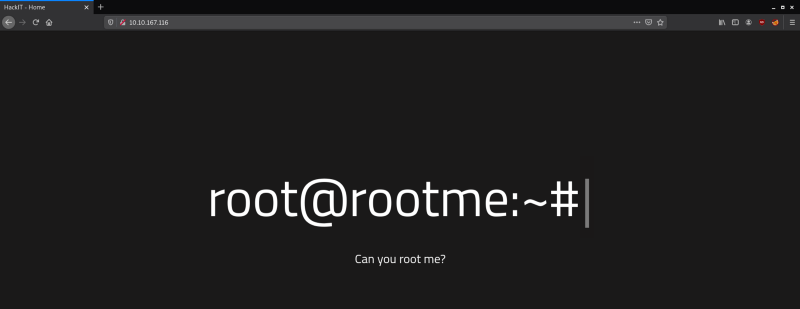
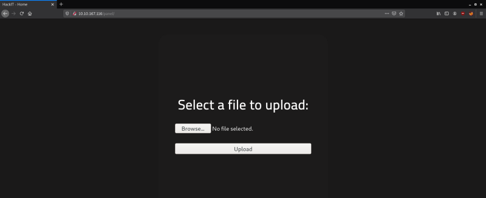
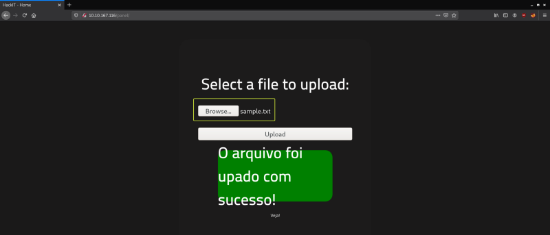
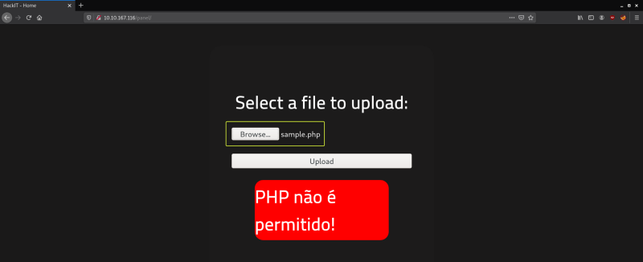
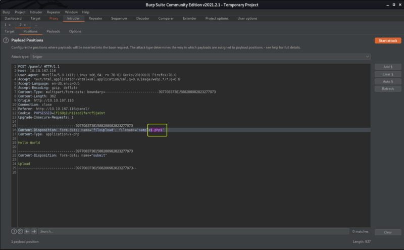
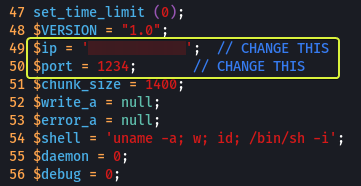
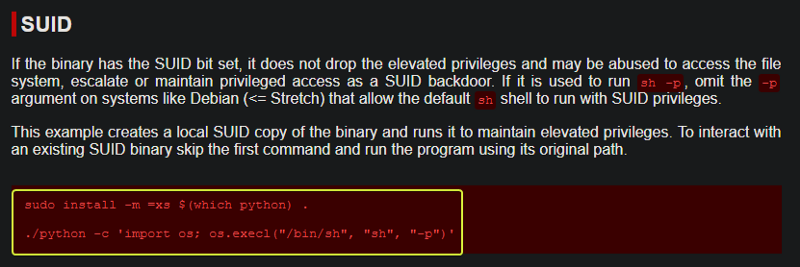

Cover Image by [BiZkettE1](https://www.freepik.com/free-vector/modern-business-background-with-geometric-shapes_5287944.htm) on Freepik

## Task 1: Deploy the machine

Connect to the TryHackMe network and deploy the machine. If you don't know how to do this, complete the [OpenVPN room](https://tryhackme.com/room/openvpn) first.

1. **Deploy the machine**

> No answer required

## Task 2: Reconnaissance

The first task that is performed when we are given a target to exploit is to find the services that are running on the target. To find services running on the machine I will be using "RustScan" which is a port scanner similar to Nmap but much faster (RustScan in ideal conditions can scan all the ports on the device in under 3 seconds). RustScan also integrates with Nmap so we can find open ports quickly with RustScan and then pipe the results to Nmap for using Nmap features.

[GitHub - RustScan/RustScan: 🤖 The Modern Port Scanner 🤖](https://github.com/RustScan/RustScan)


### Command Options

* **-a:** Target IP Address
* **--ulimit:** Number of parallel connections to target
* **-sV:** Service Versioning
* **-A:** Aggressive Scan
* **-oN:** Normal output file

**Note:** All the flags after the `--` along with the ports found by RustScan are going to be passed to Nmap for processing

### Nmap Equivalent

> nmap -vvv -p- -Pn -sV -A -oN nmap_output.txt 10.10.167.116


1. **Scan the machine, how many ports are open?**

> 2

2. **What version of Apache is running?**

> 2.4.29

3. **What service is running on port 22?**

> SSH

From the Port Scan, we have found that 2 ports are open on the target and one of the ports is a web server. Let's open the server in our browser and see what we get.



We get a webpage. Let's try to brute force the website and see if we find any hidden directories.


### Command Options

*   **dir:** Perform directory brute forcing
*   **-u:** URL of Target
*   **-x:** Extensions of files to find
*   **-w:** Wordlist
*   **-t:** Threads (Used for parallelization)

**Note:** The `2> /dev/null` at the end is used to redirect any errors that might occur during the brute forcing process to `/dev/null` (NULL is a special device on Linux that destroys any data that is sent to it)

From the above scan, we see there are two directories `/uploads` and `/panel` that look interesting and can be useful to us.

4. **Find directories on the web server using the GoBuster tool.**

> No answer required

5. **What is the hidden directory?**

> /panel

## Task 3: Getting a shell

Let us visit the `/panel` path and see what we can find



We see that we have an upload page. Let's try out files of various extensions to see which are allowed by the website.



I tried to upload a text file first and found that the server allows `.txt` files to be uploaded.



Next, I tried to upload a PHP file and noticed that the server was blocking the uploading of `.php` files. Trying for extensions one by one is going to be tedious so let us use Burp and automate the process.



Capture the upload request using Burp and send the request to Intruder. In the Positions tab set the file extension in the request as the payload (Clear the other payloads if any are selected).


Under the payloads tab. Select a wordlist to use for fuzzing. Here I am making use of the wfuzz common extensions wordlist which is located at `/usr/share/wordlists/wfuzz/general/extensions_common.txt` on Kali Linux.

**Note:** Ensure to deselect the URL-encode these characters option else the fuzzing is not going to work properly.


After the fuzzing was done. I had a look at the result returned for uploading an file with the .phtml extension and saw that the result was a success. This is great for us we can use a PHP reverse shell and try to gain access to the system.

We can utilize the excellent reverse shell code that is provided by `pentestmonkey`

[php-reverse-shell/php-reverse-shell.php at master · pentestmonkey/php-reverse-shell · GitHub](https://github.com/pentestmonkey/php-reverse-shell/blob/master/php-reverse-shell.php)

After downloading the file ensure to change the file extension to .phtml and then open the code and set the IP address in the script to our machines IP Address



**Note:** We can find our machine's IP Address by using "ip a show eth0" and looking under the inet interface.


When we try to upload the file we see that it gets uploaded successfully. From the Gobuster scan that we had performed at the start we had seen a page called `/uploads` let's open that page and see if we can see the files that were uploaded to the server.


We can see the reverse shell that we just uploaded. Before we run the script let's set up a listener on our device this can be done easily using Netcat and then let's run the script.

```
netcat -nvlp 1234
```

**Note:** The reason we are using port 1234 is that this is the port that we specified in the reverse shell script. If you changed the port ensure to change that port here as well.


And as we can see we have managed to get access to the system. On checking which user I was using "whoami" command, I saw that I was the "www-html" user.

In the question on TryHackMe, we have been told to find a file called `user.txt` so let us make use of the find command and locate this file


### Command Options

*   **/:** Search the entire server
*   **-type f:** Search for files only (No directories)
*   **-iname:** Search for a file named `<`filename>` (Case Insensitive)

**Note:** The `2> /dev/null` at the end is used to redirect any errors that might occur during the brute forcing process to `/dev/null` (NULL is a special device on Linux that destroys any data that is sent to it)

We see that there is a file which the name "user.txt" in the `/var/www/` directory

1. **user.txt**

> THM{y0u_g0t_a_sh3ll}

## Task 4: Privilege escalation

Now that we have found the user flag let's see how we can escalate our privileges and become root. Let us see if there are any files on the system whose SUID bit is set and it is owned by the root user. Files with the SUID bit set when executed are run with the permissions of the owner of the file. So if there is a binary that is owned by root and it has the SUID bit set we could theoretically use this binary to elevate our permissions.

[How to Use SUID, SGID, and Sticky Bits on Linux](https://www.howtogeek.com/656646/how-to-use-suid-sgid-and-sticky-bits-on-linux/)


### Command Options

*   **/:** Scan the entire device
*   **-type f:** Look only for files (No directories)
*   **-user root:** Check if the owner of the file is the root user
*   **-perm -4000:** Look for files that have a minimum of 4000 as their privilege. 4000 is the numerical representation for a file whose SUID bit is set.
*   **-exec:** Execute a command using the results of find
*   **ls -l {} +:** Display the results in long form ({} is a placeholder for the results that are returned by find. + at the end is used to terminate the -exec option)

The `2> /dev/null` at the end is not required but using that we are sending any errors that could be returned by find (directories that cannot be accessed due to lack of proper permissions) to NULL. NULL is a special device on Linux that deletes whatever data is sent to it.

Looking at the output we see that the Python binary does not have the usual permissions for this binary so we might be able to use this to gain root access.

1. **Search for files with SUID permission, which file is weird?**

> /usr/bin/python

Whenever we have to exploit a system binary we refer "GTOBins" which have instructions on how these binary files could be exploited.

2. **Find a form to escalate your privileges.**

> No answer required

[GTFOBins](https://gtfobins.github.io/)



When we search for Python and we look under the SUID session we can see that by running a line of command we could exploit this binary. Let us try this code and see if we can get root.

After running the code and running "whoami" we see that we have become root. Now similar to the user.txt let's search for root.txt using the find command and see where the file is located.


3. **root.txt**

> THM{pr1v1l3g3_3sc4l4t10n}

That's all. Happy Hacking :)