Cover Image by [BiZkettE1](https://www.freepik.com/free-vector/modern-business-background-with-geometric-shapes_5287944.htm) on Freepik

## Task 1: Simple CTF

The first task that is performed when we are given a target to exploit is to find the services that are running on the target. To find services running on the machine I will be using "RustScan" which is a port scanner similar to Nmap but much faster (RustScan in ideal conditions can scan all the ports on the device in under 3 seconds). RustScan also integrates with Nmap so we can find open ports quickly with RustScan and then pipe the results to Nmap for using Nmap features.

[GitHub - RustScan/RustScan: 🤖 The Modern Port Scanner 🤖](https://github.com/RustScan/RustScan)

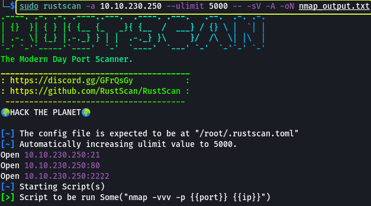

### Command Options

*   **-a:** Target IP Address
*   **--ulimit:** Number of parallel connections to target
*   **-sV:** Service Versioning
*   **-A:** Aggressive Scan
*   **-oN:** Normal output file

**Note:** All the flags after the `--` along with the ports found by RustScan are going to be passed to Nmap for processing

### Nmap Equivalent

> nmap -vvv -p- -Pn -sV -A -oN nmap_output.txt 10.10.230.250

1. **How many services are running under port 1000?**

> 2

2. **What is running on the higher port?**

> SSH

As we have found 3 ports that are open on the target device. Let us enumerate them one by one and see if we can find any vulnerability in them that we can exploit.

I started with FTP which is running on port 22.

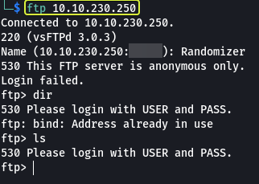

Even though I was able to connect to the FTP service I could not run any commands since it required authentication. Since I had no idea what these credentials could be I moved on to the next service which is a Web server running on port 80.

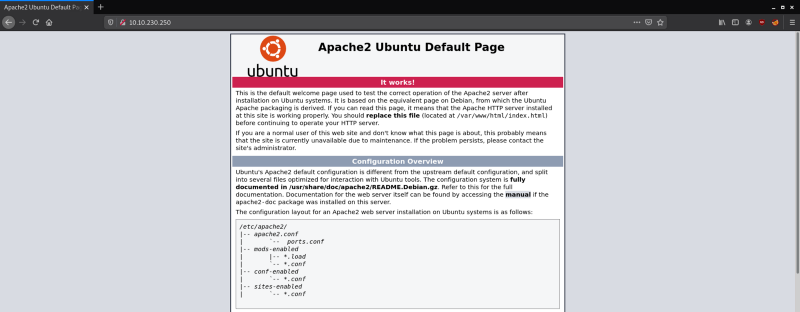

On accessing the server from my browser I was greeted with the default Apache Server page which did not provide anything useful. Next, I checked to see if the server has a "robots.txt" file.

[What Is A Robots.txt File? Best Practices For Robot.txt Syntax - Moz](https://moz.com/learn/seo/robotstxt)

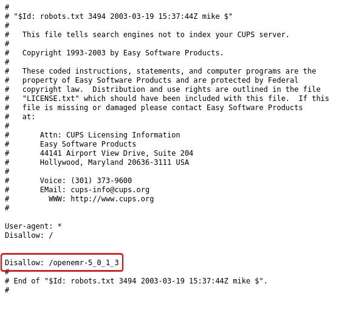

The server did have a "robots.txt" file and there seemed to be a directory that was hidden from being accessed by web crawlers. But on visiting the page I received the "Not Found" error.

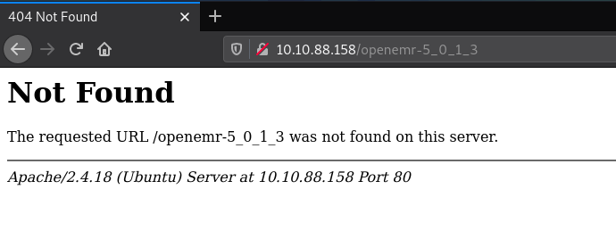

Since by looking around the web server manually, I wasn't able to find anything I decided to run a directory brute force attack on the server to see if I can uncover any hidden directories.

### Command Options

*   **dir:** Perform directory brute forcing
*   **-u:** URL of Target
*   **-x:** Extensions of files to find
*   **-w:** Wordlist
*   **-t:** Threads (Used for parallelization)

**Note:** The `2> /dev/null` at the end is used to redirect any errors that might occur during the brute forcing process to `/dev/null` (NULL is a special device on Linux that destroys any data that is sent to it)

From the scan, I discovered there is a directory called `/simple` on the server.

There is a website called "CMS Made Simple" that was present on this path. On just checking out the tabs that were present on the website I wasn't able to find any login/ upload fields that I could hijack for uploading a reverse shell.

So I decided to use "Searchsploit" and look if there are any known exploits that are available for this service. On scrolling to the bottom of the main page, we can see the version of the CMS system that is running on the server.

Searchsploit found an SQL Injection exploit that is present for the version of the CMS system that was running on the server.

**Note:** Searchsploit is just can command line-based tool for searching ExploitDB. If we directly use the website we will get the same results

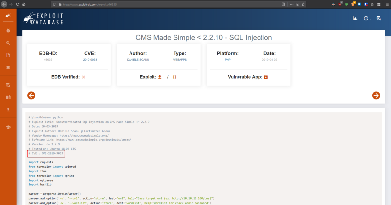

3. **What's the CVE you're using against the application?**

> CVE-2019-9053

4. **To what kind of vulnerability is the application vulnerable?**

> SQLi

**Note:** SQLi is short for SQL Injection

On downloading the exploit and trying to run it using Python I noticed that the code was written in Python 2 because of which it couldn't run on my system.

**Note 1:** New versions of Kali have Python 2 but don't have a pip installer, without which we can't install any Python modules. Python 2 support is going to be completely removed soon.

**Note 2:** If we look online we will find a Python 3 version of the script as well which will work directly. Since I wanted to understand how to get this code to work with Python 3 so I decided to convert it myself.

I know that Python has a module called "2to3" which helps to convert Python 2 code to Python 3 code. I used that to convert the code to Python 3.

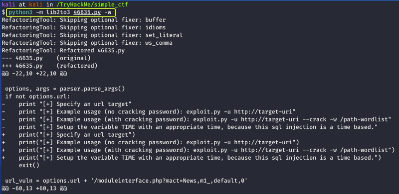

After the conversion now when I run the code I get some output telling me how to use the script.

When I ran the script with the required parameters the script started performing the SQL Injection but after some time I noticed that the script failed again as it ran into an error. On inspecting the error I understood there was a function that required some changing.

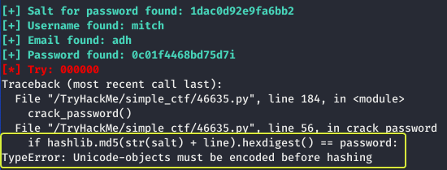

On changing the line as shown in the above image I ran the code again and this time I was successfully able to perform the Injection attack and get the username and password.

**Note:** If your network connection is slow the script is not going to return the correct results in this case increase the "TIME" variable in the code to a higher number.

5. **What's the password?**

> secret

At this stage, I ran a directory brute force attack on the `/simple` directory to see if there are any hidden login pages present.

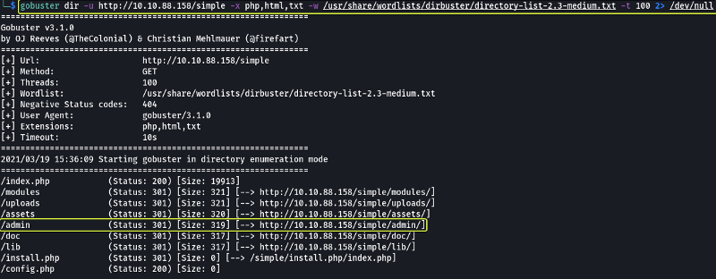

The results showed that there is a directory called `/admin` present for the CMS system on opening it I found a login page. On entering the credentials that were found using the SQL Injection I was able to login into the admin control panel.

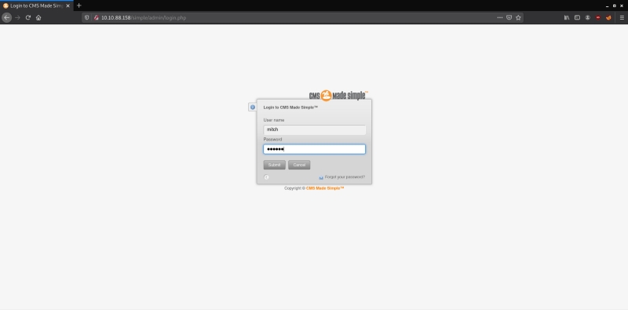

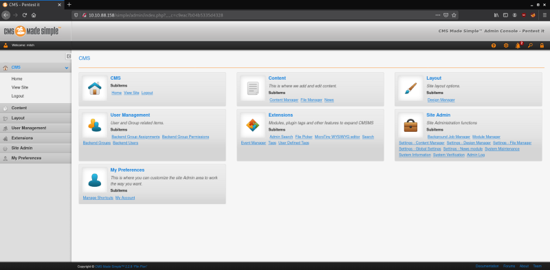

Looking around the control panel I could not find anything that looked like it could be used to get access to the system so I logged out and decided to try the SSH service that is running on port 2222.

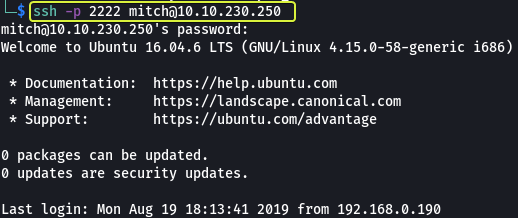

6. **Where **can you **log in** with the** details obtained?**

> SSH

On looking around I found a file called "user.txt" which is the first flag we require.

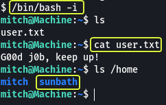

7. **What's the user flag?**

> G00d j0b, keep up!

8. **Is there any other user in the home directory? What's its name?**

> sunbath

Now that I had got a foothold on the system my next task was to find a way to elevate my privileges and become the root user.

I run the "sudo -l" command to see if there are any commands on the system that I can run without root privileges.

I found that on the system Vim could be run without root privileges

9. **What can you leverage to spawn a privileged shell?**

> Vim

Whenever we have a system binary that could be exploited the first place to visit is GTOBins. If a system binary can be exploited then they will have directions on how that could be done.

[GTFOBins](https://gtfobins.github.io/)

If we search for Vim and look under the Sudo session we see multiple approaches that could be used to evaluate our privileges. I used the first one to get root access and find the root flag.

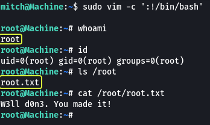

10. **What's the root flag?**

> W3ll d0n3. You made it!

That's all. Happy Hacking :)