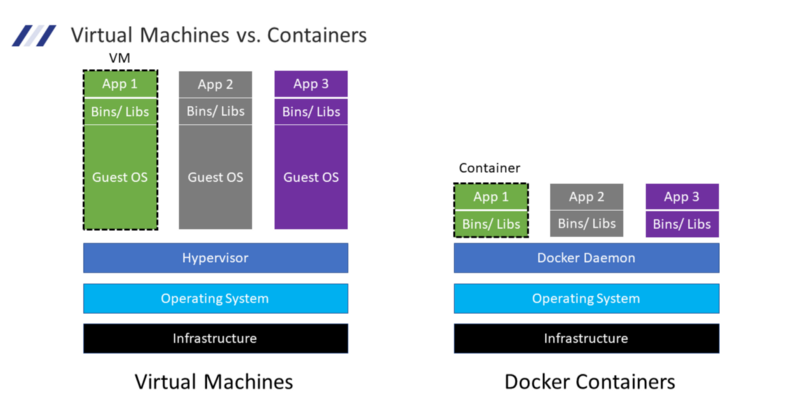
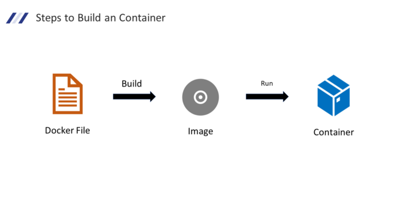

In this post we will be looking at some basics concepts that are important in understanding Docker and have an discussion along the way on how Virtual Machines differ from Containers.

### What does to mean to Containerize software and What is a Container ?

*   The process of packaging software along with all of its components is called as **containerization**. Components can be anything ranging from external libraries, frameworks, drivers and other dependencies that are essential for the functioning of the software.
*   **Containers** are lightweight, standalone, executable package of software that containers **everything** needed to run an application. Since an container consists of everything that is necessary to run the software they are **platform agnostic** and can be run on any system.
*   The above properties of containers also makes them **secure** as they don't have to relay on any software that is outside the container.

### Virtual Machines vs. Containers

Lets look at what a deployment look like when making used of Virtual Machines (VMs) and Containers. Lets take a use case where there are three applications that need to be deployed in a **isolated** manner.

Firstly we have **Infrastructure** this could be anything from developers laptop/ desktop to hardware provisioned in the cloud. Above this we have the **Operating System (OS)** which consists of the Kernel along with Libraries and Packages that implement the basic functionality that is exposed by the kernel. This OS is also refereed to as the Host OS. Above this is the **hypervisor** which is a piece of software that handles the communication between the Virtual Machines deployed on the system and the underlying Host OS. It is also responsible for **emulating the Hardware** that is required for the Virtual Machines (It is possible to install Hypervisors directly on Bare Metal as well this comparison holds true there as well). Above this we have the running VMs. The Virtual Machine consists of its **own OS** also called as Guest OS on which we install the libraries and binaries required to run our application and then we finally can deploy our software.

Just by looking at the image above one thing should come clear to us Virtual Machine based deployments are very **bulky**. Even to deploy an simple Hello World app we will need to provision an VM which can be couple GBs in size. Now just imagine scaling this to **multiple application**.

Now lets look at containers the first two layers are exactly the same for as VMs. The next layer is the Docker **Runtime** which is an software that sits between containers and the Host OS and is responsible for providing the resources necessary for running containers and managing their lifecycle. The container runtime is what makes running containers on **any platform** possible. Above this we have our running containers which consists of the dependencies of our application along with the application itself.

**Note**: Docker is not the only Container Runtime out there but it is the most popular and widely used one. What is true for the Docker Runtime is also more or less apply for other Runtimes as well.

Now looking at the above representation it might look like container do not contain an OS but this is not **entirely true**. Lets look at another diagram to understand this point further.

As eluded to before an operating system consists on two main parts **the Kernel** and the **low level libraries** that exposes the features of the kernel to the applications running on the system. A container unlike an Virtual Machine **does not** consist of a **kernel** rather it relies on the Host OSes kernel to utilize the kernel level features that are required by the container. This is what makes container so much more **lightweight** when compared to an VMs.

**Note**: Alpine Linux is can containerized version of an Linux system that is less than 5 MBs is size this should give you an idea of show small containers can be compared to VMs

Another way to look at this is VM allow us to **isolate environments** (OS + Software) while Containers move this abstraction one layer higher and allows to **isolate applications**.

### How to Build a Container ?

Building an container in a three step process. Firstly we need to create a **Dockerfile** which can be taught of as a **blueprint**. It contains all the steps that are necessary to build our software. On **building** this file what we get as output is refereed to as an **Image**. This image is the blueprint that will generate our container. Now if we **run** an image we get an **container**.

As you might have noticed there is an small different between Images and Containers. The output of containerization step is called as an Image and when this **Image** is a **running state** it is refereed to as an **container**.

Once we build an Image we can distribute this image to other people by uploading it to an **Container Registry** which is an site to host and store Images. From here other people can **download** our Images and run it on there system easily without having to install anything (except Container Runtime).

This is one of the key areas where Containers shine unlike VMs we do not have to go through **complex steps** to get our software up and running. As long as the Host OS has an Container Runtime installed we can run containers on that system and the functioning of the software is going to be **exactly the same** as it was on our system. So no more **"But it worked on my Machine idk why it is not working on yours"** :)

### Advantages of Containers

*   **Portable**: Containers are platform agnostic and are isolate and hence can be installed on any system
*   **Resource Efficient**: As each container does not bundle its own kernel the complete software package footprint is very lean.
*   **Isolated**: Containers contain everything required for this functioning and hence has no external dependencies due to which can function in a isolated manner.
*   **Speed**: Since containers an so lightweight they allow us to start, create, replicate and delete them in seconds
*   **Secure**: Containerized image is self sufficient the container does not have to interact with its outside environment. Further container builders are configured out of the box to use the best security practices which further reduces the resultant container is secure. Also containers are lightweight and only contain necessary packages for the software this lowers the probability of inclusion of packages that have a vulnerability.
*   **Scalable**: We can create multiple instances using an single image and hence can spin up as many containers as required to match load.

I how I was able to at least clear to come extent mystery around containers and docker. I am planning to turn this into an fully featured Docker 101 guide where I will be covering getting stated with Docker, Building Images, Docker Networks & Volumes, Docker Compose, etc. so say turned for more Docker content.

In closing, we looked at what is **container** and how does it mean to **containerize** an application. We **compared VMs** and **containers** to see how they differ from each other. We covered the steps that are involved in **building** a containers and finally saw what are the **advantages** to using containers.

### References

*   [What is a Container? \| Docker](https://www.docker.com/resources/what-container/)
*   [What is containerization?](https://www.redhat.com/en/topics/cloud-native-apps/what-is-containerization)
*   [Docker vs Virtual Machine - simply explained \| Docker Tutorial 6 - YouTube](https://www.youtube.com/watch?v=5GanJdbHlAA)
*   [Virtualization Explained - YouTube](https://www.youtube.com/watch?v=FZR0rG3HKIk)
*   [Virtual Machines vs Docker Containers - Dive Into Docker - YouTube](https://www.youtube.com/watch?v=TvnZTi_gaNc)