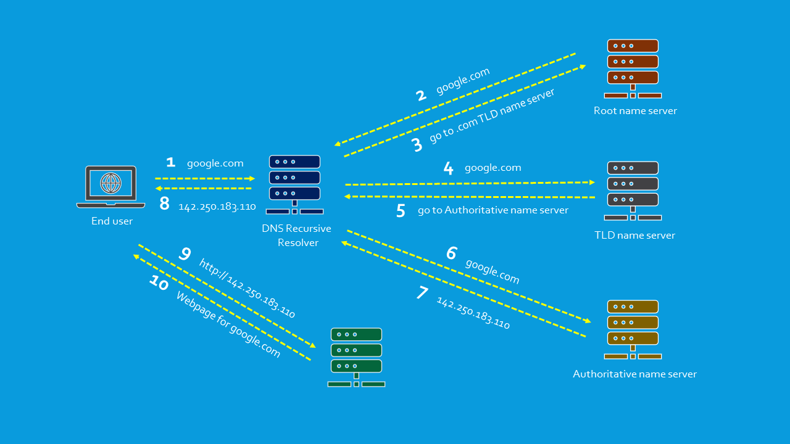
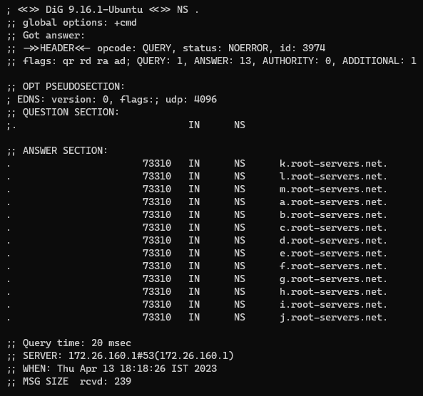
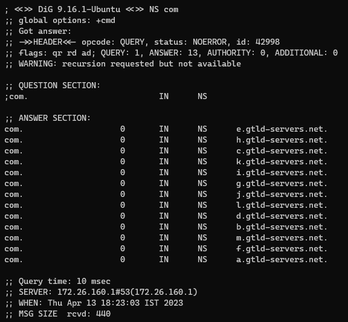
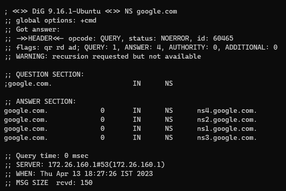
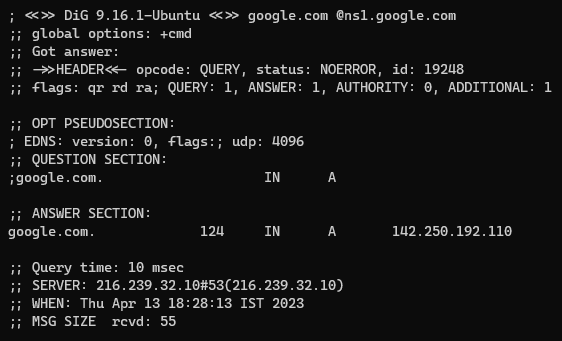

<a href="https://www.freepik.com/free-vector/tiny-business-people-with-digital-devices-big-globe-surfing-internet_11669276.htm#page=2&query=domain%20name%20system&position=2&from_view=search&track=ais" target="_blank" rel="noopener noreferrer">Banner graphic by Vectorjuice</a> on Freepik

### What is DNS?

Domain Name System (DNS) is a hierarchical distributed naming system for devices on the internet. It is used for translating domain names to IP Addresses. DNS is like a phonebook for devices on the internet. A phonebook is used to map a name (contact) to a phone number. Similarly, DNS stores the mapping between domain names and IP Addresses.

<iframe width="560" height="315" src="https://www.youtube-nocookie.com/embed/JkEYOt08-rU" title="YouTube video player" frameborder="0" allow="accelerometer; autoplay; clipboard-write; encrypted-media; gyroscope; picture-in-picture; web-share" allowfullscreen></iframe>

### Why is DNS required?

Every device on the internet has a unique IP Address which is used by other devices to communicate with it. Unlike computers for humans, it is difficult to remember long arbitrary strings of unrelated characters. This is why a system to map domain names to IP Addresses was created. 

Back in the day when the internet was still called ARPAnet, each computer maintained a "hosts.txt" file which contained the domain name to IP Address mapping for all the domains on the network. This file was updated every one/two weeks to fetch all the new domains that were added. As time went on the number of domains present on ARPAnet started increasing rapidly due to which the size of the hosts.txt file also started growing significantly. Because of this rapid growth, it started becoming challenging to maintain the domain name mapping on each device. So a new system was devised that would elevate the limitations of the "hosts.txt" file-based implementation. This effort led to the creation of DNS as we know it today.

### What are DNS Servers?

Before we can look at how DNS works we must first understand what is a DNS Server. A server is a computer that provides a service/resource to computer programs and its users using the internet. Servers that are in charge of translating domain names to IP Addresses are called DNS Servers. Four types of DNS Servers are involved in process of obtaining the IP Address from the domain name.

#### DNS Recursive Resolver

The DNS Resolver is a server that is provided by our ISP (Internet Service Provider). It is the first stop in the DNS lookup process. It acts as a middleman between our computer and DNS. The resolver is responsible for performing the entire DNS lookup process on behalf of the requesting device. The resolver recursively queries DNS servers until it can find the IP Address for the requested domain. Due to the recursive nature of DNS lookup, DNS Resolvers are also called "DNS Recursive Resolvers". 

DNS Resolvers also maintain caches that store the domain name to IP Address mapping for frequently visited domains. There are also other DNS Resolver providers out there that can be configured in place of our ISP's resolver.

#### Root name server

Root servers sit at the top of the DNS hierarchy. All DNS Resolvers know how to reach all the Root name servers. Root servers consist of 13 servers that are geographically distributed all over the world. While there are only 13 root servers each root server is not a single computer, each server is made of multiple nodes which are linked together and work as a single system to ensure the root server is reachable and operational with low latency even when there are node failures. 

They are managed by 12 organizations whose likes include NASA, USC (University of Southern California), ICANN and the US Department of Defense. They are logically named "letter.root-servers.net". Where the letter ranges from "a" to "m". Information about all the root name servers can be found at "root-servers.org".

#### Top Level Domain (TLD) Server

The TLD name servers form the next level in the DNS hierarchy. They store information about all the domains that share a common domain extension. For example, the .com TLD name server contains information about all the websites whose domain name ends in ".com". After receiving a response from the root name server the DNS resolver is directed to the TLD server. TLD name servers store information about Authoritative name servers.

TLD name servers are managed by IANA which is a subsidiary of ICANN. IANA classifies TLD Servers into two categories:
- Generic TLDs: They contain all domains that are not country-specific like .com, .net, .dev, .org, .gov
- Country Code TLDs: They contain all domains that are country specific like .uk, .jp, .in, .us

#### Authoritative Name Server

The Authoritative name server is the last step in the DNS lookup. Authoritative servers contain all the details related to all the websites for the domain/zone that it serves. The Authoritative name server contains the IP Address of the requested domain and returns it to the DNS resolver. 

Sometimes the Authoritative name server will not contain the IP Address (A record) of the requested site instead it will have a domain name (CNAME record) i.e. domain name maps to another domain name. In this case, the Authoritative name server provides the new domain name to the resolver and the resolver performs the entire DNS lookup for the new domain.

### How does DNS Work?



Let's imagine we want to visit google.com, when we enter the domain name into our browser, the browser will first look in its cache to see if it knows the IP Address of google.com. If the IP Address is not found it looks at the cache that is maintained by the Operating System (OS). If the IP Address is not found in the OS cache the browser makes a DNS Lookup request to the DNS Resolver that is configured on the Operating System.

When the request reaches the DNS resolver it first checks its cache to see if it knows the IP Address for google.com. If its cache does not contain the IP Address the resolver requests one of the Root servers of the Domain Name System (DNS) for the IP Address.

Since the Root server only knows about TLD name servers it looks at the last part of the domain google.com (which is .com) and sends the DNS resolver a list that contains the names of all .com TLD name servers.

The DNS resolver then queries one of the .com TLD name servers from the list for the IP Address of google.com. The TLD name server looks at its database and returns the IP Address of the Authoritative name server that is responsible for the google.com domain.

The DNS resolver using the IP Address returned from the TLD name server queries the Authoritative name server for the IP Address of google.com. The Authoritative name server looks at its database and returns the IP Address of google.com to the DNS resolver.

The DNS resolver caches the received IP Address and then returns the IP Address to the user's browser. The browser caches the IP Address and then sends an HTTP request to the IP Address of google.com. The server at the IP returns a webpage that is loaded by the browser.

> For sites that are commonly visited, the domain to IP Address mapping will be found in either the browser, OS or DNS resolver cache so for these cases the entire DNS lookup process is not performed.  
> All the mappings that are stored in the cache has a TTL (Time to Live) once the TTL time has expired the mapping is removed from the cache and a new request is made to fetch the IP Address. 

### How do TLD name servers learn the IP Addresses of the Authoritative name servers?

To host a website using a custom domain two things are needed. First, we need a web host (Netlify, Vercel, Azure Web App, etc.) who is responsible for hosting the website. Second, we need a domain name that will point to the website hosted on the web hosting provider's servers. Domain names are purchased through a Domain Registrar (NameCheap, GoDaddy, etc.) who is responsible for reserving domain names and assigning IP Addresses to Domain names.

Once we deploy our website on the hosting provider's server we will be provided with a list of Authoritative name servers that are used by the hosting provider. These name servers need to be added to our domain on the Domain Registrar's portal. Once this is complete in the background the Domain Registrar sends a message to the TLD managing authority which contains the domain name to Authoritative name server mapping. The TLD managing authority then adds the mapping provided by the Domain Registrar to its servers. This transaction between the Domain Registrar and the TLD managing authority is how TLD name servers learn about new domains on the internet.

### Exercise: Finding google.com IP Address

For this example, I will be using `dig` a command line utility available on Linux which allows us to make requests to DNS name servers. The first step in obtaining the IP Address is getting the names of the Root name servers which can be done using the following command.

```bash
dig NS .
```



Next, by using one of the root name servers we find the TLD name servers

```bash
dig NS com @a.root-servers.net
```



Once we have the list of TLD name servers we can request one of them for the names of the Authoritative Name servers used by google.com

```bash
dig NS google.com @a.gtld-servers.net
```



And finally using the Authoritative name server we can get the IP Address of google.com

```bash
dig google.com @ns1.google.com
```



Now if we enter this IP Address in our browser we should be taken to google.com's webpage

---

### References

- [What is DNS? \| How DNS Works \| Cloudflare](https://www.cloudflare.com/learning/dns/what-is-dns/)
- [DNS \| DNS Zones \| DNS Records - Digitial Archive](https://notes.davidvarghese.dev/computer%20networks/network%20devices/dns%20server/dns%20server/)
- [What is DNS? How Domain Name System Works](https://www.techtarget.com/searchnetworking/definition/domain-name-system)
- [DNS server types \| Cloudflare](https://www.cloudflare.com/learning/dns/dns-server-types/)
- [Domain Name System - Wikipedia](https://en.wikipedia.org/wiki/Domain_Name_System)
- [A brief history of DNS - O'Reilly](https://www.oreilly.com/library/view/dns-and-bind/0596100574/ch01.html)