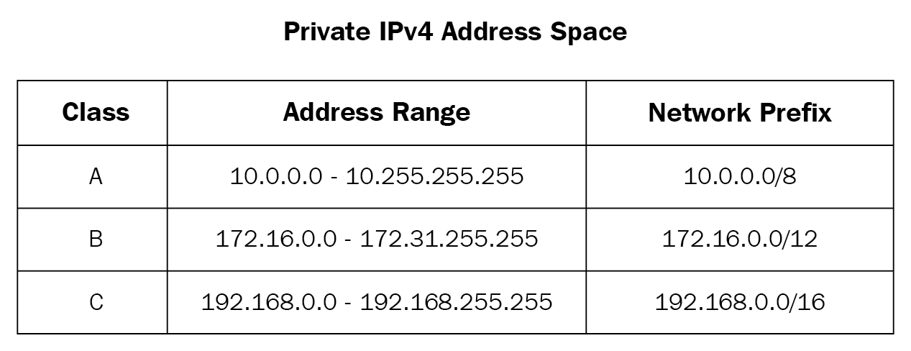
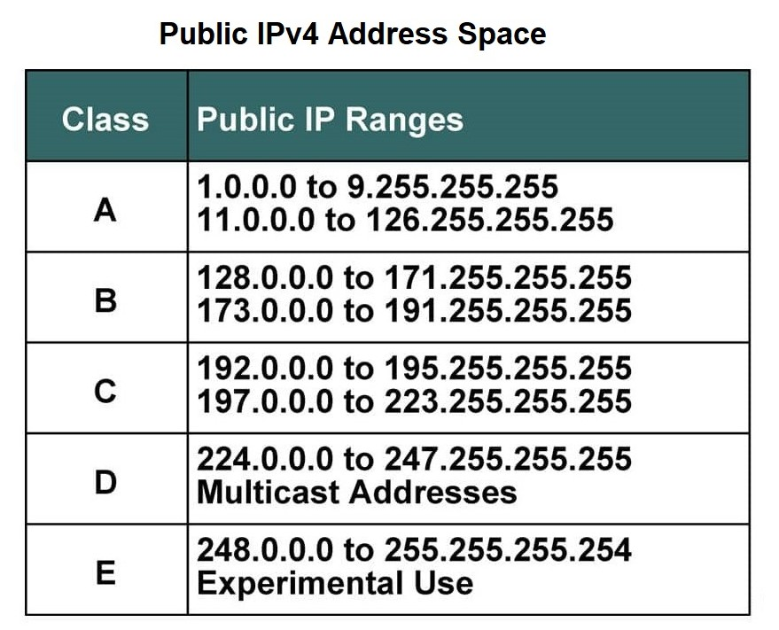
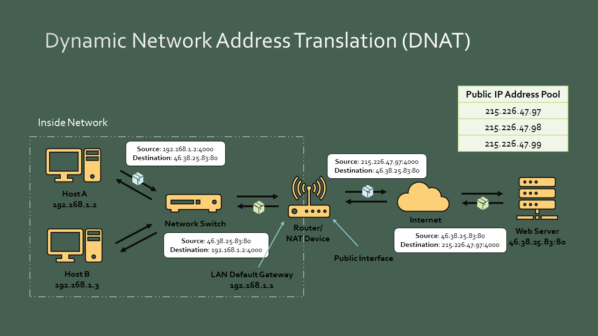

## What is NAT?

NAT stands for Network Address Translation. It is a protocol that is used to map a private IPv4 address to a public IPv4 address. The translation process is performed by a traffic-routing device like a router. NAT was a short-term solution that was introduced to solve the scarcity of IPv4 addresses by allowing multiple devices to share the same IP address.

<iframe 
    width="560" height="315" 
    src="https://www.youtube-nocookie.com/embed/videoseries?list=PLIFyRwBY_4bQ7tJvbLA9A0v8Fq9l-H923" 
    title="YouTube video player" frameborder="0" 
    allow="accelerometer; autoplay; clipboard-write; encrypted-media; gyroscope; picture-in-picture; web-share"
    allowfullscreen>
</iframe>

## Why is NAT required?

When the internet was initially created, the intention was to assign every host a unique IP address. If we had a network consisting of 10 hosts then we would need 10 IP addresses for all of the hosts to be able to access the Internet. An IPv4 address is made up of 32 bits (4 bytes) which gives us a total of $2^{32}$ or ~4.2 billion unique IP addresses. 

Since back in the day there weren't many devices that accessed the internet it was assumed that this address space would be sufficient for connecting all the hosts that would ever exist on the Internet. As the internet grew in popularity the industry soon realized that this address space would not be sufficient.

The permanent long-term solution for this issue was to create a larger address space, which led to the creation of IPv6 addresses. IPv6 addresses are made up of 128 bits (16 bytes) which gives us $2^{128}$ or ~$3.4 \times 10^{38}$ (340 trillion trillion trillion) IP addresses. This address space is so astronomically large that even if we assign trillions of addresses to each human being on the planet we would still have leftover IP addresses. However, the migration to IPv6 proved to be a difficult, complicated and slow process so a short-term solution needed to be created. This interim solution gave us NAT as well as the concept of public and private IP addresses.

[TCP/IP Guide - IPv6 Address Size and Address Space](http://www.tcpipguide.com/free/t_IPv6AddressSizeandAddressSpace-2.htm)

**Private IP Addresses** are a range of non-routable (internal) IP addresses. Private IP addresses can be used by hosts on a network to communicate with each other but they cannot be used to access the internet. Private IP addresses can be used by anyone without any restriction. The same private IP address can even be used by multiple organizations at the same time without any issues.

**Public IP Addresses** on the other hand are routable (global) IP addresses. A public IP address is required if a host wants to access the Internet. All public IP addresses on the internet are unique to their host or server and cannot be duplicated. The assignment of public addresses for home users is managed by ISPs. Public IP addresses by design are not provided for free. Public IP addresses are tracked and managed by IANA (International Authority of Assigned Numbers) to ensure no organization inadvertently uses duplicate public IP addresses.

Once the IPv4 address Space was separated into public and private addresses, a protocol was required that would allow a device that is using a private IP address to access the internet using a public IP address. This is why NAT was created. NAT is responsible for mapping private IP addresses to public IP addresses. 

> **Note:**  
> While normally NAT is used for translating private a IPv4 address to public IPv4 address which is the usage of NAT this article will cover. However, in reality, it does not matter if the IP address is public or private. NAT can just as easily be used to translate a public IP address to another public IP address or private IP address to another private IP address. NAT can even be used to convert a IPv6 address to IPv4 address.

## Types of NAT

NAT can be configured in different ways, the three main types of Network Address Translation are as follows:

### Static NAT (SNAT)

SNAT is used to perform a one-to-one mapping of a private IP address to a public IP address. If there are multiple devices on the network then for each device a static private to public IP address mapping is provided. This type of NAT does not preserve any IP address and hence does not help solve the IPv4 address shortage. Static NAT is used to expose an internal server over the internet.

### Dynamic NAT (DNAT)

DNAT is used to perform a one-to-one mapping of a private IP address to a public IP address. But unlike SNAT, the public-to-private IP address mapping is not permanent, instead, public IP addresses are selected dynamically from a pool of reserved IP addresses as required.

### Port Address Translation (PAT)

PAT is used to perform a many-to-one mapping between private IP and public IP addresses. PAT is also known as NAT Overloading, Network and Port Translation (NAPT) and IP Masquerading. Since multiple private IP addresses are translated to a single public IP, it's possible to have devices that have services that are running on the same port. To resolve this issue PAT performs port translation along with IP translation. 

This is the type of NAT that is used in home networks. PAT allows thousands of devices to access the Internet using a single IP address. Since PAT maps many private IPs to a single public IP using this form of NAT we can conserve public IP addresses.

## How does NAT Work?

All routers have two interfaces - Public (External) and Private (Internal). Packets that originate on the internal network are always received on the private interface while packets that arrive from the internet are received on the public interface.

### Port Address Translation (PAT)

The private interface of the router in this example has the IP address 192.168.1.1 and the public interface of the router has the IP address 215.226.47.97. The router acts as the translation device, it converts IP addresses from the internal network (192.168.1.0/24) to the public IP address (15.226.47.97). The router stores the information related to the translation in its NAT table.

A web server (46.38.25.83) is hosting a website on port 80. Host A wants to access this website. Host A creates a packet and sets its private IP address as the source IP address. A random high port that is selected by the Host is used as the source port. The IP address and port of the Web server are used as the destination IP address and port.

When the packet reaches the router the source IP address of the packet is changed to 215.226.47.97. The source port is changed to a new unique port that is selected by the router. The translation details are recorded in the router's NAT table which will be used to un-translate the response that will be sent back by the web server.

The source and destination details from the packet that was received by the web server are used in reverse (source becomes the destination and destination becomes source) in the packet the web server uses to respond to the Host.

Once the router receives the response packet it looks at its NAT table to determine how to un-translate the IP address and port. The destination details in the packet are replaced with the mapping that is found in the NAT table. The modified packet is put on the internal network where it is delivered to the appropriate device.

PAT is unidirectional which means packets that originate from the internet that do not have a mapping in the NAT table are dropped by the router. PAT only works when the initial request is sent by an internal Host.

#### Why does PAT need to randomize the Source Port?

While 65,535 ports are available to be used by each Host, two devices on a network may end up using the same port for communicating with an external resource. If PAT did not perform the port translation, for the above network we can end up with the following mappings in the NAT table.

Host A - 192.168.1.2:400 (Internal) - 15.226.47.97:400 (External)  
Host B - 192.168.1.3:400 (Internal) - 15.226.47.97:400 (External)

The response that the router receives from the webserver for both Host A and Host B would have the destination set to 15.226.47.97:400, because of this the router will not be able to decide which mapping needs to be used to send the response to the correct Host. To prevent this problem, PAT translates the port along with the IP address.

### Dynamic NAT (DNAT)

The private interface of the router in this network has the IP address 192.168.1.1 and the public interface will have an IP assigned from a pool of reserved IP addresses. In this example, the router's public interface can use the following addresses (215.226.47.97, 215.226.47.98, 215.226.47.99). Similar to PAT the translation details for DNAT are stored in the NAT table of the router.

A web server (46.38.25.83) is hosting a website on port 80. Host A wants to access this website. Host A creates a packet and sets its private IP address as the source IP address. A random high port that is selected by the Host is used as the source port. The IP address and port of the Web server are used as the destination IP address and port.

When the packet reaches the router the source IP address of the packet is changed to the first unused IP address from the pool of reserved IP addresses. The router changes the source IP address of the packet to 215.226.47.97. The translation details are recorded in the router's NAT table which will be used to un-translate the response that will be sent back by the web server. When a public IP address is in use it is removed from the pool of available public IP addresses.

The source and destination details from the packet that was received by the web server are used in reverse (source becomes the destination and destination becomes source) in the packet the web server uses to respond to the Host.

Once the router receives the response packet it looks at its NAT table to determine how to un-translate the IP address. The destination details in the packet are replaced with the mapping that is found in the NAT table. The modified packet is put on the internal network where it is delivered to the appropriate device. The public IP address is added back into the pool to be used by other Hosts.

Since each device uses a different public IP address for accessing the internet DNAT does not need to translate the ports. In the above network if we had 4 Hosts then all of them would not be able to communicate with the internet at the same time. The first 3 Hosts would end up using all the available public IP addresses. The 4th Host would have to wait for one of the other Hosts to finish its communication before it can access the internet. 

DNAT-based IP address mappings are non-deterministic as the same public IP address could be used by different Hosts on the internal network. DNAT is also bidirectional which means if a connection was initialized from the external network it would still be delivered to a Host on the private network but, since the Host using the public IP keeps changing there is no guarantee the packet will be received by the correct Host. Because of its non-deterministic nature, Dynamic NAT is very rarely used in real-world networks.

### Static NAT (SNAT)

SNAT is used to make an internal Host accessible over the Internet. The private interface of the router in this network has the IP address 192.168.1.1. The public interface will have a static public IP address which is reserved specifically for the Host device that needs to be accessed over the internet. SNAT does not make use of a NAT table. It stores a static mapping that defines the private IP and public IP relation.

When the packet from Host A reaches the router the source IP address of the packet is changed to the public IP address that is reserved for the Host. Since a NAT table is not used there are no records to be updated in any table.

The source and destination details from the packet that was received by the web server are used in reverse (source becomes the destination and destination becomes source) in the packet the web server uses to respond to the Host.

Once the router receives the response packet it looks at its mapping configuration and changes the public IP that is present in the destination field to its corresponding private IP address. The modified packet is put on the internal network where it is delivered to the appropriate device.

Since each device requires a different public IP address for accessing the internet SNAT does not need to translate the ports. In the above network if we had 4 Hosts and all of them needed to be accessed from the internet we would require 4 public IP addresses. SNAT does not help in conserving IP addresses which was the primary reason NAT was introduced. SNAT is bidirectional which means if a connection was initialized from the external network it would still be delivered to the Host on the private network.

## References

- [Network address translation - Wikipedia](https://en.wikipedia.org/wiki/Network_address_translation)
- [Why NAT? – NAT Series – Practical Networking](https://www.practicalnetworking.net/series/nat/why-nat/)
- [Network Address Translation Definition \| How NAT Works \| Computer Networks \| CompTIA](https://www.comptia.org/content/guides/what-is-network-address-translation)
- [NAT (Network Address Translation) - Digital Archive](https://notes.davidvarghese.dev/Computer%20Networks/Layer-wise%20Concepts/Network%20%28Internet%29%20Layer%20Concepts/NAT%20%28Network%20Address%20Translation%29/)
- [What is the difference between a public and private IP address? – Keenetic](https://help.keenetic.com/hc/en-us/articles/213965789-What-is-the-difference-between-a-public-and-private-IP-address)