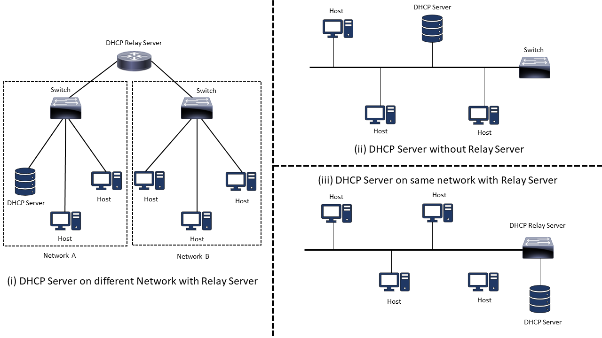
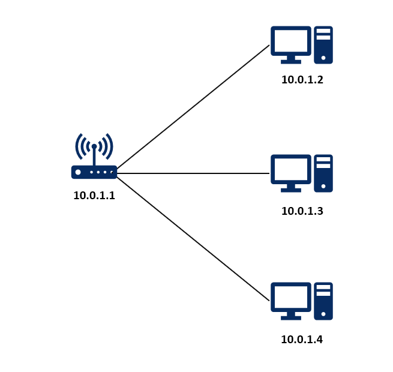
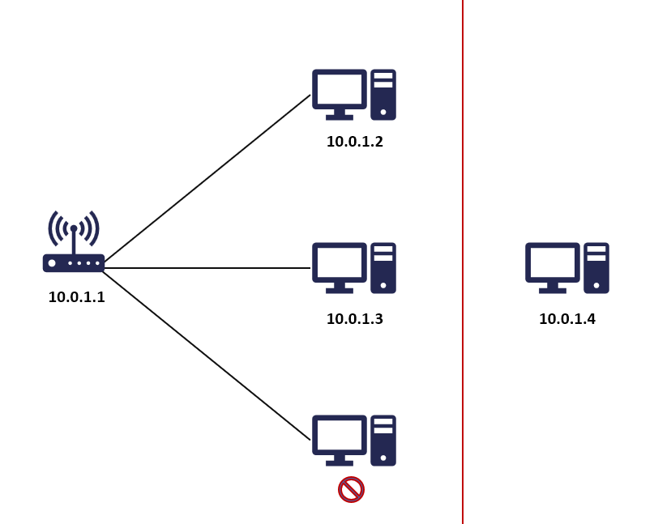
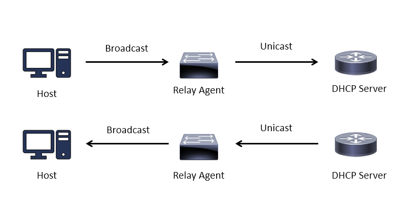

Banner graphic by <a href="https://www.freepik.com/free-vector/gradient-website-hosting-illustration_22112055.htm#query=dhcp%20server&position=3&from_view=search&track=ais">Freepik</a>

For a device to be able to communicate with other devices (on LAN and Internet) it needs to have an IP Address. IP addresses are unique numeric identifiers that are used to identify devices on a network.

IP addresses based on how they are assigned are classified into two types:

### Static IP

Static IP addresses are assigned manually to hosts by the network administrator. While assigning IPs manually on a small network is achievable, it is practically impossible to do so on a network that contains hundreds of devices. The network administrator also needs to ensure that the IP addresses that are being configured are unique and they do not overlap with other hosts.

### Dynamic IP

Dynamic IP addresses are assigned automatically to hosts on the network by the DHCP server. The DHCP server provides IP addresses from its pool of IP addresses. Any additional network configuration that could be required by the host can also be set using DHCP.

---

The process of assigning static IP addresses does not scale well on large networks. An automated method to assign IP addresses was required. To enable rapid IP address deployment DHCP was created.

## DHCP Protocol

DHCP stands for Dynamic Host Configuration Protocol. DHCP enables the automatic assignment of unique IP addresses to hosts on the network. It can also automatically set up other network-related details like Subnet Mask, Default Gateway and DNS address for the host. DHCP is responsible for network-related configuration management and automatic assignment of IP addresses for devices on a network.

<iframe 
    width="560" height="315" 
    src="https://www.youtube-nocookie.com/embed/e6-TaH5bkjo" 
    title="YouTube video player" 
    frameborder="0" 
    allow="accelerometer; autoplay; clipboard-write; encrypted-media; gyroscope; picture-in-picture; web-share" 
    allowfullscreen>
</iframe>

### DHCP Architecture

DHCP utilizes the client-server model. The DHCP client is pre-installed on all devices that can connect to the internet (laptops, printers, VoIP phones). DHCP uses UDP for communication. The client runs on port 68 while the server runs on port 67. The DHCP server can be installed on a dedicated server (commonly found on Enterprise networks). It is also available as a built-in service on router/SOHO devices (Home network). 

DHCP server can also be set up behind a relay agent (Fig. 1 & 3). The relay agent is a device that forwards DHCP requests to the DHCP server. Some routers support being set up as DHCP relay agents as well. DHCP packets are always broadcasted over the network. Broadcast packets cannot travel from one network to another (cannot cross the router). By utilizing a relay agent we can overcome this limitation. Using the relay agent setup a single DHCP server can manage the assignment of IP addresses for hosts on multiple networks (Fig. 1).

### DHCP Scope

The IP addresses that are assigned to hosts are assigned from the DHCP scope. The DHCP scope is the range of IP addresses that have been configured on the DHCP server to be handed out to devices on the network. DHCP scope is also referred to as the IP Address Pool.

### IP Leasing

The IP addresses that are assigned to hosts by the DHCP server are not permanent. They are leased by the host from the DHCP server for a short duration.

Consider a network with a DHCP server and three hosts. The DHCP scope has been configured to contain three IP addresses (10.0.1.2, 10.0.1.3 and 10.0.1.4). Instead of leasing out IP addresses the DHCP server permanently assigns IP addresses to devices. When there are only three hosts on the network everything functions normally.

Now assume one of the devices on the network had to be taken offline and in its place a new host was introduced into the network.

The DHCP server will not be able to assign an IP address to the new device as its scope does not have any free IP Address. If the device that was taken offline had freed its IP Address the new device would have received an IP Address. Using permanent IP addresses can cause the DHCP server IP address pool to get depleted. To prevent running into this situation DHCP servers always lease IP addresses. 

DHCP server keeps track of the IP addresses that it has leased along with the lease period of the address. Before the lease period of an IP address expires the host can make a lease renewal request to the DHCP server to continue using the IP Address. If the lease period for an IP address expires and the host that was using the address does not make a lease renewal request the IP address is taken away from the host and added back into the IP address pool. Similarly, when a host is rebooted or when the network interface of the host is restarted/rebooted the IP address is taken away.

### Reservations

If we want a host to be assigned the same IP address every time, we can create a reservation for that IP address in the DHCP server. A reservation will prevent the IP address from being leased out to other devices. Reservations are mapped using the MAC address of the device. Reservations are generally created for special devices on the network like printers, routers, and servers.

---

## DORA Process 

The DORA process is used to assign an IP Address to a host that does not have an IP Address.

### Step1: DHCP Discover
When a host connects to a network for the first time it will not have an IP address. Its address will show up as `0.0.0.0`. It will also not have details like Subnet Mask, Default Gateway and DNS address configured. The host sends out a DHCP Discover broadcast message to locate the DHCP server on the network.

If the device was connected to the network previously, in the broadcast message sent to the DHCP server an extra field is included. This field contains the IP address that was previously assigned to the host. The host includes this field to find out from the DHCP server if it can be assigned the same IP address again.

### Step 2: DHCP Offer
The DHCP server sends an offer for an IP to the requesting client. If more than one offer is received by the host, the host will choose the first offer that it receives. 

A host receives more than one offer when there are multiple DHCP servers present on the network.

### Step 3: DHCP Request
On receiving the DHCP offer message the host broadcasts an ARP packet on the network. This is done to ensure that no other host on the network is using the IP Address that was offered by the DHCP server. Only when no response for the ARP packet is received does the host reply to the message from the DHCP server indicating it would like to use the IP Address.

If the host receives a response for the ARP request it indicates that the host has been offered a duplicate IP address. In this scenario, the client declines the offer using the DHCP Decline message and starts the DORA process all over again. 

Even though the DHCP server keeps track of all the addresses that it hands out, it is still possible for IP address collisions to occur. The network could contain devices that use static IP addresses that fall in the same range as the DHCP server IP pool. The DHCP server could crash which would result in the DHCP IP address mapping getting cleared. It's also possible that the IP address has already been given to a device on the network by another DHCP server running on the same network. To counter these edge cases the device being offered the IP address makes an ARP request to ensure that no device on the network is using the same IP address.

### Step 4: DHCP Acknowledgment
The DHCP server then sends the IP Address to the client along with other network properties that are needed by the host to communicate on the network and access the internet.

If the DHCP server is set up behind a relay agent, the request messages from the client are sent to the relay agent as a broadcast, the relay agent then forwards the message as an unicast packet to the DHCP server. Similarly, the responses from the DHCP server are sent to the relay agent as an Unicast message and the relay agent then broadcasts the message on the interface on which it received the original request.

## Renewal Process

Both the packet used in the renewal process is sent using Unicast.

### Step 1: DHCP Request
When half of the lease period has passed the host initiates a DHCP renewal request. The host sends its current IP address along with its network configuration parameters to the DHCP Server.

### Step 2: DHCP Acknowledgment
If the DHCP server accepts the renewal request it sends back an acknowledgment packet to the host. If the DHCP server does not accept the Renewal request the host can continue using the IP address until the lease period is active. If the lease period expires and the host still wants to access the internet it has to perform the entire DORA process to get a new IP address.

## Release Process

When the host is done using the IP address it can release its IP address using the DHCP Release message. In this message, the IP address that needs to be reclaimed by the DHCP server is specified. Unicast communication is used for sending the packet.

## References

- [How DHCP works Explained with Examples](https://www.computernetworkingnotes.com/ccna-study-guide/how-dhcp-works-explained-with-examples.html)  
- [What is DHCP and how does it work?](https://afteracademy.com/blog/what-is-dhcp-and-how-does-it-work/)  
- [DHCP Explained \| Step by Step - YouTube](https://www.youtube.com/watch?v=S43CFcpOZSI)
- [Dynamic Host Configuration Protocol (DHCP) - GeeksforGeeks](https://www.geeksforgeeks.org/dynamic-host-configuration-protocol-dhcp/)
- [Leases - IBM Documentation](https://www.ibm.com/docs/en/i/7.1?topic=concepts-leases)
- [DHCP: Differences With and Without Relay Agent - Work with the Best](https://workwiththebest.intraway.com/blog-post/dhcp-differences-with-and-without-relay-agent/)