Banner Background by <a href="https://www.freepik.com/free-vector/gradient-white-color-background-abstract-modern_34010189.htm#query=simple%20backgrounds&position=28&from_view=search&track=ais&uuid=96e36b2e-64b3-42e2-8fd8-4fd18a6e1d5d">logturnal</a> on Freepik  
Hacker Image by <a href="https://www.freepik.com/free-vector/hacker-operating-laptop-cartoon-icon-illustration-technology-icon-concept-isolated-flat-cartoon-style_11602236.htm#page=2&query=hacker&position=28&from_view=search&track=sph&uuid=070b0d8a-d045-434d-9a51-f239e46d5f17">catalyststuff</a> on Freepik

In this module we are going to download, install and configure pfSense. pfSense will be the default gateway and firewall for our home lab. The pfSense VM should be the first VM that is booted. Once the VM ready other VMs in the lab can be launched.

## Download pfSense

Go to the following link: [Download pfSense Community Edition](https://www.pfsense.org/download)

Select AMD64 for Architecture, ISO for Installer and for Mirror chose the location closest to you. As of writing the latest version of pfSense is `2.7.2`.

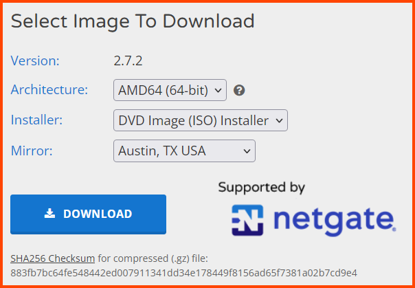

The downloaded file will be a compressed image with the extension `.iso.gz`. Use an archive extraction software like `7-Zip` to decompress the image.

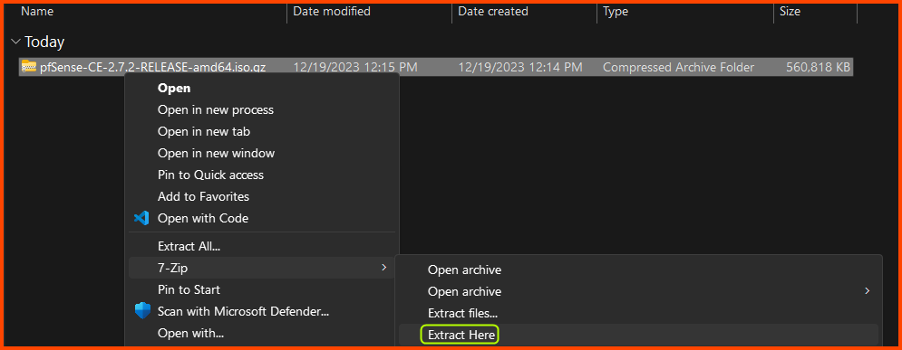

After extraction we will get a file that ends in `.iso`.

## pfSense VM Creation

Launch VirtualBox. Check on Tools on the sidebar and then Select New from the Toolbar.

For Name you can enter any name that makes sense. Folder is the location where the VM is going to be stored on the system. Ensure this is set to the location where all the VMs of the lab are going to stored. From the ISO Image dropdown select Others and find the `.iso` file that we just downloaded. Finally ensure to select the correct values for the Type and Version fields.

Here we select the amount of RAM and CPU that the VM can use. Leave everything at its default setting.

On this page we need to decide the amount of storage space to reserve for the VM. Enter 20GB in the input field. Ensure Pre-allocate Full Size is not selected.

Ensure that everything looks right and click on Finish.

[10.2. Understanding Virtual Disks](https://rhv.bradmin.org/ovirt-engine/docs/Administration_Guide/Understanding_virtual_disks.html)

Once done we should see the newly onboarded VM in the sidebar.

**Note:** Ignore the Security Home Lab and Other VMs Group this will not be present in a freshly setup VirtualBox instance.

### Adding VM to Group

I like to keep my VMs organized by using the Groups feature of VirtualBox. This makes it easy to locate a VM from a sea of VMs. This is an optional step but highly recommended.

Right click on the VM from the sidebar and then click on Move to Group and finally select New. The VM will now be added to a Group called New Group. 

Right click on the Group and select Rename Group and name the Group as Firewall.

If everything was done correctly the VM should be in a group called Firewall.

## pfSense VM Configuration

Before we start the VM lets configure some settings related to VirtualBox. Select the pfSense VM from the sidebar and then click on Settings.

### System Configuration

Select System, under Motherboard in the Boot Order section using the arrows move Hard Drive to the first position, Optical should be in the second position and Uncheck Floppy. 

### Audio & USB Configuration

Go to the Audio section and uncheck the Enable Audio option. Since we are configuring a virtual router we do not need audio.

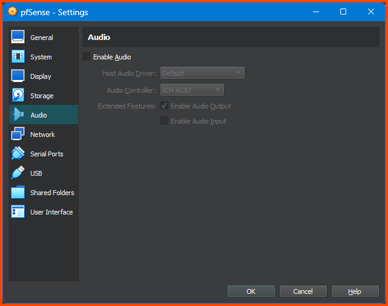

Go to the USB section and uncheck the Enable USB Controller option. Since we are configuring a router we do not need support for USB devices.

### Network Configuration

Go to the Network section. In Adaptor 1 click the Enable Network Adaptor option. For Attached to select NAT. Expand the Advanced section and for Adaptor Type select Paravirtualized Network (virtio-net).

Select Adapter 2. Click the Enable Network Adapter option to enable the 2nd network interface. In the Attached to dropdown select Internal Network. For Name enter `LAN 0`. Expand the Advanced option section. For Adapter Type select Paravirtualized Network (virtio-net).

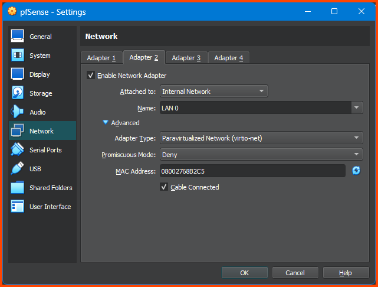

Select Adapter 3. Click the Enable Network Adapter option to enable the 2nd network interface. In the Attached to dropdown select Internal Network. For Name enter `LAN 1`. Expand the Advanced option section. For Adapter Type select Paravirtualized Network (virtio-net).

Select Adapter 3. Click the Enable Network Adapter option to enable the 2nd network interface. In the Attached to dropdown select Internal Network. For Name enter `LAN 2`. Expand the Advanced option section. For Adapter Type select Paravirtualized Network (virtio-net). Finally, click on Ok to save the changes and close the configuration menu.

[VirtualBox Network Settings: All You Need to Know](https://www.nakivo.com/blog/virtualbox-network-setting-guide/)

> **Note**  
> The network diagram from the first module of this guide consisted of 6 network interfaces. VirtualBox only allows us to configure 4 interfaces uses the UI. Towards the end of the guide we will see how to add more interfaces using the VirtualBox CLI.

## pfSense Installation

Now we can start with the installation of pfSense. Select the VM from the sidebar and click on Start from the toolbar.

Give the VM sometime to load all the setup. On boot an banner will be shown on the screen followed by a lot of text. Wait for the below screen to load. Press Enter to Accept the agreement. 

Press Enter to start the Installation.

Press Enter to select Auto (ZFS) partition.

Press Enter to select Proceed with Installation.

Press Enter to select Stripe - No Redundancy.

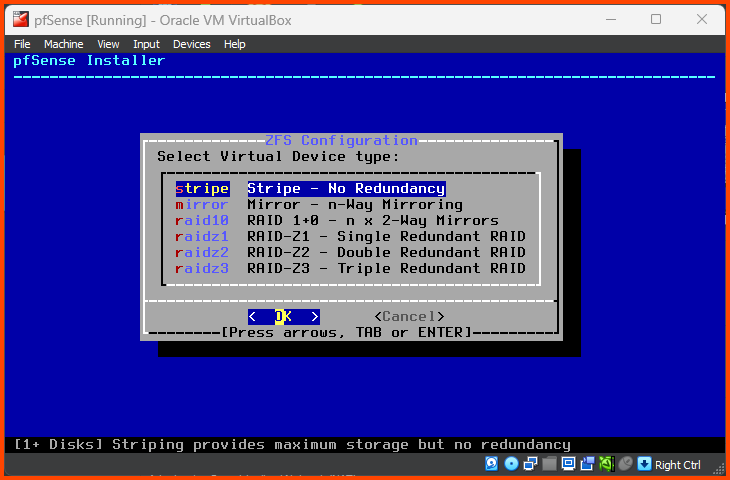

Press Spacebar to select the Hard Drive (ada0) of the VM. Press Enter to continue.

Use the Left Arrow to select YES and then press Enter to continue.

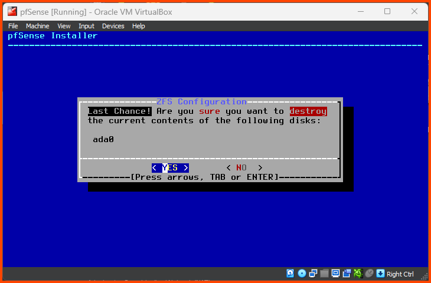

Give the VM 2-3 mins to complete the installation.

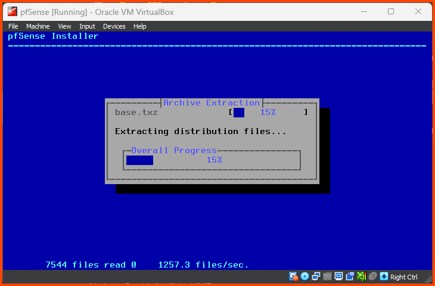

Press Enter to Reboot the VM. Once it reboots it will launch into pfSense configuration.

## pfSense Configuration

Once pfSense reboots you will be presented with the following prompt. Enter `n` to continue. In the next step we will configure the interfaces manually.

For the WAN interface select `vtnet0`. For the LAN interface enter `vtnet1`. For the OPT1 interface enter `vtnet2`. For the OPT2 interface enter `vtnet3`. When asked if we want to proceed enter `y`.

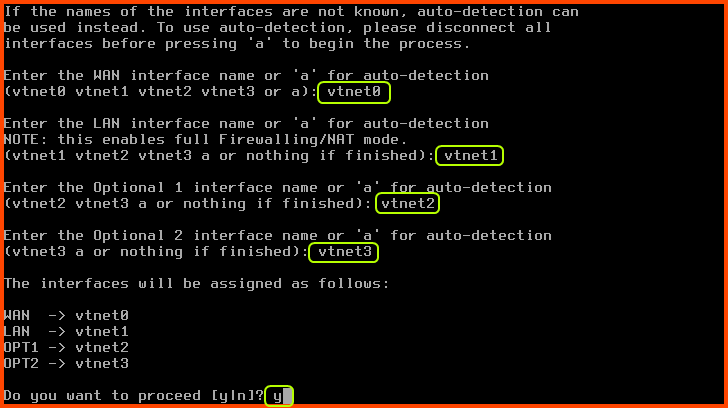

Since the WAN interface of pfSense is connected to VirtualBox it has automatically been assigned an dynamic IPv4 address using DHCP. pfSense has also gone ahead and assigned a dynamic IPv4 address to the LAN interface using its DHCP. The OPT1 and OPT2 interfaces have not been assigned any IP address. For our lab we do not want the IPs to change so we will assign static IPv4 addresses to LAN, OPT1 and OPT2 interface.

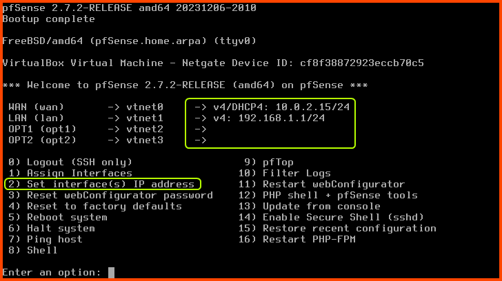

> **Note**  
> The IP address of the WAN interface can be different in your case since it is assignment randomly by the VirtualBox DHCP server.

#### Configuring LAN (vtnet1)

Enter `2` to configure the IP address of the interface. Enter `2` to select the LAN interface. When asked if we want to use DHCP to configure the IP address enter `n`. Enter `10.0.0.1` as the new static IPv4 address for the interface. When asked to select the subnet mask of enter `24`.

When asked for the upstream gateway address press `Enter`. Since this is an LAN interface we do not have an upstream gateway. When asked if we want to use DHCP-based IPv6 addressing for the devices connected to the interface press `n`. Leave the new IPv6 address section blank (Press `Enter`). When asked if we want to use DHCP-based IPv4 addressing for device connected to the interface enter `y`. For DHCP start address enter `10.0.0.11` and for DHCP end address enter `10.0.0.243`. For the web configurator related question enter `n`. 

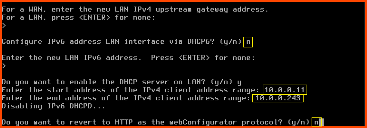

pfSense will use the details provide and restart the corresponding components. Press `Enter` to complete the process.

Once the changes have been applies we see that the IP address of the LAN interface has been changed to the IP address that we provided.

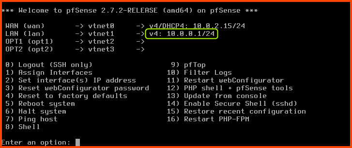

### Configuring OPT1 (vtnet2)

Select `2` to start Interface IP address configuration. Enter `3` to select the OPT1 interface. For interface IP assignment using DHCP enter `n`. For interface IP address enter `10.6.6.1`. For subnet mask enter `24`.

When asked for upstream gateway address press `Enter`. Since its an LAN interface upstream gateway is not needed. When asked if we want to use DHCP-based IPv6 addressing on the interface enter `n`. When asked for IPv6 interface address press `Enter`. When asked if we want DHCP-based IPv4 addressing on the interface press `y`. For DHCP start address enter `10.6.6.11` and for end address enter `10.6.6.243`. For web configurator question say `n`.

Once the changes have been applied press `Enter` to return to the configuration menu.

### Configuring OPT2 (vtnet3)

Select `2` to start the Interface IP address configuration. Enter `4` to select the OPT2 interface. When asked if we want to use DHCP to assign the interface an IP address enter `n`. Enter `10.80.80.1` as the IP address of the interface. Enter `24` as the subnet mask of the interface.

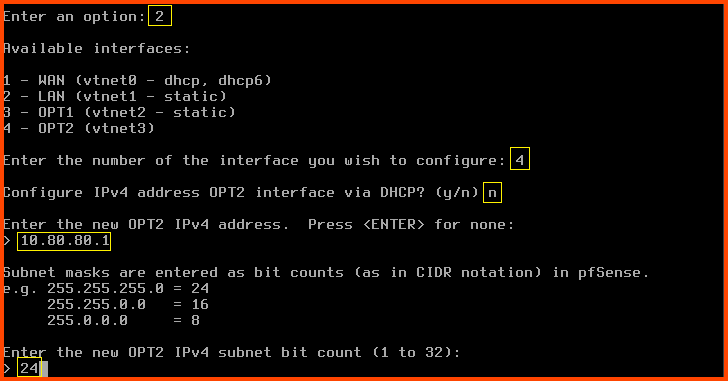

When asked to provide the upstream gateway address press `Enter`. Since we are configuring a LAN interface we don't need to set an upstream address. When asked if we want to use DHCP-based IPv6 addressing on the interface press `n`. Press `Enter` when asked if IPv6 address. When asked if we want to use DHCP-based IPv4 addressing on the network enter `n`. For the web configurator question enter `n`.

> **Note**  
> The OPT2 interface will be used to setup the Active Directory (AD) Lab. The Domain Controller (DC) in the lab will act as the DHCP server. Since the DC will perform DHCP we have disabled DHCP-based IP address assignment for this interface in pfSense.  

Once the changes have been applied press `Enter` to return to the configuration menu. 

If everything was configured properly the IP addresses for the LAN, OPT1 and OPT2 interface should look as follows:

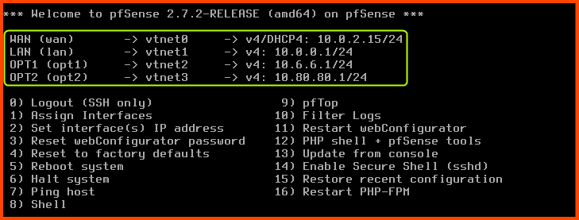

With this we have completed the configuration of the interfaces in pfSense. There are some more settings that need to be configured in pfSense. We will change these settings once we setup Kali Linux in the next module. From Kali Linux we can access the pfSense Web Interface. The Web Interface will be accessible for all the LAN interfaces. 

## Shutdown pfSense

When launching the lab pfSense is the first VM that has to be booted. When we want to shutdown the lab pfSense will be the last VM that is stopped.

To shutdown pfSense select option `6` and when asked to confirm action enter `y`.

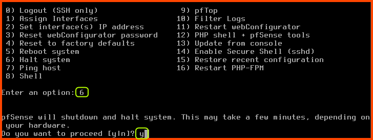

## Post-Installation Cleanup

After the VM is shutdown. Click on the Settings menu from the toolbar. Select Storage from the sidebar. In the Storage Devices section click on the pfSense `.iso` image. Click on the small disk image on the right side of the Optical Drive option.

From the menu select Remove Disk from Virtual Drive. Click on Ok to save the changes.

The `.iso` file along with the `.iso.gz` file that were downloaded to create the VM can be deleted now if you do not plan to store it for future use.

In the next module we are going to setup Kali Linux on the LAN interface. This VM will be used to configure and manage pfSense. It can additionally be used as an attack VM to target the other systems in the lab.