Banner Background by <a href="https://www.freepik.com/free-vector/gradient-white-color-background-abstract-modern_34010189.htm#query=simple%20backgrounds&position=28&from_view=search&track=ais&uuid=96e36b2e-64b3-42e2-8fd8-4fd18a6e1d5d">logturnal</a> on Freepik  
Hacker Image by <a href="https://www.freepik.com/free-vector/hacker-operating-laptop-cartoon-icon-illustration-technology-icon-concept-isolated-flat-cartoon-style_11602236.htm#page=2&query=hacker&position=28&from_view=search&track=sph&uuid=070b0d8a-d045-434d-9a51-f239e46d5f17">catalyststuff</a> on Freepik

The VM images that are available online are mainly going to be in `.vmdk` (Virtual Machine Disk Image) or `.ova` (Open Virtualization Format) format. In this module we will step up some vulnerable VMs on the CYBER_RANGE interface which we can then attack using Kali Linux running on the LAN interface. Along the way we will also see examples of importing `.vmdk` and `.ova` files into VirtualBox.

## VM 1: Metasploitable 2

### Download Metasploitable 2

Go to the following URL: [Metasploitable: 2 \~ VulnHub](https://www.vulnhub.com/entry/metasploitable-2,29/) and download Metasploitble 2.


The download file is compressed file. Use an extraction software like `7-zip` to decompress the file. After decompression w should have a folder.


If you open the folder the following files should be present. We only require the `.vmdk` file.


### Creating the VM

In VirtualBox select Tools from the sidebar and then from the Toolbar clock on New.


Give the VM a name. Ensure that Folder is set to the location where all the VMs of the Home Lab are going to be saved. Leave the ISO Image option empty. Select the correct value for Type and Version and then click on Next.

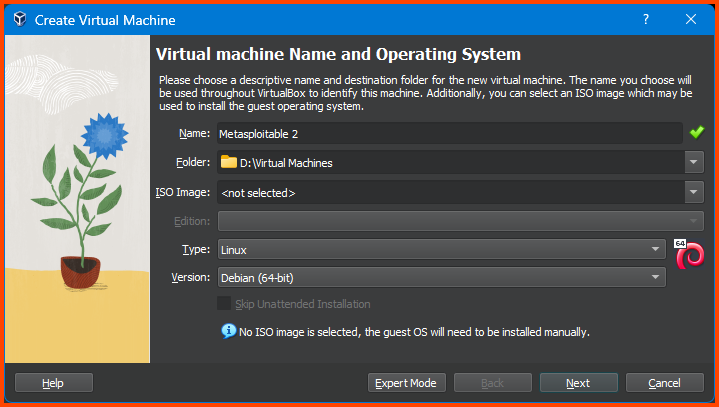

Reduce the Memory to 1024MB and click on Next.


Select "Do Not Add a Virtual Hard Disk" and click on Next.

> **Note**  
> The `.vmdk` file we downloaded is the Hard Disk. The OS is pre-installed on it. In the next step we will see how to attach to it to the VM we are creating.

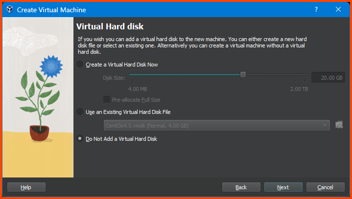

Confirm that all the settings look correct and click on Finish.


We will get a error that Warns us that we have not provided an Hard Disk for the VM. This can be ignored. Click on Continue.


### Adding VM to Group

This is an optional but highly recommended step to organize the VMs that belong to the Home Lab in groups. Right-click on the Metasploitable VM. Select Move to Group and then click on New.


Right-click on the New Group that is created and select Rename Group. Call the group `Cyber Range`.

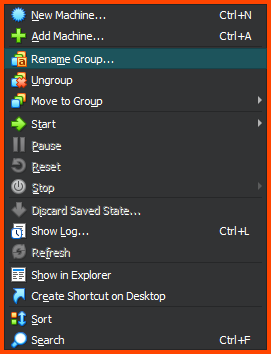

The output should look as follows:


Now right-click the `Cyber Range` group and select Move to Group and click on `Home Lab`. This will move the Cyber Range group into the Home Lab group.

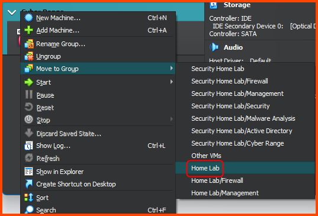

The final output should look as follows:

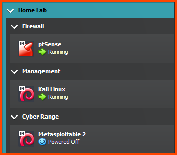

### Configuring the VM

All my VMs for the Home Lab project are located in `D:\Virtual Machines`. Whenever we create a new group in VirtualBox a corresponding folder is created is created on the filesystem. Since the Metasploitable 2 VM is in the Cyber Range group which is inside the Home Lab group the location of the VM on my Hard Drive is `D:\Virtual Machines\Home Lab\ Cyber Range\Metasploitable 2`. Find the Metasploitable 2 VM folder in your case and move the download `.vmdk` into it. 


Select the VM from the sidebar and from the toolbar click on Settings.


Go to Storage and select `Controller: SATA` then click on the small Hard Drive icon on the right. This will open up

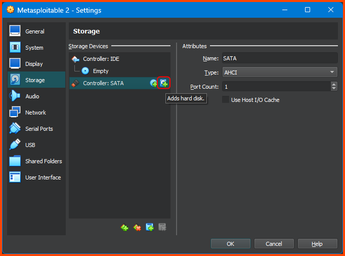

This will open the Hard Disk Selector menu. Click on Add and then select the `.vmdk` file. Then click on the Choose button to use the Hard Drive.

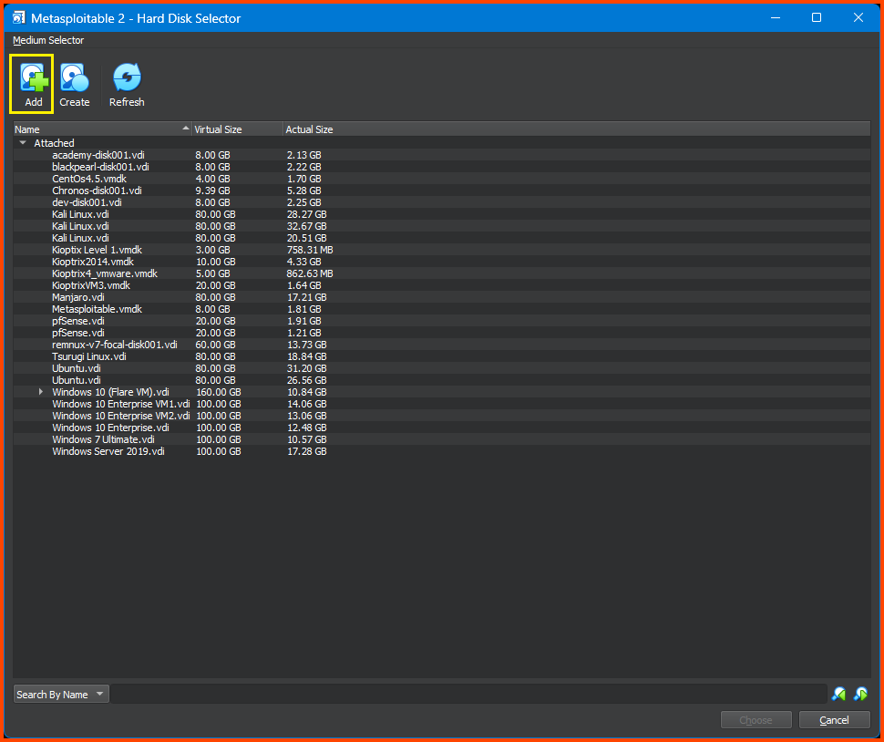

If done correctly under `Controller: SATA` the Hard Drive will be visible.


Select `System` and go to Motherboard then for Boot Order ensure Hard Drive is to the top followed by Optical. Disable Floppy.  


Click on `Network` and go to Adapter 1. Ensure Enable Network Adapter is checked. Change `Attacked to` to Internal Network and in Name select LAN 1. Expand Advanced options and ensure Adapter Type is set to `Intel PRO/1000 MT Desktop`. Click on Ok to save the changes.

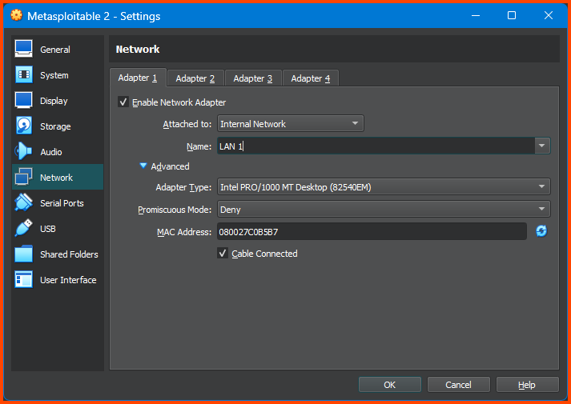

### Testing the Connectivity

From the sidebar select Metasploitable 2 and then click on Start.


After the VM boots the login page will become visible.

Username: `msfadmin`  
Password: `msfadmin`


After login use the following command to check if we have an IP address:

```bash
ip a l eth0
```

We can see that we have been assigned the IP `10.6.6.12` which is inside the DHCP range for the CYBER_RANGE interface.


We can ping google to test we can access the internet.

```bash
ping google.com -c 5
```

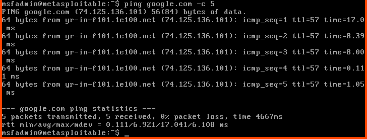

We can do a similar test to check connectivity to Kali Linux.

```bash
ping 10.0.0.2 -c 5
```


We can also try to reach the Metasploitable 2 VM from Kali Linux.

```bash
ping 10.6.6.12 -c 5
```


## VM 2: Chronos

### Download Chronos

Go to the following URL: [Chronos: 1 \~ VulnHub](https://www.vulnhub.com/entry/chronos-1,735/) to download Chronos.


The downloaded file this time is an `.ova` file. This file format is much easier to load into Virtual Box.


### Creating the VM

From the VirtualBox sidebar select Tools and then click on Import.


This will open the Appliance Import wizard. Click on the folder icon to the right of the `File` field and select the downloaded `.ova` file then click on Next.

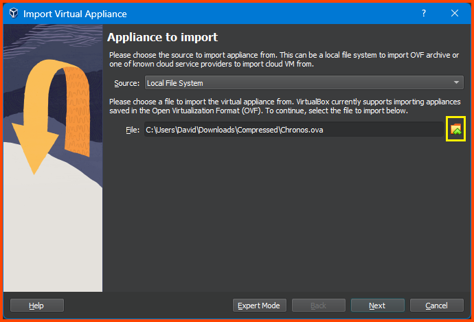

From this menu we can change the configuration of the VM as required. I have gone ahead and reduced the RAM of the VM to 1024MB. You can change the name of the VM to suite your naming convention. For MAC Address Policy ensure that Generate new MAC addresses for all network adapters is selected. If everything looks right click on Finish.


VirtualBox will now start importing the VM. This can take some time depending on the size and complexity of the VM.


### Adding VM to Group

Once the import is complete right-click on the VM, chose Move to Group and then select the `Home Lab/Cyber Range` group.

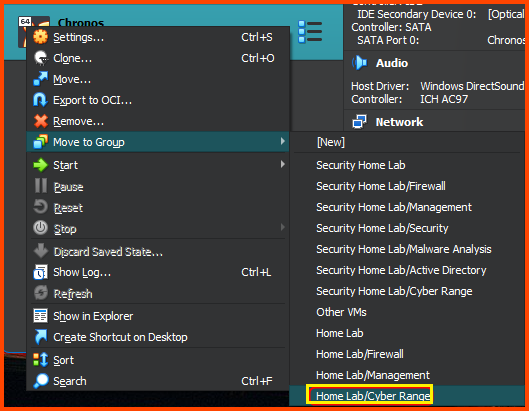

### Configuring the VM

Select the Chronos VM and from the toolbar chose Settings. 

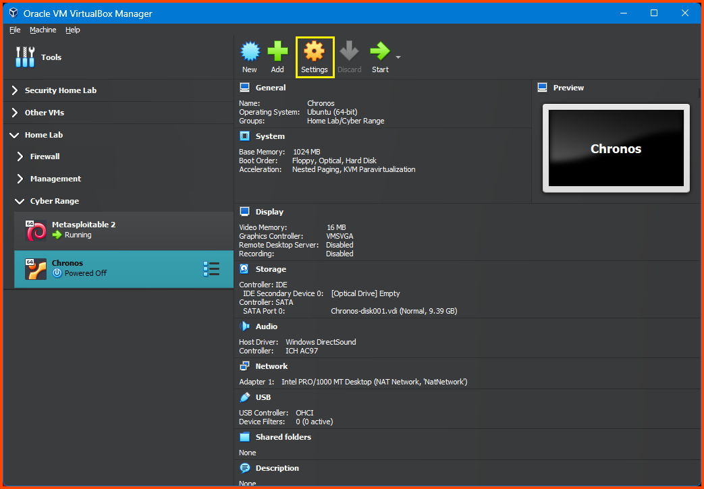

Go to `System -> Motherboard`. For Boot Order ensure that Hard Drive is on the top followed by Optical. Disable Floppy. 


Go to `Network -> Adapter 1`. Ensure Enable Network Adapter is checked. For the Attached to field select Internal Network, for name select LAN 1. Expand the Advanced settings option. From Adapter Type select `Paravirtualized Network (virtio-net)`. Click Ok to save the changes.


### Testing the Connectivity

Select the Chronos VM and from the toolbar select Start. Once the VM starts we should see the login screen. The credentials for this machine is not known so we cannot login and check if its has been assigned an IP address.

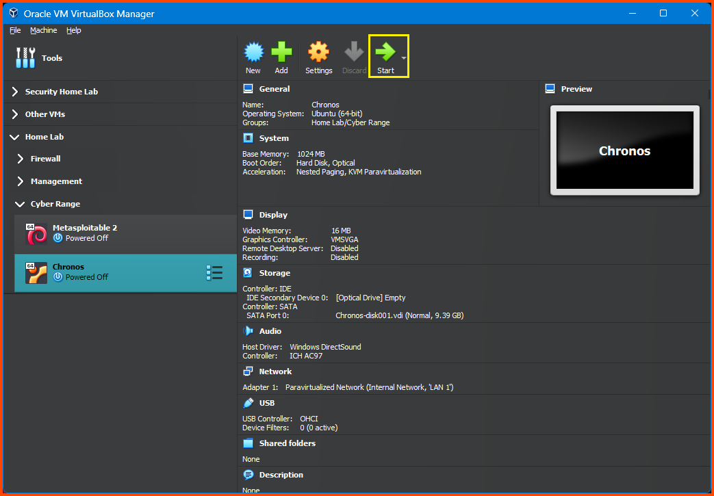

Open the pfSense Web UI in Kali Linux. From the navigation bar select Status and then chose DHCP Leases.


Under the Leases section there should be an entry for Chronos. We can see that it has been assigned the IP `10.6.6.13`.

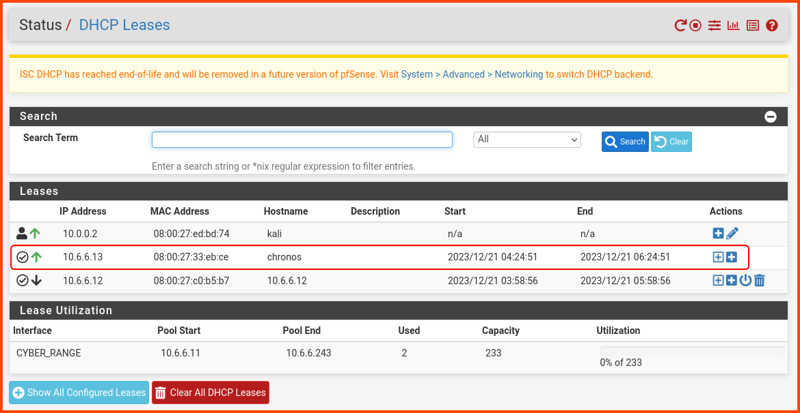

We can ping the VM to test if we are able to connect to it.

```bash
ping 10.6.6.13 -c 5
```


## Adapter Type Selection

In this module you would have noticed that for the Metasploitable 2 VM we did not chose `Paravirtualized Network`. This VM is quite old and does not work properly on that Adapter. 

From a performance point of view the `Paravirtualized Network` is the best and should be used whenever possible. We don't have a way to know in advance a VM will work on a given Adapter. So what I recommend is to always use `Paravirtualized Network` booting up the VM and see if the network is working properly if not shutdown the VM and use a different Adapter.
