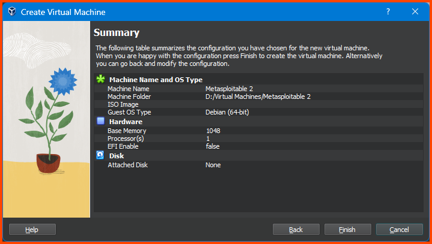
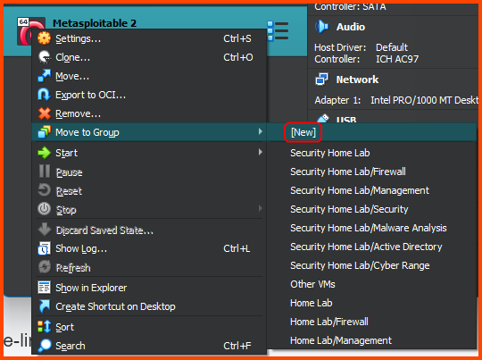
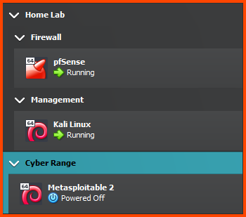
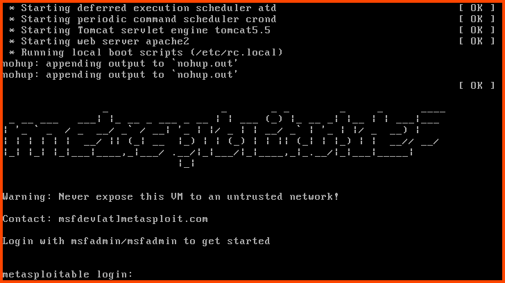
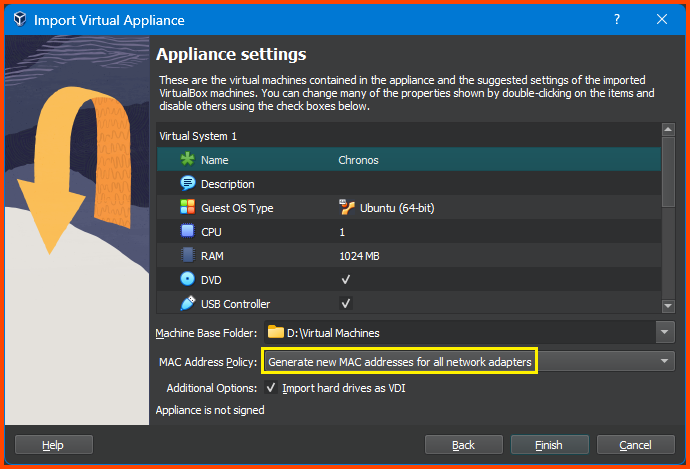
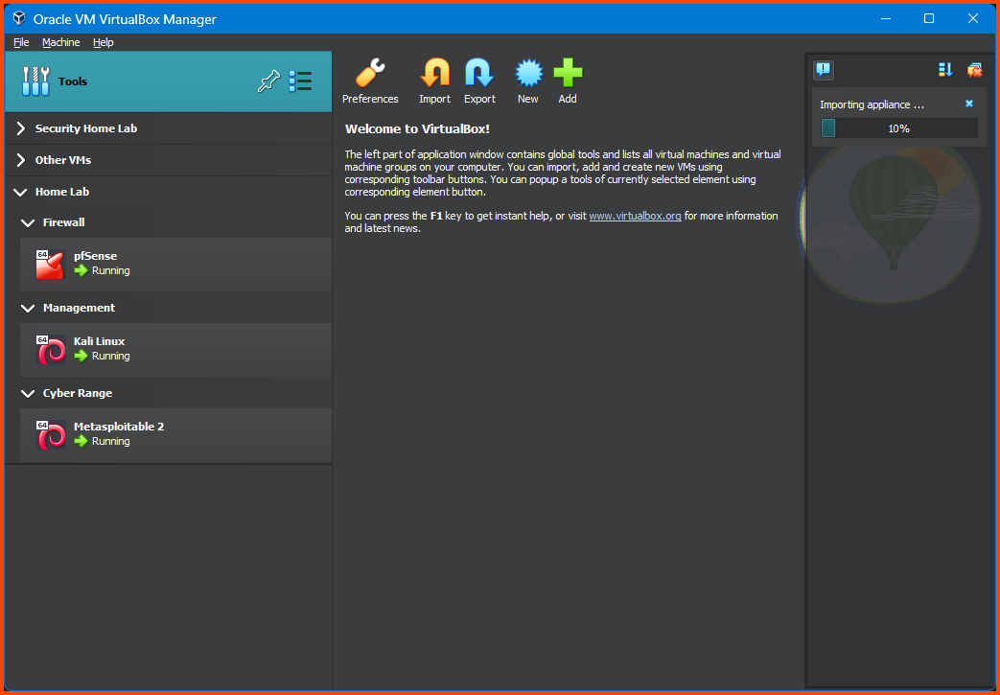
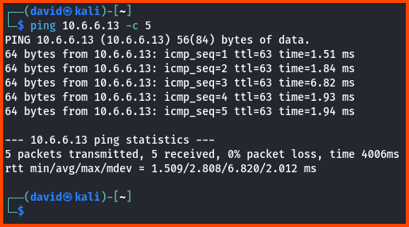

Banner Background by [logturnal](https://www.freepik.com/free-vector/gradient-white-color-background-abstract-modern_34010189.htm) on Freepik  
Hacker Image by [catalyststuff](https://www.freepik.com/free-vector/hacker-operating-laptop-cartoon-icon-illustration-technology-icon-concept-isolated-flat-cartoon-style_11602236.htm) on Freepik

Virtual Machine images present online come in 2 formats - `.vmdk` (Virtual Machine Disk Image) or `.ova` (Open Virtualization Format). In this module, we will step up some vulnerable VMs on the **`CYBER_RANGE`** interface which we can then access using Kali Linux running on the **`LAN`** interface. We will also see how to import `.vmdk` and `.ova` images into VirtualBox.

> [!INFO]
> Boot the pfSense VM if it was turned off before proceeding with the below setup. Once pfSense is up start the Kali Linux VM as well.

## VM 1: Metasploitable 2

### Download Metasploitable 2

Go to the following URL: [Metasploitable: 2 \~ VulnHub](https://www.vulnhub.com/entry/metasploitable-2,29/) and download Metasploitable.


The download is a compressed file (**`.zip`**). Use an extraction software like **`7-zip`** to decompress the file. After extraction, we should have a folder.


The folder will have multiple files. We only require the **`.vmdk`** file.


### Creating the VM

Launch VirtualBox. Select <u>Tools</u> from the sidebar, then click on **`New`** from the toolbar.


Give the VM a <u>name</u>. Ensure that the <u>Folder</u> is set to the location where all the VMs of the Home Lab are going to be saved. Leave the <u>ISO Image</u> option empty. Select the value for <u>Type</u> and <u>Version</u> as shown below and then click on **`Next`**.


> [!NOTE]
> The sites from which the VM images are downloaded will in most cases have details on OS type and Version that can be used in VirtualBox

Reduce the <u>Memory</u> to **`1024MB`** and click on **`Next`**.


Select "<u>Do Not Add a Virtual Hard Disk</u>" and click on **`Next`**.

> [!NOTE]
> The **`.vmdk`** file we downloaded is the Hard Disk. The OS is pre-installed on it. In the next step we will see how to attach to it to the VM we are creating.


Confirm that everything looks correct and click on **`Finish`**.



You will get a <u>Warning</u> as shown in the below image. Ignore it and click on **`Continue`**.


### Adding VM to Group

Right-click on the Metasploitable VM. Select `Move to Group -> [New]`.



Right-click on the group that is created and select **`Rename Group`**. Call the group **`Cyber Range`**.


The output should look as follows:



Right-click on the **`Cyber Range`** group and select `Move to Group -> Home Lab`.


The final output should look as follows:


### Configuring the VM

All my VMs for the Home Lab project are located in **`D:\Virtual Machines`**. Whenever we create a new group in VirtualBox a corresponding folder is created is created on the filesystem to store the VM. 

Since the Metasploitable 2 VM is in the Cyber Range group which is nested inside the Home Lab group the location of the Metasploitable VM on my Hard Drive will be **`D:\Virtual Machines\Home Lab\Cyber Range\Metasploitable 2`**. 

Find the Metasploitable VM folder location in your case and move the downloaded **`.vmdk`** into it. 


Select the VM from the sidebar and then from the toolbar click on **`Settings`**.


Go to **`Storage`** and select **`Controller: SATA`** then click on the small "<u>Add Hard Disk</u>" icon on the right.


This will open the Hard Disk Selector menu. Click on <u>Add</u> and then select the **`.vmdk`** file. Then click on the <u>Choose</u> button to use the Hard Drive.


If done correctly under **`Controller: SATA`** the Hard Disk will be visible.


Go to **`System -> Motherboard`**. For <u>Boot Order</u> ensure that the **`Hard Disk`** is on the top followed by **`Optical`**. Disable **`Floppy`**.  


Go to **`Network -> Adapter 1`**. Change the <u>Attacked to</u> field to **`Internal Network`** and in Name <u>select</u> **`LAN 1`**. Click on **`OK`** to save the changes.


### Testing Connectivity

From the sidebar select Metasploitable 2 and then click on **`Start`**.


Once the VM boots use the following credentials to log in.  
Username: **`msfadmin`**  
Password: **`msfadmin`**



After login use the following command to check if we have an IP address:

```bash
ip a l eth0
```

We can see that we have been assigned the IP **`10.6.6.12`** (IP may be different in your case) which we know is inside the DHCP address range for the **`CYBER_RANGE`** interface.


We can ping Google to test if we have an Internet connection.

```bash
ping google.com -c 5
```


We can do a similar test to check connectivity to the Kali Linux.

```bash
ping 10.0.0.2 -c 5
```


We can also try to reach the Metasploitable 2 VM from Kali Linux.

```bash
ping 10.6.6.12 -c 5
```


## VM 2: Chronos

### Download Chronos

Go to the following URL: [Chronos: 1 \~ VulnHub](https://www.vulnhub.com/entry/chronos-1,735/) and download Chronos.


The downloaded file is a **`.ova`** file.


### Creating the VM

From the VirtualBox sidebar select <u>Tools</u> and then click on **`Import`**.


This will open the Virtual Appliance Import wizard. Click on the folder icon to the right of the <u>File</u> field and then select the downloaded **`.ova`** file then click on **`Next`**.


From this menu, we can change the configuration of the VM as required. I have gone ahead and reduced the <u>RAM</u> to **`1024MB`**. You can change the <u>name</u> of the VM to match your naming convention. For <u>MAC Address Policy</u> ensure that **`Generate new MAC addresses for all network adapters`** is selected. If everything looks right click on **`Finish`**.



The import process can take some time.



### Adding VM to Group

Once the import is complete right-click on the VM and then select **`Move to Group -> Home Lab/Cyber Range`**.


The result result will be as follows:


### Configuring the VM

Select the Chronos VM and then from the toolbar click on **`Settings`**. 


Go to **`System -> Motherboard`**. For <u>Boot Order</u> ensure that **`Hard Disk`** is on the top followed by **`Optical`**. Disable **`Floppy`**. 


Go to **`Network -> Adapter 1`**. For the <u>Attached to</u> field select **`Internal Network`**, for <u>name</u> select **`LAN 1`**. Expand the <u>Advanced</u> settings option. From <u>Adapter Type</u> select **`Paravirtualized Network (virtio-net)`**. Click **`OK`** to save the changes.


### Testing Connectivity

Select the Chronos VM and from the toolbar select **`Start`**. Once the VM starts we should see the login screen. The credentials for this machine are not known so we cannot log in and check if it has been assigned an IP address.


On the Kali Linux VM open the pfSense Web Portal. From the navigation bar select **`Status -> DHCP Leases`**.


Under the Leases section, there should be an entry for Chronos. We can see that it has been assigned the IP **`10.6.6.13`**.


From Kali, we can ping the VM to test if we can connect to it.

```bash
ping 10.6.6.13 -c 5
```



> [!INFO] Adapter Type Selection
> You would have noticed that for the Metasploitable 2 VM we did not chose **`Paravirtualized Network`**. This VM is quite old and does not work properly on that Adapter. Windows VMs also don't work on **`Paravirtualized Network`** Adapter.  
> From a performance point of view **`Paravirtualized Network`** is the better choice. We don't have a way to know in advance if a Linux VM will work on the Adapter. So what I recommend is to first select **`Paravirtualized Network`** booting up the VM and check if the network is working properly if not shutdown the VM and select a different Adapter.
