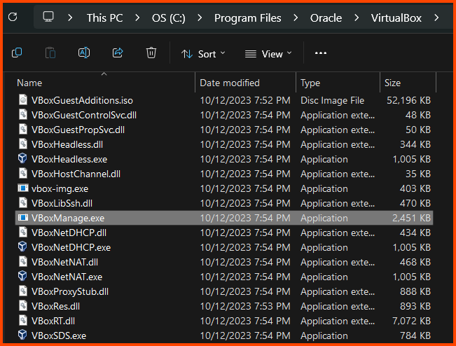
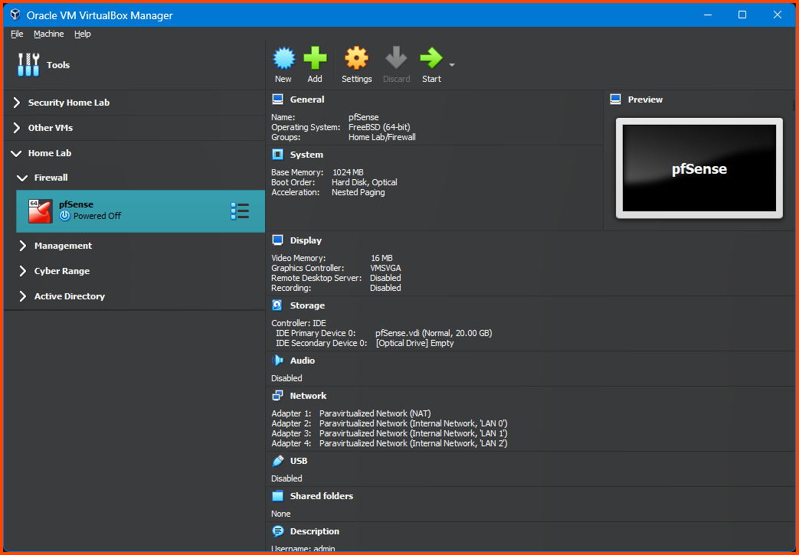
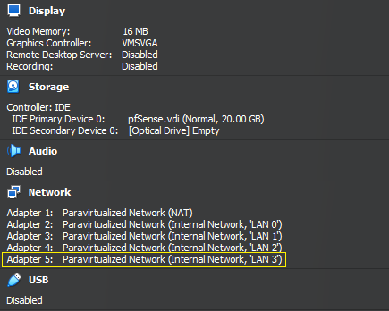
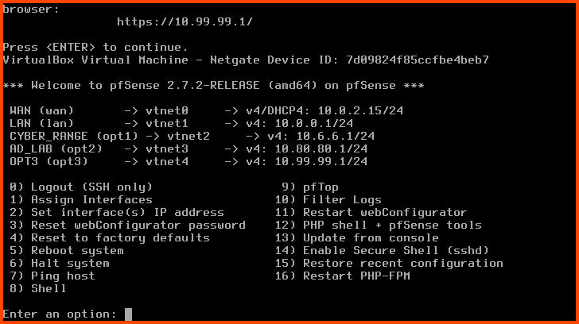
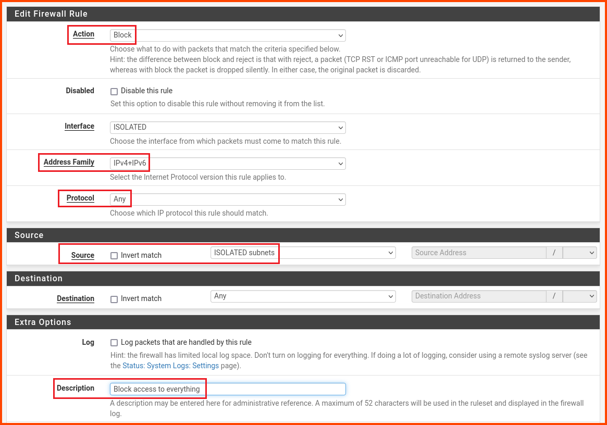

Banner Background by <a href="https://www.freepik.com/free-vector/gradient-white-color-background-abstract-modern_34010189.htm#query=simple%20backgrounds&position=28&from_view=search&track=ais&uuid=96e36b2e-64b3-42e2-8fd8-4fd18a6e1d5d">logturnal</a> on Freepik  
Hacker Image by <a href="https://www.freepik.com/free-vector/hacker-operating-laptop-cartoon-icon-illustration-technology-icon-concept-isolated-flat-cartoon-style_11602236.htm#page=2&query=hacker&position=28&from_view=search&track=sph&uuid=070b0d8a-d045-434d-9a51-f239e46d5f17">catalyststuff</a> on Freepik

In the module we are going to create a Malware Analysis Lab. This lab will consist of two VMs. One of the VM will run Windows will the other one will run Linux. More we start with the VM configuration we will have a look at VirtualBox CLI.

## Creating New Interface

VirtualBox GUI does not allow us to creating more than four Network Interface for a VM. 


However, we can actually configure up to 8 interface per VM. To add more than 4 
interface we have to utilize the VirtualBox CLI.

### VirtualBox CLI

The CLI binary is called `VBoxManage.exe`.



Before using the CLI we need to add it location as an environment variable.  
VirtualBox is by default installed  in: `C:\Program Files\Oracle\VirtualBox`.

Open Search and type "Environment". Click on "Edit environment variables for your account".


In the top window select the variable named "Path" and then click on "Edit".


Click on "New" and then paste the VirtualBox install location. Click on Ok.


Click on Ok to close the Environment Variables menu.

To test if the variable was added successfully open PowerShell. Then enter the following command:

```powershell
# List all installed VMs
VBoxManage.exe list vms
```


### Creating new Interface

Before we create the new interfaces we need to know the name of the pfSense VM. Additionally, ensure that is VM is "Powered Off".



To create the interface running the following commands:

```powershell
# Create a Internet Network
VBoxManage modifyvm "pfSense" --nic5 intnet

# Use the Paravirtualized Adapter
VBoxManage modifyvm "pfSense" --nictype5 virtio

# Give it the name LAN 3
VBoxManage modifyvm "pfSense" --intnet5 "LAN 3"

# Network Interface is connected by Cable
VBoxManage modifyvm "pfSense" --cableconnected5 on
```

**Note:** In the above commands "pfSense" is the name of my VM. In the 3rd command in place of "LAN 3" you can use a different name.


Now of we look at the overview of the pfSense VM we should see Adapter 5.



### Adding the Interface

Start the pfSense VM. On boot you will notice that there is still only 4 interfaces. The new interface needs to be onboarded before it shown up.


Enter `1` to select "Assign Interfaces".  
Should VLANs be set up now? `n`


Enter the WAN interface name: `vtnet0`  
Enter the LAN interface name: `vtnet1`  
Enter the Optional 1 interface name: `vtnet2`  
Enter the Optional 2 interface name: `vtnet3`  
Enter the Optional 3 interface name: `vtnet4`


Do you want to proceed?: `y`


The new interface has been added. Now we need to assign the interface an IP address.


Enter `2` to select "Set interface(s) IP address". Enter `5` to select the new interface. 


Configure IPv4 address OPT3 interface via DHCP?: `n`  
Enter the new OPT3 IPv4 address: `10.99.99.1`  
Enter the new OPT3 IPv4 subnet bit count: `24`  

For the next question press Enter since we are configuring a LAN interface.


Configure IPv6 address OPT3 interface via DHCP6: `n`  
For the new OPT3 IPv6 address question press Enter.  
Do you want to enable the DHCP server on OPT3?: `y`  
Enter the start address of the IPv4 client address range: `10.99.99.11`  
Enter the end address of the IPv4 client address range: `10.99.99.243`  
Do you want to revert to HTTP as the webConfigurator protocol?: `n`


Now interface OPT3 will have an IP address.



### Renaming Interface

Launch the Kali Linux VM that is configured on the LAN interface. Login to the pfSense web portal. From the navigation bar select `Interfaces -> OPT3`. 


In the description field enter `ISOLATED`. Scroll to the bottom and click on Save.


Click on Apply Changes in the popup that appears to persist the changes.


### Interface Firewall Configuration

From the navigation bar click on `Firewall -> Rules`.


Select the ISOLATED tab. This interface will not have any rules configured. Click on the "Add" button to create a new rule.


Change the values as follows:  
Action: `Block`  
Address Family: `IPv4+IPv6`  
Protocol: `Any`  
Source: `ISOLATED subnets`  
Description: `Block access to everything`

Scroll to the bottom and click on Save.



In the popup click on Apply Changes to persist the new rule.


**Note**: Since this Interface is going to be used for Malware Analysis we are blocking network access. This will ensure that the malware does not spread to other systems using the network.

## Flare VM Setup

To install Flare we first need to configure a Windows machine. Flare can be setup on most modern versions of Windows. Since we already have the ISO for Windows 10 Enterprise I will be using it to configure Flare.

## REMnux VM Setup
