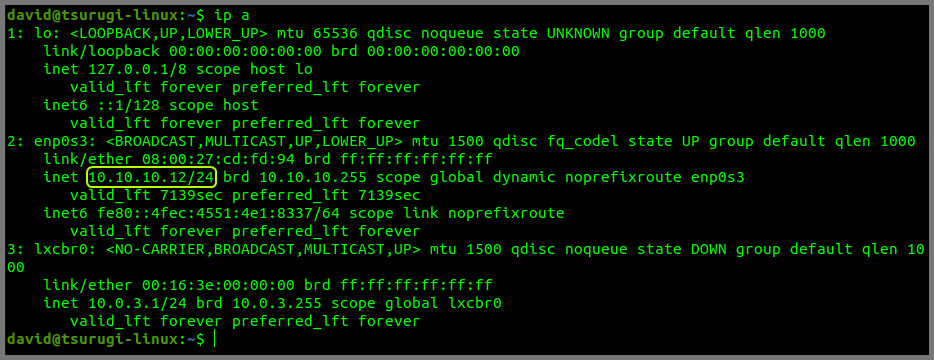
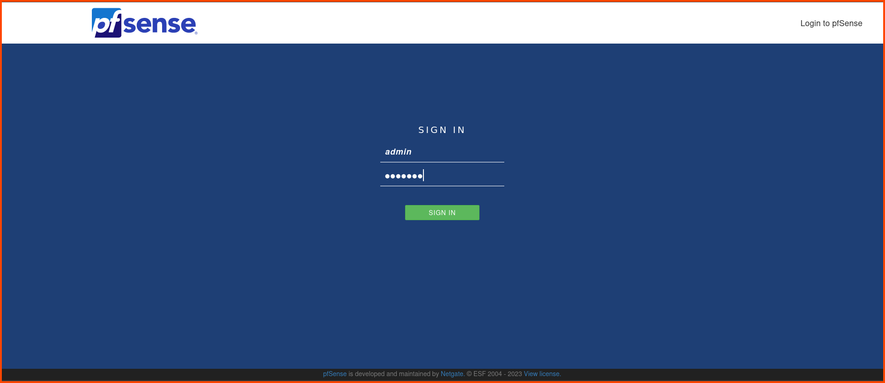
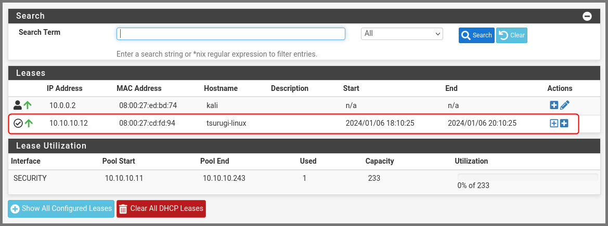
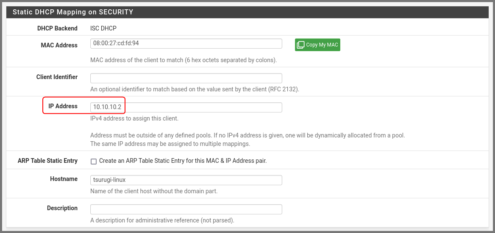
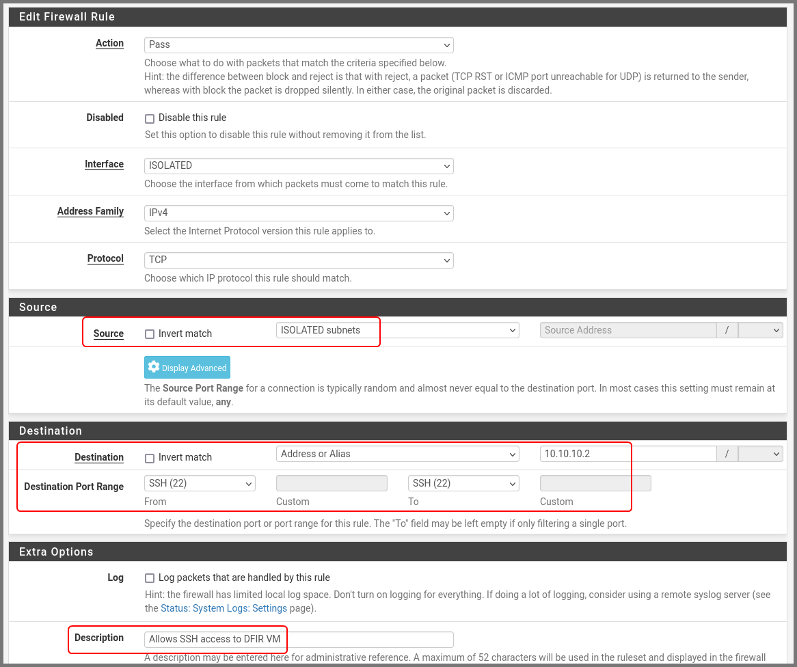
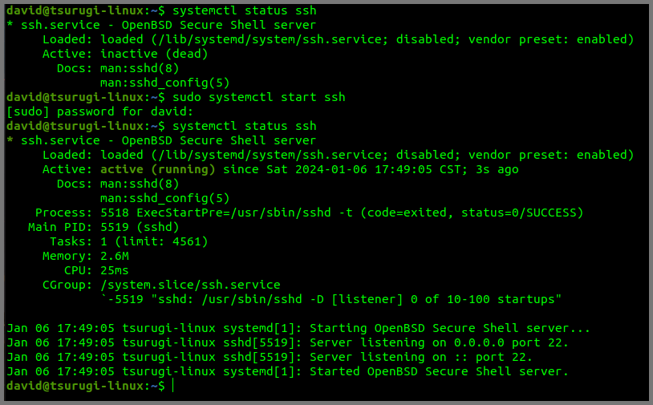
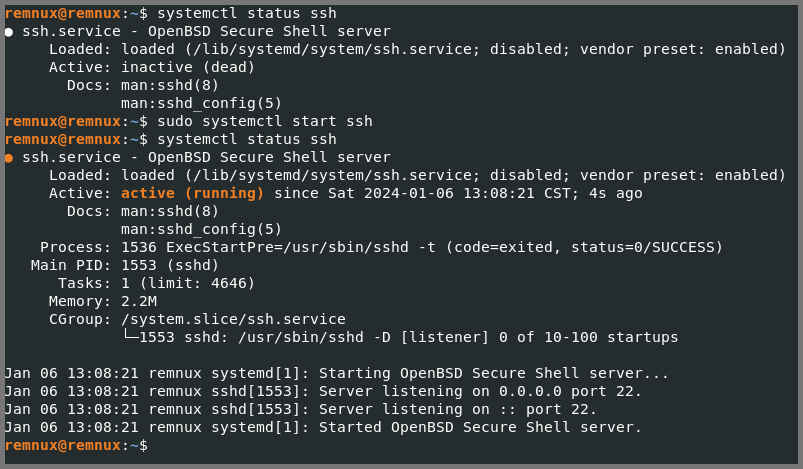
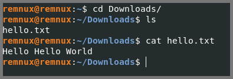

---
categories:
  - Security
  - Home Lab
date: 2024-02-03 20:15:00 -0600
description: A step-by-step guide for building your very own Cybersecurity Home Lab using VirtualBox
img_path: /assets/
published: false
tags:
  - security
  - home-lab
  - virtualbox
  - networking
  - malware
title: "Building a Virtual Security Home Lab: Part 11 - Transferring Files to Malware Analysis Lab"
---


Banner Background by [logturnal](https://www.freepik.com/free-vector/gradient-white-color-background-abstract-modern_34010189.htm) on Freepik  
Hacker Image by [catalyststuff](https://www.freepik.com/free-vector/hacker-operating-laptop-cartoon-icon-illustration-technology-icon-concept-isolated-flat-cartoon-style_11602236.htm) on Freepik

In module module, we will see how we can transfer files using SCP from "Tsurugi Linux" which is on the SECURITY subnet to VMs on the ISOLATED subnet. 

I recommend this approach to get Malware Samples into the Malware Analysis Lab. We can use other methods for transferring files to these VMs but since we are dealing with Malware Samples I want to keep the samples far from the Internet and the host machines filesystem.

## Tsurugi Linux Static IP Assignment

Start the pfSense VM if it was Shutdown. Once pfSense is up and running. Start the Tsurugi Linux VM. One the terminal and run the following command:

```bash
ip a
```



Tsurugi Linux has been assigned the IP Address 10.10.10.12 by the DHCP server.

Start the Kali Linux VM and login into the pfSense Web UI.



From the navigation bar select **`Status -> DHCP Leases`**.


In the Leases section find Tsurugi Linux. Click on the hollow "+" icon (Add Static IP) on the right hand side.



In the IP Address field enter 10.10.10.2. Scroll to the bottom and click on Save.



A popup will appear at the top. Click on Apply Changes.


### Refreshing Tsurugi Linux IP Address

On Tsurugi Linux from the terminal run the following command:

```bash
# Disable and then Enable the Network Adapter
sudo ip l set enp0s3 && sudo ip l set enp0s3 up
```

Restarting the adapter will cause the dynamic IP that was assigned to the VM to be release. Run the following command to confirm the VM is using the configured static IP.

```bash
ip a enp0s3
```


Refresh the DHCP Leases page and we should see that Tsurugi Linux is now using the IP address that we configured. 


## pfSense Firewall Configuration





## Enabling SSH

### Tsurugi Linux



### Flare VM (Windows)

[How to SSH into a Windows 10 Machine from anywhere - Scott Hanselman's Blog](https://www.hanselman.com/blog/how-to-ssh-into-a-windows-10-machine-from-linux-or-windows-or-anywhere)


### REMnux Linux



## Testing SSH Connectivity

### Finding Target VM IP Address


### Connecting to Flare VM


### Connecting to REMnux Linux


## SCP File Transfer

### File Transfer to Flare VM


### File Transfer to REMnux Linux




## Disabling SSH

### Tsurugi Linux


### Flare VM (Windows)


### REMnux Linux


