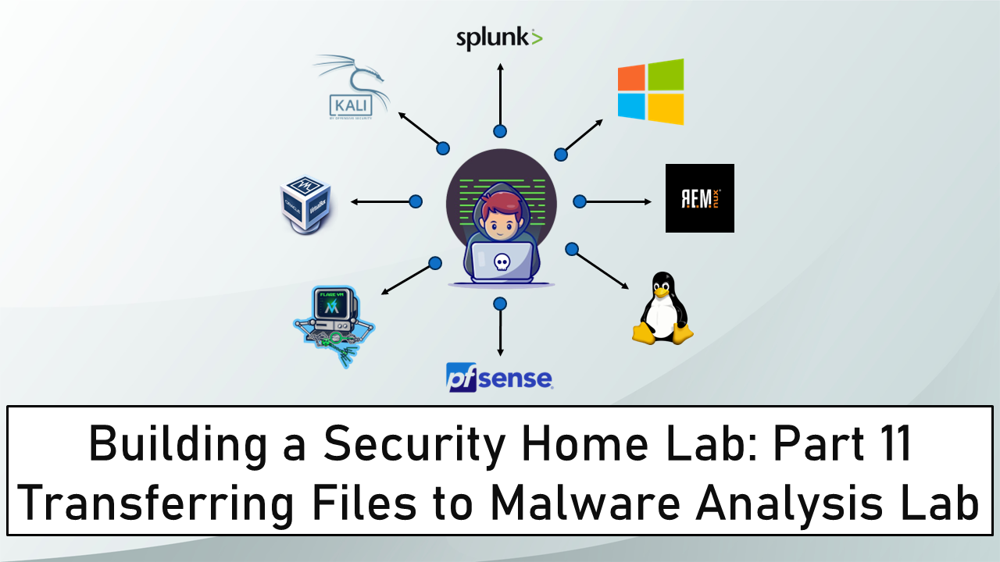
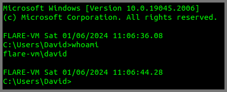
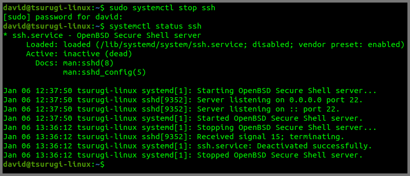
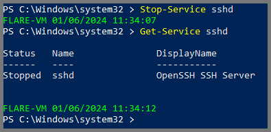

---
categories:
  - Security
  - Home Lab
date: 2024-02-19 13:10:00 -0600
description: A step-by-step guide for building your very own Cybersecurity Home Lab using VirtualBox
img_path: /assets/
published: true
tags:
  - security
  - home-lab
  - virtualbox
  - networking
  - malware
title: "Building a Virtual Security Home Lab: Part 11 - Transferring Files to Malware Analysis Lab"
---



Banner Background by [logturnal](https://www.freepik.com/free-vector/gradient-white-color-background-abstract-modern_34010189.htm) on Freepik  
Hacker Image by [catalyststuff](https://www.freepik.com/free-vector/hacker-operating-laptop-cartoon-icon-illustration-technology-icon-concept-isolated-flat-cartoon-style_11602236.htm) on Freepik

In this module, we will see how we can transfer files using SCP from "Tsurugi Linux" which is on the **`SECURITY`** subnet to VMs on the **`ISOLATED`** subnet. 

I recommend this approach to get Malware Samples into the Malware Analysis Lab. We can use other methods for transferring files to these VMs but since we are dealing with Malware I want to keep the samples isolated from the Internet and the host machine filesystem.

## Tsurugi Linux Static IP Assignment

Start the pfSense VM if it is shut down. Once pfSense is up and running. Start the Tsurugi Linux VM. One the terminal and run the following command:

```bash
ip a
```


Tsurugi Linux has been assigned the IP Address **`10.10.10.12`** by the DHCP server.

Start the Kali Linux VM and log into the pfSense Web UI.


From the navigation bar select **`Status -> DHCP Leases`**.


In the **`Leases`** section find Tsurugi Linux. Click on the hollow "+" icon (Add Static IP) on the right-hand side.


In the <u>IP Address</u> field enter **`10.10.10.2`**. Scroll to the bottom and click on **`Save`**.


A popup will appear at the top. Click on **`Apply Changes`**.


### Refreshing Tsurugi Linux IP Address

On Tsurugi Linux from the terminal run the following command:

```bash
# Disable and then Enable the Network Adapter
sudo ip l set enp0s3 down && sudo ip l set enp0s3 up
```

Restarting the adapter will cause the dynamic IP that was assigned to the VM to be released. Run the following command to confirm the VM is using the configured static IP.

```bash
ip a enp0s3
```


Refresh the DHCP Leases page and we should see that Tsurugi Linux is now using the IP address that we configured. 


## pfSense Firewall Configuration

From the navigation bar select **`Firewall -> Rules`**.


Go to the **`ISOLATED`** subnet tab. Click on the "<u>Add rule to the top of the list</u>" button.


Enter the details as shown below:  
Source: **`ISOLATED subnets`**  
Destination: **`Address or Alias - 10.10.10.2`**  
Destination Port Range: **`SSH (22)`**  
Description: **`Allows SSH access to DFIR VM`**


A popup will appear at the top of the page. Click on **`Apply Changes`**.


The final firewall rules will look as follows:


## Enabling SSH

### Tsurugi Linux

Run the following command to check if SSH is running.

```bash
systemctl status ssh
```

If SSH is disabled use the following command to enable it.

```bash
sudo systemctl start ssh
```


### Flare VM (Windows)

Right-click on the Start menu icon. Select **`Windows PowerShell (Admin)`**.


Enter the following command to check if the SSH server is running.

```powershell
Get-Service sshd
```

Run the following to enable the SSH server.

```powershell
Start-Service sshd
```

[How to SSH into a Windows 10 Machine from anywhere - Scott Hanselman's Blog](https://www.hanselman.com/blog/how-to-ssh-into-a-windows-10-machine-from-linux-or-windows-or-anywhere)


### REMnux Linux

Running the following commands to check the status of SSH and enable it.

```bash
# Check Status
systemctl status ssh

# Enable SSH
sudo systemctl start ssh
```


## Testing SSH Connectivity

### Finding Target VM IP Address

To connect to Flare VM and REMnux we need their IP address.

```powershell
ipconfig
```


```bash
ip a
```


### Connecting to Flare VM

In my case, the IP address of Flare VM is **`10.99.99.11`**.

Use the following command to remote into Flare VM from Tsurugi Linux.

```bash
# ssh target-system-username@target-system-ip-address
ssh david@10.99.99.11
```

Type **`yes`** to add the fingerprint.  
Enter the password of the target system when prompted.


This will log you into Flare VM.



Type **`exit`** to quit the remote connection.

### Connecting to REMnux Linux

In my case, the IP address for REMnux is **`10.99.99.12`**.

Use the following command to remote into REMnux from Tsurugi Linux.

```bash
# ssh target-system-username@target-system-ip-address
ssh remnux@10.99.99.12
```

Type **`yes`** to add the fingerprint.  
Enter the password of the target system when prompted.


Type **`exit`** to quit the remote connection.

## SCP File Transfer

Now we know that we can connect to the Malware Analysis Lab VMs from Tsurugi Linux. 

To demonstrate how to transfer files from Tsurugi Linux to the Malware Analysis Lab VMs I will use a simple text file. To follow along run the following commands on Tsurugi Linux:

```bash
cd Downloads
echo "Hello Hello World" > hello.txt
cat hello.txt
```

### File Transfer to Flare VM

To transfer **`hello.txt`** to the target systems we will use SCP which is can command line utility that uses SSH to securely copy files over the network.

Run the following command to copy the file to Flare VM.

```bash
# scp file-to-copy target-ysername@target-ip-address:destination-path
scp hello.txt david@10.99.99.11:/C:/Users/David/Downloads
```


The above command will copy the file into the Downloads folder on Flare VM.


### File Transfer to REMnux Linux

Using the same command we can move the file onto REMnux as well.

```bash
# scp file-to-copy target-ysername@target-ip-address:destination-path
scp hello.txt remnux@10.99.99.12:~/Downloads
```


The above command will copy the file into the Downloads folder on REMnux.


> [!INFO]
> To copy a whole folder use the **`-r`** (recursive) flag with the SCP command  
> [SCP Linux - Securely Copy Files Using SCP examples](https://linuxblog.io/linux-securely-copy-files-using-scp/)

## Disabling SSH

Once you copy the required files onto the Malware Analysis lab use the following commands to disable SSH on all the systems.

### Tsurugi Linux

```bash
sudo systemctl stop ssh
```



### Flare VM (Windows)

```powershell
Stop-Service sshd
```



### REMnux Linux

```bash
sudo systemctl stop ssh
```


