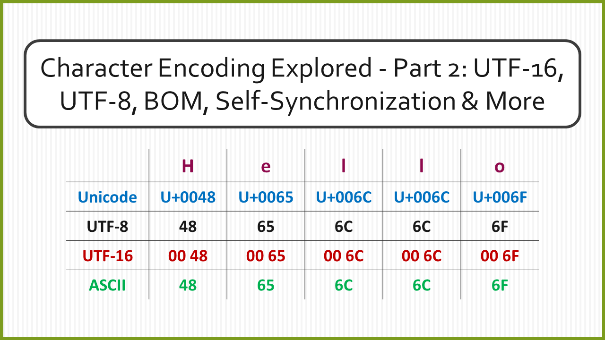
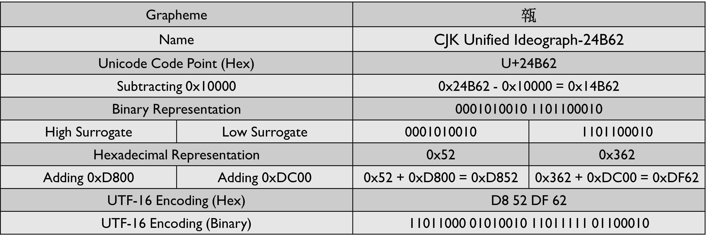
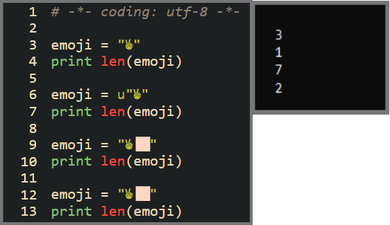

In is module we will continue from where we left off in the last part. We start by going over the remaining Unicode encoding schemes. We will then spend some time discussing the BOM character and Unicode-aware functions. Finally, we will conclude by covering what it means for a character encoding to be self-synchronizing.

<iframe
	width="560" height="315" src="https://www.youtube-nocookie.com/embed/uTJoJtNYcaQ?si=v-f7SRNJyeXQ3jpu" title="YouTube video player" frameborder="0" allow="accelerometer; autoplay; clipboard-write; encrypted-media; gyroscope; picture-in-picture; web-share" allowfullscreen>
</iframe>

#### UTF-16 Encoding
This encoding scheme was created to solve the space inefficiency of UTF-32. The original 2-byte character encoding was UCS-2. It utilized 16 bits to represent the characters from the Unicode character set. A stream of 16 bits is called a “word”. Since all the graphemes could be represented using 2 bits, it was a fixed-length encoding scheme.

[UTF-16 - Wikipedia](https://en.wikipedia.org/wiki/UTF-16)

Before 2000 ~50,000 graphemes were assigned a code point in Unicode (Unicode 3.0). USC-2 could easily encode all these graphemes. Using 2 bits, ~65,000 graphemes can be represented in UCS-2. With every subsequent version of Unicode, numerous additional graphemes were added. Soon we had graphemes that had code points that fall outside the ~65,000 (U+FFFF) range. It was no longer possible to represent all the characters in Unicode, in just 16 bits. 

To remedy this issue, a new encoding UTF-16 was proposed. UTF-16 introduced the concept of surrogate pairs. Any character that was too large to be represented in 16 bits was represented using a surrogate pair. A surrogate pair was made of two 16-bit chunks. The 1st 16-byte chunk is called the high surrogate, the 2nd 16-byte chunk is called the low surrogate. Graphemes that are in the range `U+0000-U+FFFF` are encoded in the same way as USC-2. UTF-16 represents all characters in Unicode using 2 or 4 bytes. Since the encodings are of variable length, it is a variable-length encoding scheme.

The algorithm for encoding graphemes that are beyond `0xFFFF` is as follows:
* Subtract `0x10000` from the Unicode point of the grapheme.
* Convert the result into binary. The result will always consist of 20 bits.
* Split the binary number into two 10-bit chunks. These chunks will form the high and low surrogate.
* Add `0xD800` to the high surrogate to get the final high surrogate value.
* Add `0xDC00` to the low surrogate to get the final low surrogate value.

[How does UTF-16 encoding use surrogate code points? - Stack Overflow](https://stackoverflow.com/questions/66605467/how-does-utf-16-encoding-use-surrogate-code-points)

The value of the high surrogate will always be in the range `0xD800` - `0xDBFF`  
The value of the low surrogate will always be in the range `0xDC00` - `0xDFFF`

While UTF-16 was a big improvement over UTF-32, there was still room for improvement. If we do a frequency analysis on the characters that are most commonly used in text, we find that the majority of them are Latin characters. Latin characters could be represented using 8 bits when ASCII was used. Also, similar to UTF-32, UTF-16 is not backward compatible with other systems. UTF-16 is a good choice for encoding text that predominately contains CJK characters.

#### UTF-8 Encoding
This encoding scheme was created to solve the shortcomings of UTF-32 and UTF-16. UTF-8 maps, code points to between 1 and 4 bytes. Small code points can be represented using 1 byte, which saves a lot of space. Larger code points can take anywhere from 2 to 4 bytes. Since the length of the encoding is not fixed, UTF-8 is a variable-length encoding scheme.

[UTF-8 - Wikipedia](https://en.wikipedia.org/wiki/UTF-8)

UTF-8 is backward compatible with ASCII. All the graphemes that are represented in ASCII have the same code point and encoding in UTF-8. Because of this, UTF-8 encoding can be used to communicate with programs that only understand ASCII. Old programs can read UTF-8 encoded characters without even knowing it is UTF-8. Do note that this only works when the communication uses characters that are present in ASCII. UTF-8 also ensures that code points do not have 8 consecutive 0s.

The drawback of UTF-8 is its variable length. Since each grapheme is encoded using a variable length scheme, the decoding process cannot be performed in constant time. Indexing into a UTF-8 encoded stream to find the nth character is also challenging, as jumping around the stream using a fixed-size hop is not possible. This does introduce a slight impact on performance, but we don't have to worry about it.

UTF-8 is the most widely used Unicode encoding scheme. The small code points in UTF-8 are used to represent English letters, and the larger code points are used to represent the letters from other writing systems. Because of this, English text can be represented using fewer bytes as compared to other languages. This does give English text an edge in space-efficiency over other languages when using UTF-8. This is an unfortunate consequence of English being the most widely used language on the internet because of ASCII and the early development of computers being predominantly concentrated in the US and UK.

The 1st 127 Unicode graphemes map 1-to-1 with Extended ASCII. These graphemes are represented in UTF-8 using a 1 byte. Since all the graphemes in this range can be encoded with 7 bits, a 0 is added to the left of the string to make it 8 bits (1 byte).

Graphemes in the range 128 to 1,919 are encoded in UTF-8 using 2 bytes. The left 3 bits of the 1st byte is set to `110`. The left 2 bits of the 2nd byte is set to `10`. The binary representation of the Unicode code point should be padded to be 11 bits long before encoding it to UTF-8.

The same pattern is used for encoding the graphemes that fall in the other two ranges. You would have observed that for graphemes that require more than 1 byte, the number of 1s in the 1st byte is equal to the number of bytes that will be used. The length of the stream required before performing the UTF-8 encoding is determined by the amount of `x` that is shown in the above image.

Let us take a look at some examples to see how the encoding is performed.

With UTF-8 we will never have 8 consecutive 0s because of this we do not have to worry about the transmission getting terminated prematurely. Since most of the commonly used characters can be represented in 1 byte, UTF-8 is a lot more space-efficient than UTF-16 and UTF-32.

### Unicode Aware Functions

<iframe 
	width="560" height="315" src="https://www.youtube-nocookie.com/embed/jeIBNn5Y5fI?si=Au82ap2gQjwZB36o" title="YouTube video player" frameborder="0" allow="accelerometer; autoplay; clipboard-write; encrypted-media; gyroscope; picture-in-picture; web-share" allowfullscreen>
</iframe>

Let us look at a code snippet from a Python 2 program.

The `len()` function returns the number of bytes in a string which is 3 (shown by the 1st result) rather than the no. of graphemes or code points which is 1. These types of functions are called Unicode Unaware String Functions, as they work on the bytes and are unable to understand the meaning behind them. To make the `len` function Unicode Aware we need to prefix the string with a `u`. After which the `len` function will work as expected (shown by the 2nd result).

The 3rd and 4th strings denote the victory emoji with the color modifier. It is a single grapheme but is represented as 2 by my terminal since it is made of 2 code points. When the Unicode Unaware String Function is used we get the result as 7. This is because the victory emoji and color modifier are represented by 3 and 4 bytes respectively in UTF-8. When the Unicode Aware String Function is used we get the result as 2 which is the number of code points.

### BOM (Byte Order Mark)

BOM is a special usage of the Unicode character `U+FEFF`. This character is called "No Width No-Break Space" in the Unicode standard. It is used at the start of a Unicode-encoded data stream and can provide useful information about the stream.

[Byte Order Mark (BOM) - Wikipedia](https://en.wikipedia.org/wiki/Byte_order_mark)

BOM is primarily used to indicate the endianness of data that is encoded using UTF-16 and UTF-32. The presence of BOM also indicates that the data stream is encoded using Unicode. BOM can also be used to identify the type of Unicode encoding that was used.

**Endianness** is a term used in computer science to represent the order in which bytes of data are stored in memory. Endianness is represented as Big-Endian (BE) or Little-Endian (LE). Let’s say we have a 16-bit number `12345`, which is `30 39` in hexadecimal. In a big-endian system, it would be stored as `30 39`. In a little-endian system, the same number would be stored as `39 30`. 

[Endianness - Wikipedia](https://en.wikipedia.org/wiki/Endianness)

The concept of endianness becomes important when we deal with data that spans multiple bytes (like 16-bit code units in UTF-16 and 64-bit code units in UTF-32). The choice between big-endian and little-endian is often made based on the specific requirements of a system. For instance, network protocols like the TCP/IP use big-endian (Network Byte Order), while many processor architectures (like x86 and ARM) use little-endian (Host Byte Order).

[Network Protocols - Big Endian or Little Endian? - Stack Overflow](https://stackoverflow.com/questions/997571/big-endian-or-little-endian-on-net)

The string "¡Hello World!👍🏻" was used as input for the examples shown below.  

#### UTF-32
In UTF-32 BOM is used to represent the byte order. The BOM character will be encoded as `00 00 FE FF` when UTF-32-BE is used.

BOM will be encoded as `FF FE 00 00` when UTF-32-LE is used. Notice how in UTF-32-LE (the image below) the encoding of all the graphemes is reversed.

#### UTF-16
Similarly, BOM is used in UTF-16 to represent the byte order. The BOM character will be encoded as `FE FF` when UTF-16-BE is used.

BOM will be encoded as `FF FE` when UTF-16-LE is used. Notice how in UTF-16-LE (the image below) the encoding of all the graphemes is reversed.

#### UTF-8
In UTF-8 BOM is not required since each grapheme is encoded using 8 byte code units. The Unicode standard also discourages using BOM with UTF-8. 

However, some applications still add BOM to UTF-8 streams. The BOM in this case is used to denote that the data stream is encoded using UTF-8. BOM will be encoded as `EF BB BF` under UTF-8.

BOM should not be used in UTF-8 data streams that will be read by software that only understands ASCII. Since BOM is not present in ASCII the software reading the data will not be able to decode it. It can also cause display problems in browsers, unwanted characters will get displayed at the top of the web page because BOM was present in the HTML file.

### Self-Synchronizing Encoding

In your studies on character encodings, you might come across encodings that self-synchronizing. But what does it mean to be self-synchronizing? For a stream of encoded characters to be self-synchronizing we should be able to start reading the data at any point and still able to identify where each character begins. Imagine, you are reading a book, you can flip to any page and start reading (decoding) a sentence (encoded data) without needing to know about anything that comes before that sentence. Self-synchronizing character encoding schemes operator in a similar manner.

[Self-synchronizing code - Wikipedia](https://en.wikipedia.org/wiki/Self-synchronizing_code)

This is an important property to consider when choosing a character encoding scheme. Data can sometimes get lost or corrupted during transmission. If the encoding is self-synchronizing, we can still make sense of the remaining data even if some of the data is missing or corrupted. This is analogues to reading a book which has a few pages torn.

#### UTF-32
UTF-32 is self-synchronizing at the byte level. This is because all the Unicode graphemes are encoded using 4 bytes by UTF-32. Even if some error occurs during transmission and some of the 32-bit data is corrupted or changed, we can still decode the remaining data by jumping to the next 4-byte boundary. In UTF-32 it is possible to decode corrupted characters but the encode will result in a character that is different from the one that was originally encoded.

In other words, UTF-32’s self-synchronization comes from its consistency - each character takes up the same amount of space. However, as discussed earlier UTF-32 is not space-efficient, especially for graphemes that can be represented with fewer bytes in UTF-8 and UTF-16. This is why UTF-32 is not commonly used for transmitting data. It’s mainly used in internal processing where the fixed width of characters can simplify certain operations.

#### UTF-16
UTF-16 is self-synchronizing at the 16-bit code unit level. It is important to note that it is different from UTF-8 and UTF-16 which are self-synchronizing at the byte level. 

If we read a sequence of 16-bit code units (not bytes), we can identify the start of a character based on the value of each code unit. If it is in the range `0xD800—0xDBFF`, it's the high surrogate pair. If it’s in the range `0xDC00—0xDFFF`, it’s the low surrogate pair. If it’s in neither of those ranges, it’s a standalone character. Even if the data were to get changed in transmission, when we read the stream we might misinterpret a 16-bit code unit but when we read the next unit we can correctly identify it as its value will be in the high surrogate, low surrogate or standalone character range.

On the other hand, If we start reading from the middle of a UTF-16 encoded sequence of bytes, in chunks of 8-bits we will not be able to determine if we are at the start of a 16-bit unit or in the middle of one. This is especially problematic in systems that do not read data in 16-bit units.

This makes UTF-16 more fragile in comparison to UTF-8. This is one of the reasons why UTF-8 is generally preferred for transmitting and storing text data, even though UTF-16 can be more space-efficient for scripts like Chinese, Japanese, and Korean.

#### UTF-8
UTF-8 is self-synchronizing at the byte level. In UTF-8 all characters are represented by 1 to 4 bytes. The 1st byte of each character has a specific pattern that represents the number of bytes that make up each character. The pattern has been discussed in detail in the UTF-8 Encoding section. This pattern is what allows UTF-8 to self-synchronize.

Let’s consider the grapheme `A`. In UTF-8, it is represented in a single byte (`01000001`). If you start reading at this byte, you can tell it’s the start of a 1-byte character because it begins with a `0`.

If we have a grapheme like `©` (the copyright symbol). In UTF-8, it would be represented using 2 bytes (`11000010 10101001`). If you start reading at the first byte, you can tell it’s the start of a 2-byte character because it begins with `110`. If you start reading at the second byte, you can tell it’s not the start of a character because it begins with `10`.

Assume we have a sequence of UTF-8 encoded characters, and an error causes one byte to be changed. When we read this sequence, we will misinterpret the character. However, when we read the next byte, we can identify it correctly because its first byte will have the correct pattern. Because of this, the error is isolated to the character where it occurred and doesn’t cause us to misinterpret the remaining characters in the sequence.

This property of UTF-8 makes it robust against transmission errors and is one of the reasons why it’s widely used for transmitting and storing text data.

### Conclusion

To wrap up, in the 1st part we went over some of the terminologies that are used to explain character encoding concepts. Then we looked at ASCII and Extended ASCII which were 2 encoding schemes that were used extensively in the early days of the Internet. Then we dived into Unicode and why we required a new standard to represent characters. We covered some topics related to the Unicode code space like planes and blocks. Finally, we went over UTF-32 a fixed-length character encoding scheme supported by Unicode.

In this module, we discussed UTF-16 and UTF-8 which are both variable-length character encoding schemes. We took a look at Unicode Aware Functions. Then we discussed the BOM character which is used to denote the endianness of text in Unicode encoding. Finally, we had a brief discussion on self-synchronizing character encodings and why they are better than encodings that require external synchronization.
