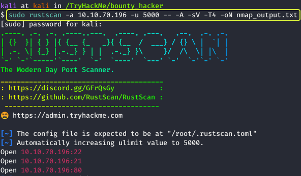
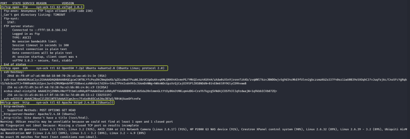
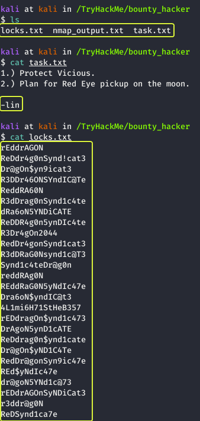
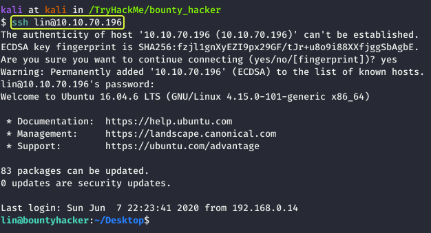

### Task 1 : Living up to the title

1. **Deploy the machine.**

> No answer required

The first task that is performed when we are given an target to exploit is to find the services that are running on the target. To find services running on the machine I will be using "RustScan" which is an port scanner similar to Nmap but much faster (RustScan in ideal conditions can scan all the ports on the device in under 3 seconds). RustScan also integrates with Nmap so we can find open ports quickly with RustScan and then pipe the results to nmap for using Nmap features.

[GitHub - RustScan/RustScan: 🤖 The Modern Port Scanner 🤖](https://github.com/RustScan/RustScan)

#### Command Options

*   **-a :** Target IP Address
*   **-u :** Number of parallel connections to target
*   **-sV :** Service Versioning
*   **-A :** Aggressive Scan
*   **-oN :** Normal output file

**Note:** All the flags after the `--` along with the ports found by RustScan are going to be passed to nmap for processing

#### Nmap Equivalent

> nmap -vvv -p- -Pn -sV -A -oN nmap_output.txt 10.10.70.196

From the scan results we can see that there are three services that are running on the target device.

2. **Find open ports on the machine**

> No answer required

Lets try to access each of the running services one by one and see what we can find. Lets start out with the FTP service that is running on port 21.

Some FTP servers have an option enabled which allows anyone to login and access the files on the server. Nmap has an script that allows us to check if "Anonymous" logins are allowed. Lets use that and see what we get.

We can see from the results that Anonymous FTP Logins are allowed. Now lets connect to this server and see if we get any useful files.

After logging into the FTP server as Anonymous and listing the files in the directory we see that there are two files on the server. Lets download them onto our system. This can be done using the "mget" command which allows to download multiple files.

[List of FTP Commands for Linux and UNIX \| Serv-U](https://www.serv-u.com/linux-ftp-server/commands)

**Note:** The \* after mget is an wildcard character which stands for all. So here we are telling mget to download all the files. Another thing to note here is that mget does not ask for an destination folder so whatever folder we where in before we started the FTP connection that's the location where the downloaded files are going to be saved.

Lets go ahead and look at the contents of the files.

We see that "tasks.txt" was written by an user called "lin" and the contents of the "locks.txt" file looks like a list of passwords which maybe we can used to gain SSH access into the system (SSH was discovered to be running on the system from the initial scan).

3. **Who wrote the task list?**

> lin

4. **What service can you bruteforce with the text file found?**

> SSH

One of the best tools to try and brute force passwords for online services is THC-Hydra so lets us it.

[A Detailed Guide on Hydra - Hacking Articles](https://www.hackingarticles.in/comprehensive-guide-on-hydra-a-brute-forcing-tool/)

[GitHub - vanhauser-thc/thc-hydra: hydra](https://github.com/vanhauser-thc/thc-hydra)

#### Command Options

*   -**l :** Username
*   **-P :** List of passwords to use for bruteforcing

**Note:** And the end of the command we specify the service that we want to crack. If the service is running on a non default port then we could use the port number in place of the service name as well.

From the results we can see that we have succeeded in finding the password for the user lin. Lets use that to login into the system using SSH.

5. **What is the users password?**

> RedDr4gonSynd1cat3

Lets list the files that are present in the current directory and see if any flags are present.

6. **user.txt**

> THM{CR1M3_SyNd1C4T3}

Now that we have gained access into the system our next task is to find an way to elevate our privileges and become the root user. Lets see which commands do we have perform to run on the system.

Looks like we have permission to run the "tar" utility on the system that to as the root user. Whenever there is an system binary that could be exploited we should visit "GTFOBins". If the binary can be exploited they will have instructions on how that can be done.

[GTFOBins](https://gtfobins.github.io/)

When we go to the page for the "tar" binary and look under the Sudo section we see an command that can be executed which if successful will spawn an new shell as the root user. Lets try it out and see if it works.

Capture the Flag for the root user and we are done with the box

7. **root.txt**

> THM{80UN7Y_h4cK3r}

Happy Hacking :)