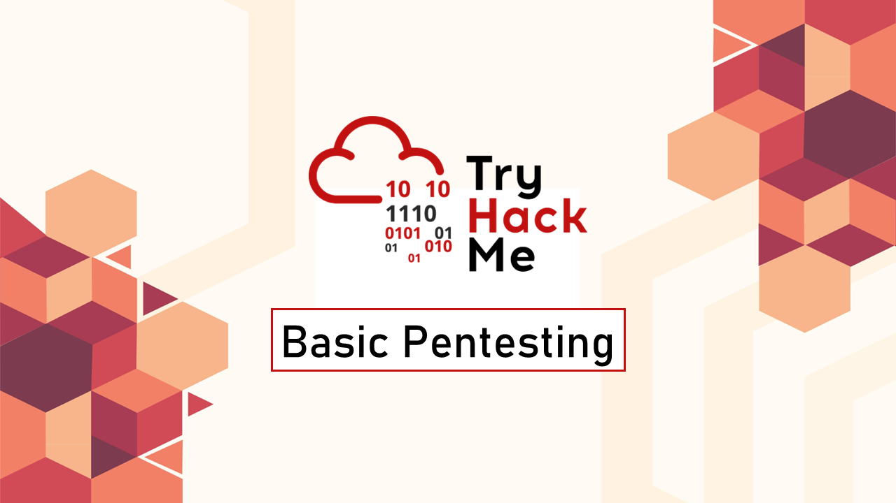
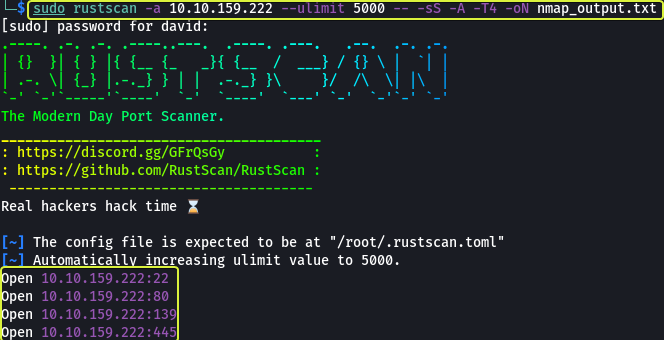
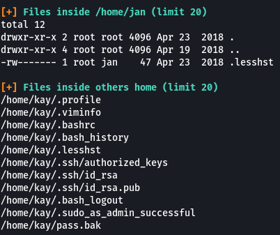
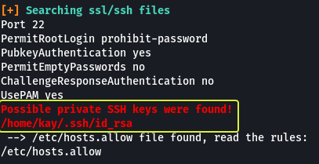
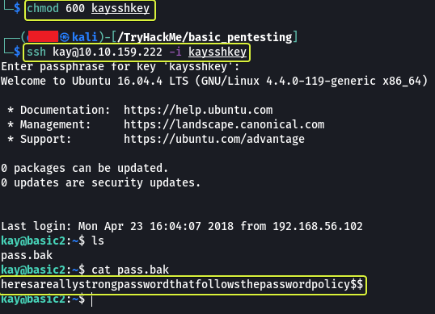
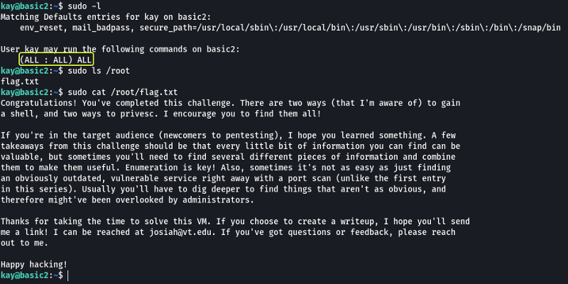

Cover Image by [BiZkettE1](https://www.freepik.com/free-vector/modern-business-background-with-geometric-shapes_5287944.htm) on Freepik

In this set of tasks you'll learn the following:
*   Brute Forcing
*   Hash Cracking
*   Service Enumeration
*   Linux Enumeration

The main goal here is to learn as much as possible. Make sure you are connected to our network using your [OpenVPN configuration file](https://tryhackme.com/access).

## Task 1: Web App Testing and Privilege Escalation

1. **Deploy the machine and connect it to our network**

> No answer required

To find services running on the machine I will be using "RustScan" which is a port scanner similar to Nmap but much faster (RustScan in ideal conditions can scan all the ports on the device in under 3 seconds). RustScan also integrates with Nmap so we can run the port scan quickly with RustScan and then pipe the results to Nmap for using Nmap features.

[GitHub - RustScan/RustScan: 🤖 The Modern Port Scanner 🤖](https://github.com/RustScan/RustScan)



### Command Options

*   **-a:** Target IP Address
*   **--ulimit:** Specify the number of sockets to use for parallelization
*   **-sS:** Stealth Scan (SYN Scan)
*   **-A:** Aggressive Scan
*   **-T4:** Timing Template (Aggressive)
*   **-oN:** Normal output file

**Note:** All the flags after the `--` as well as the ports found by RustScan are going to be passed to Nmap for processing

### Nmap Equivalent

> nmap -vvv -p- -sS -A -T4 -oN nmap_output.txt 10.10.159.222


We can see that ports 22 (SSH), 80 (HTTP), 139 (SMB) and 445 (SMB) are open on the machine.

2. **Find the services exposed by the machine**

> No answer required

Since we know there is a web server running on port 80 let's open that link in your browser and see what we can find.


We see a website that is under maintenance. Let's view the source of the page (Ctrl + U) and see if there are any comments.


We see a comment saying to look at the "dev notes" for more information. There might be a hidden folder on the web server that might give us some clues. To find hidden directories we will have to "brute force" the server. I will be using gobuster in this task (Tools like dirb, dirbuster and feroxbuster will work just fine as well).


### Command Options

*   **dir:** Perform directory brute forcing
*   **-u:** URL of Target
*   **-x:** Extensions of files to find
*   **-w:** Wordlist
*   **-t:** Threads (Used for parallelization)

**Note:** The `2> /dev/null` at the end is used to redirect any errors that might occur during the brute forcing process to `/dev/null` (NULL is a special device on Linux that destroys any data that is sent to it)

For the results, we see that we found a folder called `/development`

3. **What is the name of the hidden directory on the web server(enter the name without /)?**

>development

Let's open the directory and see what we can find


There are two files in the directory which look like the "dev notes" which were hinted to us before in the source of the webpage. We can see that the two developers were talking to each other. The initials for their names are "K" and "J".

A clue that we get from these conversations is that the password of "J" is not very strong and can be cracked easily.

We can try to brute force the Usernames and Passwords at this stage. But that would be highly ineffective (as well will have to try random combinations for both fields) so let's see if we can find the names of the users on the system using any of the open services found on the system.

We know that there is an SMB server that is running on the target. SMB servers have an option that allows anonymous users to log in. Let's see if this setting is enabled and we can access the Share.


As we can see this setting was enabled and we were able to access the Share. We also see that there is a text file that is present let's take a look at its contents.


In the file, some instructions were given to the developers but more importantly, we see that we get the name of two users "Jan" and "Kay". And looking at the initials that we found on the server. We can say that J is Jan and K is Kay.

**Alternate Approach:**

Another way to find the usernames would be to use the enum4linux tool that allows you to Enumerate Windows Machines and Samba Shares.

[GitHub - CiscoCXSecurity/enum4linux: enum4Linux is a Linux alternative to enum.exe for enumerating data from Windows and Samba hosts](https://github.com/CiscoCXSecurity/enum4linux)


The `-a` flag is used to enumerate all the information on the system that can be found using SMB.


After scanning for some time we can see that the usernames "Kay" and "Jan" are found.

Now that we have the usernames and we know that "Jan" has a weak password. Let's try to brute force the SSH login credentials for this user. For this task, I will be using Hydra.


### Command Options

*   **-t:** Number of parallel tasks
*   **-l:** Username
*   **-P:** Wordlist that consists of passwords

At the end of the command the IP Address of the target and the name of the service that we are trying to brute force as specified. After some time we can see that Hydra was able to find the password for the user "Jan".

4. **User brute-forcing to find the username & password**

> No answer required

5. **What is the username?**

> jan

6. **What is the password?**

> armando

Let's login into the server as "Jan" using SSH


7. **What service do you use to access the server(answer in abbreviation in all caps)?**

> SSH

Now that we have access to the system the new task is to enumerate for vulnerabilities that can be used to get root privileges. For this, we can see a tool like LinPEAS that will gather information on the target for us (LinEnum and Linux Smart Enumeration as two other tools that can be used to achieve the same results).

We need to download the LinPEAS file onto the target system so first let's see in which folders the user Jan has permission to write data.


### Command Options

*   **/:** Scan the entire device
*   **-type d:** Scan for directories only (No files)
*   **-maxdepth:** The max depth (subfolders) to scan
*   **-writable:** Check if the current user can write to the folder
*   **-exec:** Execute a command on the results returned by find
*   **ls -l {} +:** List the output in long form ({} is a placeholder for the location where the result of the find command is substituted. The + at the end is used to terminate the -exec command)

There are multiple folders that we can use but I will be making use of the `/var/tmp` folder to download the script.

[PEASS-ng/linPEAS at master · carlospolop/PEASS-ng · GitHub](https://github.com/carlospolop/privilege-escalation-awesome-scripts-suite/tree/master/linPEAS)

After downloading the script on our system (Kali) let's set up an HTTP server using Python which is going to host the file and then use wget to download the file on the target.


Once the file is downloaded change the permission on the file so that it can be executed. Now let's execute the file and see if any attack vectors can be found on the system.

```
./linpeas.sh
```






From the results, we see that there are some hidden files in the home directory of both users. There is an SSH key file that is present in the home directory of Kay and a file called "password.bak" as well.

1. **Enumerate the machine to find any vectors for privilege escalation**

> No answer required

9. **What is the name of the other user you found(all lowercase)?**

> kay

10. **If you have found another user, what can you do with this information?**

> No answer required

Looking at the file that is present in our home directory we see that we don't have sufficient permissions to run the file. And when we try using "sudo" to run the file we see that "Jan" is not part of the sudoers group.


Let's see if we can access the SSH Key of "Kay"


We can read the file. Let's copy the key and save it on a file on your system (Kali) and see if we can log in as the user "Kay".


**Note:** Ensure to change the permissions on the key file to at least 600 or SSH is going to show a warning.


When we try to log in we are asked for a passphrase which we don't know. So we can't log in directly using the key. Let's use John the Ripper and see if we can crack the password for the key.


We have managed to crack the key and get the password.



We could log in this time into the system. From the previous section, we know there is a "password.bak" file in the home directory of Kay. On viewing the file we can see the system password for the user kay. Now that we have the password we should be able to access all the files on the system.

Let's view the permissions that Kay has by using "sudo -l" and see if we can access the root directory on the system as well.



We have the privilege to run all commands on the system. We see that there is a file called "flag.txt" in the home directory of the root user. When we view the content of that file we are presented with a message congratulating us on completion of the challenge.

That's all. Happy Hacking :)