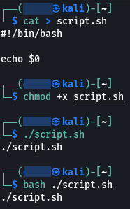
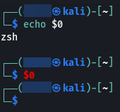

## Level Goal

> After all this `git` stuff its time for another escape. Good luck!

## Commands you may need to solve this level

> sh, man

```
> whatis man  
man (7)              - macros to format man pages
man (1)              - an interface to the system reference manuals

> whatis sh        
sh (1)               - command interpreter (shell)
```

## Helpful Reading Material

[How to Use SUID, SGID, and Sticky Bits on Linux](https://www.howtogeek.com/656646/how-to-use-suid-sgid-and-sticky-bits-on-linux/)

## Solution

As soon as we login into this level we notice that we are not in a bash shell instead we are in a shell called "uppercase shell"


When we try to run any command we see that the command is getting converted to uppercase and so we get an error saying "Command not found"

What we need to understand here is that this shell that we see is nothing but a binary file that takes whatever we enter converts it into uppercase and then has the bash/sh shell execute the command.

```
sh -c "<user-input>"
```

Another thing that we should know about is the variable "$0". This variable holds the name of the file/ script that is being executed. Let us have a look at this using an example.



But if we type `echo $0` directly in the terminal we see that we get the name of the currently used shell. And if we just type `$0` we spawn a new shell.



Now that you understand this let us get back to the question at hand. So since we have understood that the input that we enter is converted to uppercase and then executed by the bash/sh shell. We can use the logic that we saw in the above example. Pass `$0` to the shell and we should spawn a new shell. This will internally (in the binary) look as follows:

```
sh -c "$0"
```

This is exactly what we did when we typed `$0` directly into our terminal. So let's now try this and see if we can spawn a shell.

```
>> $0  
$ echo $0  
sh
```

As we expected we have got a proper shell now. Let us have a look at the binary for the uppercase shell.

```
$ ls -la                       
total 28  
drwxr-xr-x  2 root     root     4096 May  7  2020 .  
drwxr-xr-x 41 root     root     4096 May  7  2020 ..  
-rw-r--r--  1 root     root      220 May 15  2017 .bash_logout  
-rw-r--r--  1 root     root     3526 May 15  2017 .bashrc  
-rw-r--r--  1 root     root      675 May 15  2017 .profile  
-rwsr-x---  1 bandit33 bandit32 7556 May  7  2020 uppershell
```

We see that the SUID bit is set for the file (The SUID bit allows a file to be executed with the same privileges as the owner of the file) and the binary is owned by bandit33.

So since the shell that we have currently is spawned by the uppercase shell. We should also be having the permissions/ privileges of user bandit33.

```
$ whoami  
bandit33

$ id  
uid=11033(bandit33) gid=11032(bandit32) groups=11032(bandit32)
```

From the above, we can confirm that we indeed have currently are bandit33.

Let us cat the password file to get the password for bandit33

```
$ cat /etc/bandit_pass/bandit33  
c9c3199ddf4121b10cf581a98d51caee
```

And there we go we have the password for the next level !!!

This is the end of the Bandit series. If new levels are added in the future they will be updated as and when possible.

That's all. Happy Hacking :)