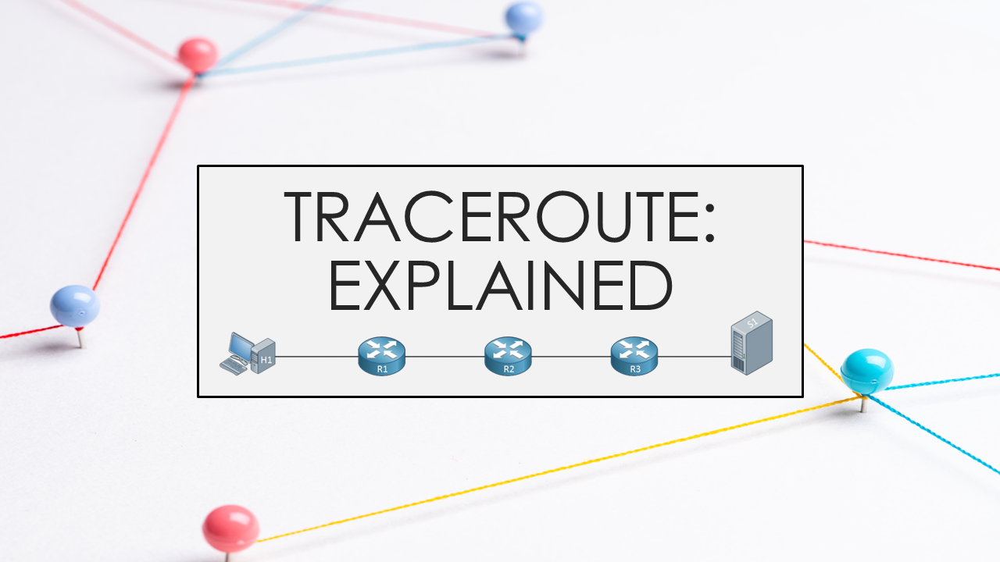
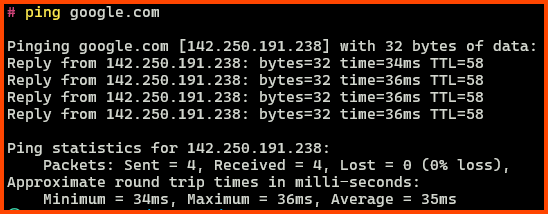
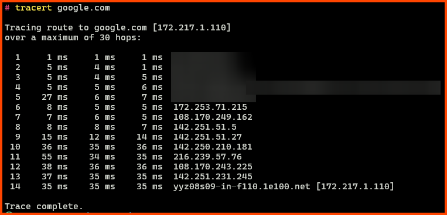
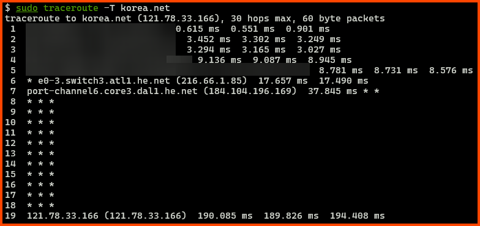
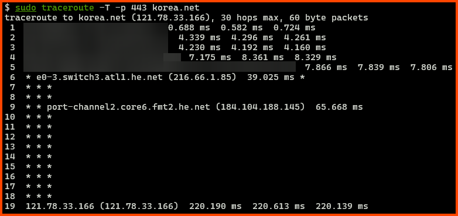

Image by [rawpixel.com](https://www.freepik.com/free-photo/business-network-background-connecting-dots-technology-design_21629645.htm) on Freepik

The Internet is a globally distributed network of interconnected devices. It is made up of a large number of independently operated networks. The internet is completely distributed and no one has central control over it. A network of such scale is bound to face issues from time to time. To troubleshoot the network troubleshooting utilities were created. In this post, we will be looking at one of the network utilities - traceroute.

<iframe width="560" height="315" src="https://www.youtube-nocookie.com/embed/HgYuBN0ZYu0?si=jbbRRfXQkQHl95v7" title="YouTube video player" frameborder="0" allow="accelerometer; autoplay; clipboard-write; encrypted-media; gyroscope; picture-in-picture; web-share" allowfullscreen></iframe>

## What is Traceroute?

It is a command line utility that is used for network troubleshooting. It is used to show the route that is used by data packets when they travel to a destination server. 

As we know the Internet is made up of many independent networks. Networks are linked together using a router. A router is a networking device that enables data packets to flow from one network to another. Data packets may have to traverse multiple networks to reach their destination.

Traceroute allows mapping of the route that will be used by the data packets to travel from the source to its destination. In other words, traceroute examines how data moves through the internet. Traceroute lists the routers (hops) that the data packets use on their journey to the destination server. For each hop, the round trip time from the hop to the source system is also captured.

## What is it Used For?

Traceroute can help to diagnose network problems like bottlenecks. It allows us to see the hops the data packets had to go through as well as the time it takes the packets to traverse the hops on their way to the destination device. By viewing the path that the data packets are using a network administrator could identify if the data packets are using the ideal route to a destination.

Traceroute is used by attackers as well. APTs use it to map out the route used by data packets to reach various services. This allows them to reverse engineer the topology and location of the devices that are controlled by various entities. Because of this, it is not uncommon to use firewalls and routers being configured to drop the data packets that are used by traceroute.

## Ping vs. Traceroute

Traceroute is a little different from the ping command. When we use the ping command four data packets are sent to the destination. Once received by the destination the data packets are returned to the sending device. If we get back the packets from the destination we can say that there is a general connectivity between the source device and the service running on the destination server. The ping command also provides the time the data packets took to travel through and from the destination.



> [!NOTE] Windows and Linux Difference
> On Windows the ping command by default sends four data packets to the destination. On Linux by default the ping command sends data packets until the command is terminated by the user. 


Traceroute provides us with more information than the ping command. Unlike the ping command traceroute will ping each of the routers along the path to the destination device. The round trip time from each of the routers on the path to the destination is also provided by the traceroute command. So while ping provides us details of the destination (last hop) traceroute provides us details of all the hops to the destination.

## Traceroute Exercise

I will perform a traceroute to google.com from Windows and Linux (WSL) to see the route that will be used by the data packets to make their way to Google servers.

On Windows, the traceroute utility is called `tracert`



The data packets had to travel 14 hops from my location to reach the servers that host google.com. Traceroute sends 3 data packets to each router which is why 3 round trip times are being displayed for each hop.


On Linux the output of the traceroute is formatted in a slightly different manner. The IP/host name is provided first followed by the round trip time for the 3 packets. The traceroute from Linux took 16n hops to reach the destination. 

Additionally, we can see that from hop 8 onwards the 3 packets each use different routes to reach the destination. That is why we have 3 different IP addresses on each hop from node 8 onwards. Since Google has multiple servers that resolve to google.com we can see that the destination IP address for the data packet from the Windows machine is different from the data packet from Linux.

If we compare the round trip time that is reported by ping to the round trip time for the last hop of the `tracert` and traceroute commands we can see that are the same. This is expected as ping returns the round trip time of the last node (destination).

### Asterisks in Output

For hop 7 we see that traceroute could not find any information. When traceroute is not able to get the details for a hop it represents that hop will asterisks. There are multiple reasons why this could occur.

- The router could have its firewall configured to have traceroute data packets dropped. As covered earlier this is done to prevent malicious users from mapping out the network
- It's also possible that the data packets that were returned from that router never came back to my device. Without the return packets traceroute cannot show any information about the hop
- Since it is an intermediate router this is not the issue in the above situation but sometimes we don't get back results simply because the server is unreachable

### Additional Options

On Windows, `tracert` uses ICMP packets (cannot be changed) and on Linux traceroute uses UDP packets (default, can be changed). Depending on how the routers on the network are configured using different packets can produce different results. 

Some routers (nodes) on the internet are configured to drop ICMP packets because of this the Windows version of traceroute sometimes cannot map the entire route. 

On Linux traceroute can be configured to use TCP and ICMP packets as well. Additionally, the port to which the connection should be made can also be mentioned. One could experiment with these options to see how the nodes on the network respond to the different protocols.






The value of maximum hops can be configured on both Windows and Linux. The max hops option specifies the maximum hops that the traceroute packets will travel. If we set its value to 4 then traceroute will only map 4 hops from the source towards the destination.

## Traceroute Working

At its core traceroute utilizes the TTL (Time to Live) field found in the IP Header in a clever way to map the route used by data packets to reach its destination. The TTL field is used to limit the lifespan of a data packet. Whenever a packet passes through a router (hop) the value of TTL for that packet is reduced by 1. Packets that have a TTL of 0 cannot be routed over a network. The above two conditions ensure that data packets that do not reach/have a valid destination do not live forever on the network. This is the magic that makes traceroute and network mapping possible.


The first packet that is sent by traceroute to the 1st hop on the network will have a TTL of 1. When the 1st hop router receives the packet it will decrement its TTL by 1 making it 0. This will cause a TTL Exceeded error to be generated. This error message is returned to the source device. The traceroute program on the source device notes the IP of the router where the error occurred.


For the next packet traceroute will set the TTL value to 2. When the packet reaches the 1st hop the router decrements the TTL by 1 which makes the new TTL value 1 since it's not 0 the packet is sent to the next hop. When the packet reaches the 2nd hop the router decremented the TTL value by 1 which makes the new TTL value 0. Since packets will a TTL of 0 cannot be routed on the network an TTL Exceeded error is raised and the error message is sent back to the source system where the IP address of the router at which the error occurred is noted. 

This process is repeated continuously by traceroute till the destination is reached or until the maximum hops value for traceroute is reached. Using the IP address that is returned in the error message traceroute can identify the hops that are present on the route to the destination.

## Other Traceroute Utilities

### Visual Traceroute

Visual traceroute from MIT plots all the hops that the data packet will use to reach its destination from a server that is controlled by MIT.

[Visual Traceroute - MIT](https://csvoss.scripts.mit.edu/traceroute/)

### My Traceroute (MTR)

MTR combines traceroute and ping into a single package. It performs traceroute on the route that is used by the data packets multiple times recursively. This helps to capture performance details on the nodes more accurately. MTR also provides some additional statistics that are not present in traceroute. 

MTR does not come installed natively on Windows and Linux. Similar to traceroute MTR also provides options to change the type of data packet that will be used to map the path.

```bash
mtr google.com
```


## References

- [What is Traceroute: What Does it Do & How Does It Work?](https://www.fortinet.com/resources/cyberglossary/traceroutes)
- [Traceroute (tracert) Explained - Network Troubleshooting - YouTube](https://www.youtube.com/watch?v=up3bcBLZS74)
- [What is My Traceroute (MTR)? \| Cloudflare](https://www.cloudflare.com/learning/network-layer/what-is-mtr/)
- [What is ICMP? \| Internet Control Message Protocol \| Cloudflare](https://www.cloudflare.com/learning/ddos/glossary/internet-control-message-protocol-icmp/)
- [IPv4 Packet Header](https://networklessons.com/cisco/ccna-routing-switching-icnd1-100-105/ipv4-packet-header)