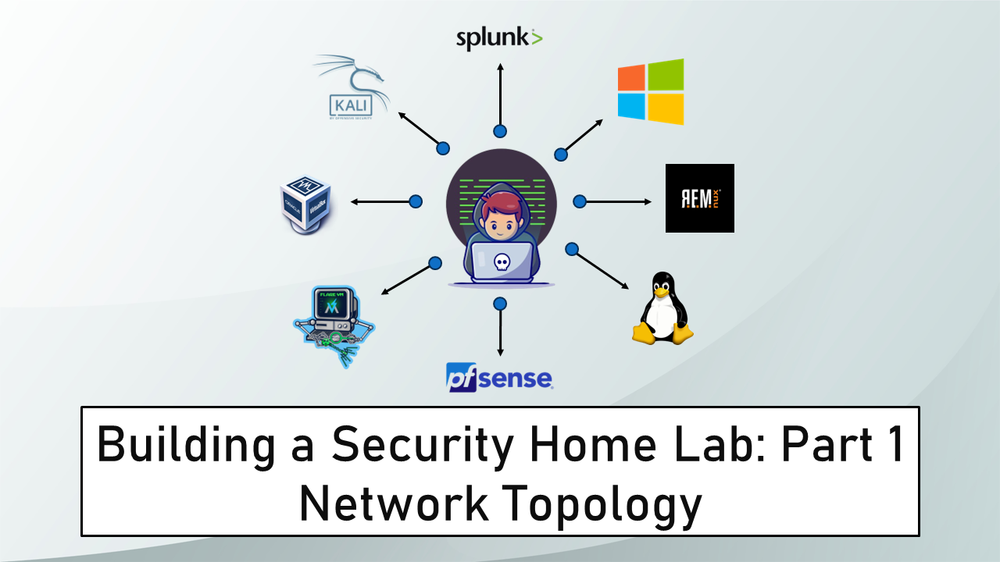
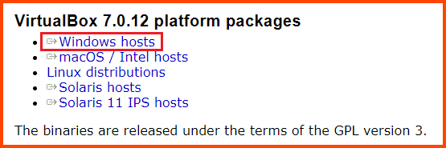
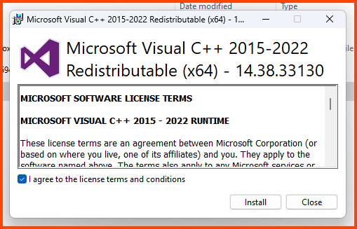
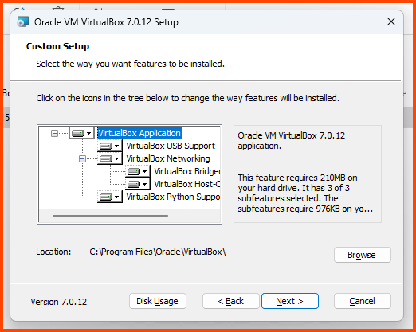
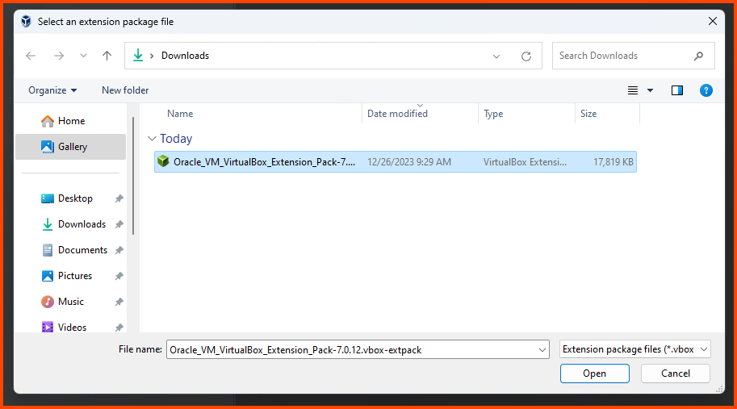
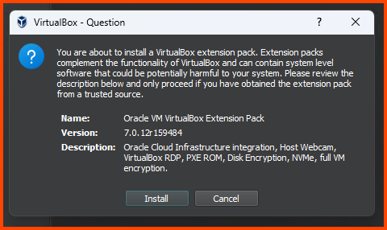
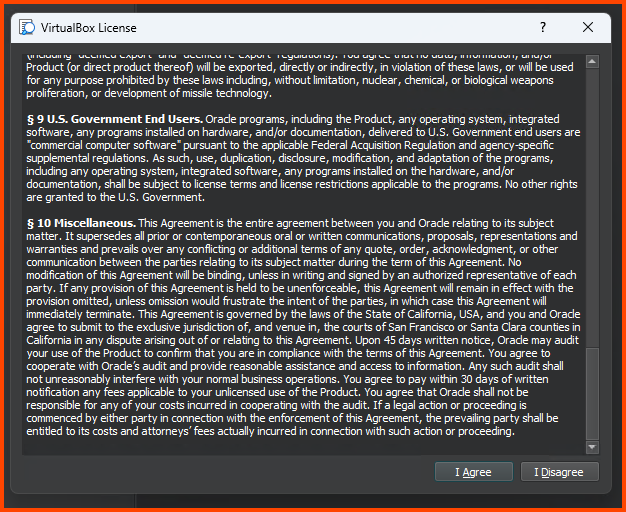
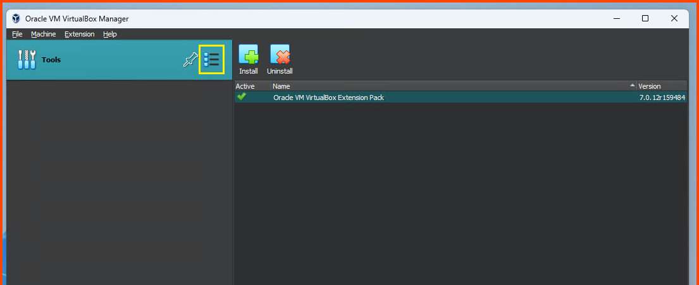
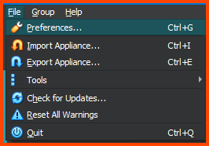
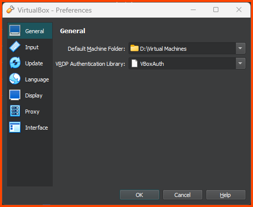

---
categories:
- Security
- Home Lab
date: 2023-12-31 10:40:00 -0600
description: A step-by-step guide for building your very own Cybersecurity Home Lab
  using VirtualBox
img_path: /assets/
published: true
tags:
- security
- home-lab
- virtualbox
- networking
title: 'Building a Virtual Security Home Lab: Part 1 - Network Topology'
---

Banner Background by [logturnal](https://www.freepik.com/free-vector/gradient-white-color-background-abstract-modern_34010189.htm) on Freepik  
Hacker Image by [catalyststuff](https://www.freepik.com/free-vector/hacker-operating-laptop-cartoon-icon-illustration-technology-icon-concept-isolated-flat-cartoon-style_11602236.htm) on Freepik

In this project, we will explore how to set up a Cybersecurity Home Lab on our laptop/PC. For this project, I will be using VirtualBox running on my Windows Laptop.

This project will consist of multiple modules. Each module will cover a different component of the lab. If at any point in the future changes are made in the project a note will be added at the start of the respective module to highlight the changes.

This project has been heavily inspired by the following Home Lab guides:

- [Building a Security Lab in VirtualBox](https://benheater.com/building-a-security-lab-in-virtualbox/)
- [Building Blue Team Home Lab Part 1 - Introduction \| facyber](https://facyber.me/posts/blue-team-lab-guide-part-1/)
- [Building a Cybersecurity Homelab for Detection & Monitoring - Cyberwox Academy](https://cyberwoxacademy.com/building-a-cybersecurity-homelab-for-detection-monitoring/)

## Home Lab Overview

- pfSense (Gateway & Firewall)
- Kali Linux (Management VM)
- Active Directory Lab (Domain Controller & 2 Clients)
- Malware Analysis Lab (Windows & Linux)
- Security VMs (DFIR & SIEM)
- Cyber Range (Vulnerable VMs for CTF practice)

> [!NOTE] Lab Startup
> pfSense is the gateway (router) and firewall for the lab. pfSense should always be the first VM that is booted when using the lab. If pfSense is not booted the machines in the lab will not be able to access the internet. Once pfSense is up other VMs can be launched.

## System Requirements

- 64-bit multi-threaded CPU (minimum 4 cores) with Virtualization Support
- 16GB RAM
- 250GB Disk Space

## Enabling Virtualization

To use VirtualBox our system has to support virtualization. On Windows to check if virtualization is enabled open Task Manager (**`Ctrl+Shift+Esc`**) and go to the Performance Tab. If like in the image below virtualization is shown as enabled then no changes need to be made.

If virtualization is shown as disabled it means that the CPU supports virtualization but it is disabled in the BIOS. If Virtualization is not shown as an option it means that the CPU does not support virtualization.

If virtualization is shown as disabled we need to enable it in the BIOS. The process of getting to the BIOS varies from device to device. Refer to the device manual and online forums for device-specific instructions.

[Enabling Virtualization in your PC BIOS](https://bce.berkeley.edu/enabling-virtualization-in-your-pc-bios.html)

## Installing VirtualBox

### Downloading VirtualBox

Go to the following URL: [Downloads – Oracle VM VirtualBox](https://www.virtualbox.org/wiki/Downloads)  
Download VirtualBox and VirtualBox Extension Pack.

As of the writing of this module, the latest version of VirtualBox is **`7.0.12`**.

You will have a **`.exe`** and **`.vbox-extpack`** file after the download. Double-click the **`.exe`** file to start the installer.

You might get the following error.

If you do not get the above error continue to the **`Installing VirtualBox`** section.

### Downloading VC++ 2019 Redistributable

Close the installer and go to the following URL to download VC++ 2019 Redistributable.  
[Latest supported Visual C++ Redistributable downloads \| Microsoft Learn](https://learn.microsoft.com/en-us/cpp/windows/latest-supported-vc-redist?view=msvc-170)

### Installing VC++ 2019 Redistributable

The download will give us an **`.exe`** file. Double-click on it to launch the installer.

<u>Accept</u> the agreement and click on **`Install`**.

### Installing VirtualBox

Click on the VirtualBox executable to start the setup. Click on **`Next`** to continue.

Leave all the settings on their default value and click on **`Next`**.

Click on **`Yes`**.

Click on **`Yes`**.

Click on **`Install`**.

Click on **`Finish`** to close the installer and start VirtualBox.

### Installing Guest Additions

From the File Menu bar select: **`File -> Tools -> Extension Pack Manager`**

On the Extension Manager page click on **`Install`**.

Select the **`.vbox-extpack`** file that we downloaded. Click on **`Open`**.

Click on **`Install`** to confirm the selection.

Scroll to the bottom of the License and click on **`I Agree`**.

Once the installation is complete click on the <u>Hamburger icon</u> on the right-side of **`Tools`** and select **`Welcome`**.

### Changing VM Storage Location

From The File Menu bar select: **`File -> Preferences`**.

From the **`General`** tab change the value of <u>Default Machine Folder</u> to change the default storage location of the VMs.

> [!NOTE] Default Machine Folder Location
> This step is not necessary but recommended on devices that have multiple drives.  
> On my laptop the primary drive (`C:\`) only has 200GB of free space which will completely get filled by the end of the project. My secondary drive (`D:\`) on the other hand has 1TB of free space. In order to not fill-up my primary drive I have changed the machine folder to a folder on my secondary drive.

In the next module, we will start with the installation and configuration of pfSense.

## Next Steps

- [Part 2 - pfSense Setup & Configuration](https://blog.davidvarghese.dev/posts/building-home-lab-part-2)
- [Part 3 - Kali Linux Setup](https://blog.davidvarghese.dev/posts/building-home-lab-part-3)
- [Part 4 - pfSense Firewall Configuration](https://blog.davidvarghese.dev/posts/building-home-lab-part-4)
- [Part 5 - Cyber Range Setup](https://blog.davidvarghese.dev/posts/building-home-lab-part-5)
- [Part 6 - Active Directory Lab Setup - Part 1](https://blog.davidvarghese.dev/posts/building-home-lab-part-6)
- [Part 7 - Active Directory Lab Setup - Part 2](https://blog.davidvarghese.dev/posts/building-home-lab-part-7)
- [Part 8 - Malware Analysis Lab Setup](https://blog.davidvarghese.dev/posts/building-home-lab-part-8)
- [Part 9 - Tsurugi Linux (DFIR) Setup](https://blog.davidvarghese.dev/posts/building-home-lab-part-9/)
- [Part 10 - Splunk Setup & Configuration](https://blog.davidvarghese.dev/posts/building-home-lab-part-10/)
- [Part 11 - Transferring Files to Malware Analysis Lab](https://blog.davidvarghese.dev/posts/building-home-lab-part-11/)
