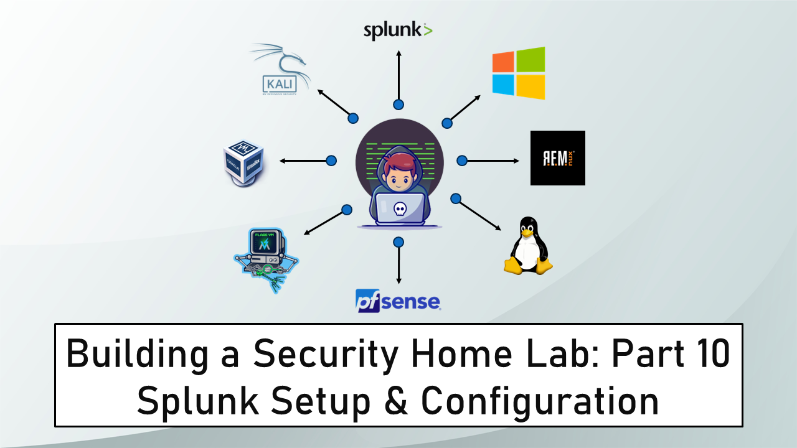

Banner Background by [logturnal](https://www.freepik.com/free-vector/gradient-white-color-background-abstract-modern_34010189.htm) on Freepik  
Hacker Image by [catalyststuff](https://www.freepik.com/free-vector/hacker-operating-laptop-cartoon-icon-illustration-technology-icon-concept-isolated-flat-cartoon-style_11602236.htm) on Freepik

In this module, we will set up Splunk (SIEM) in a Ubuntu VM. The VM will be added to the SECURITY subnet. Then we will configure Splunk Universal Forwarder on our Windows Server 2019 (DC) VM which will allow Splunk to ingest logs from the DC.

## Ubuntu Setup

### Downloading the Image

Go to the following URL: [Download Ubuntu Desktop \| Download \| Ubuntu](https://ubuntu.com/download/desktop).  
Download the latest LTS version of Ubuntu. As of writing the latest version is **`2022.04.3`**

The ISO is ~5GB.


After the download is complete you will have a **`.iso`** file.


### Creating the VM

In VirtualBox from the sidebar select **`Tools`** and then click on **`New`** from the toolbar.


Give the VM a <u>name</u>. Select the downloaded <u>ISO image</u>. Select the "<u>Skip Unattended Installation</u>" option and click on **`Next`**.


Increase the <u>Base Memory</u> to **`4096MB`** (4GB) and click on **`Next`**.


Increase the Hard <u>Disk size</u> to **`100GB`** and click on **`Next`**.


Confirm that all the settings look correct and click on **`Finish`**.


#### Adding VM to Group

Right-click the VM and select "<u>Move to Group</u>" then choose **`Home Lab/Security`**.

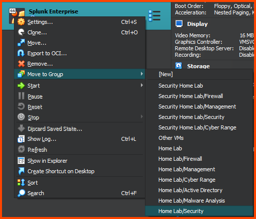

The final result should look as follows:


### Configuring the VM

Select the VM and click on **`Settings`** from the toolbar.


Go to **`System -> Motherboard`**. In <u>Boot Order</u> ensure that **`Hard Disk`** is on the top followed by **`Optical`**. Uncheck **`Floppy`**.

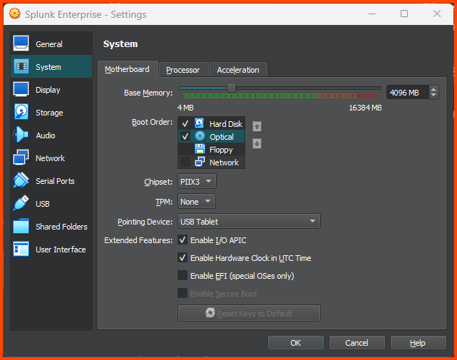

Go to **`Network -> Adapter 1`**. For the <u>Attached to</u> field select **`Internal Network`**. For <u>name</u> select **`LAN 4`**. Click on **`OK`** to save changes.


## Installing Ubuntu

Select the VM and click on **`Start`**.


Press **`Enter`** to start the <u>Graphical Installer</u>.

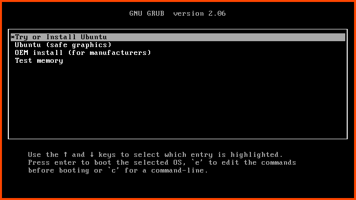

Select your <u>language</u> and click on "<u>Install Ubuntu</u>".


Select <u>Keyboard</u> Layout and click on **`Continue`**.


Enable "<u>Install third-party software for graphics and Wi-Fi hardware and additional media formats</u>" and click on **`Continue`**.


Click on **`Install Now`**.


Click on **`Continue`**.


Select your <u>location</u> and click on **`Continue`**.


Enter the <u>username</u>, <u>password</u> and <u>hostname</u> and click on **`Continue`**.


Click on **`Restart Now`** to boot into the system.


VirtualBox will automatically remove the ISO file from the disk drive. Press **`Enter`** to boot into the newly installed system.

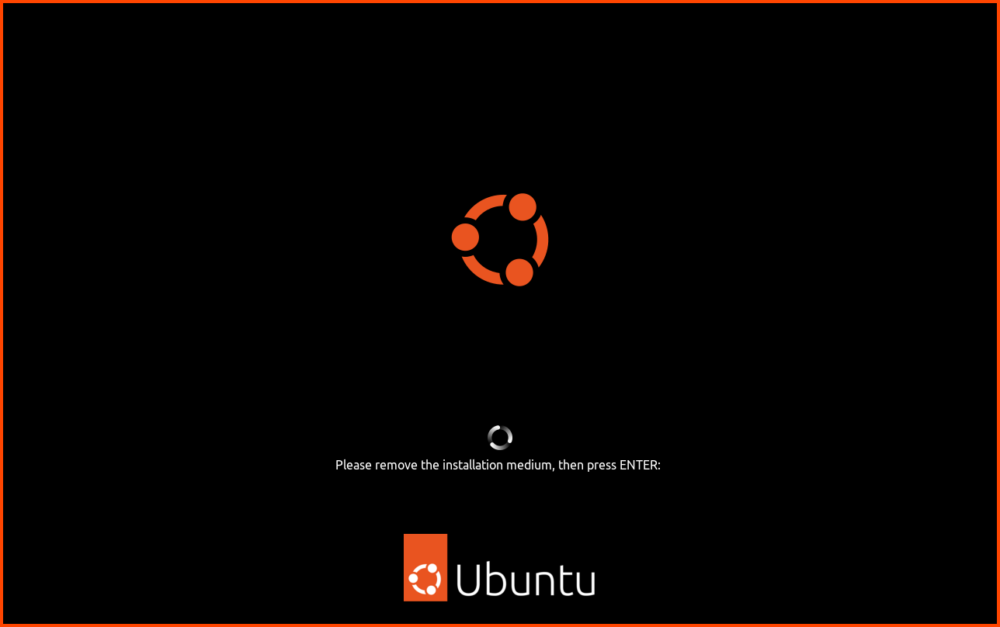

Login using your password.

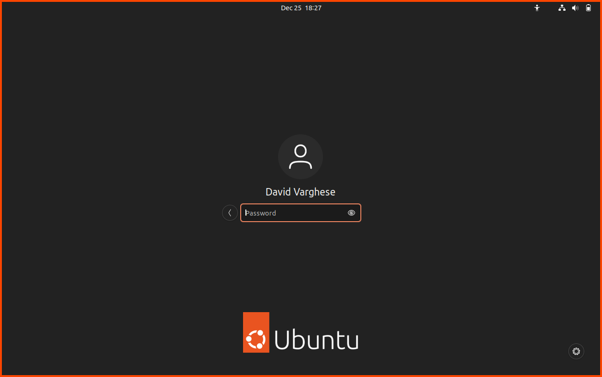

Complete the post-install setup as shown. Click on **`Skip`**.


Click on **`Next`**.

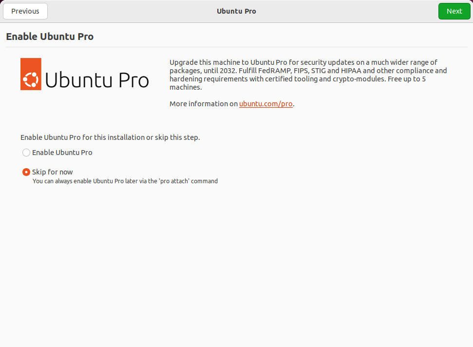

Select "<u>No, don't send system info</u>" and click on **`Next`**.


Ensure this setting is <u>disabled</u> and click on **`Next`**.

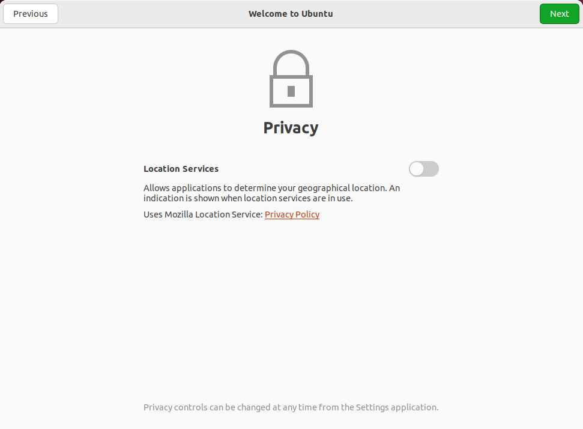

Click on **`Done`** to close the wizard.


### Post-Install Configuration

#### Install Guest Additions

From the VM toolbar select **`Devices -> Install Guest Additions CD image`**.

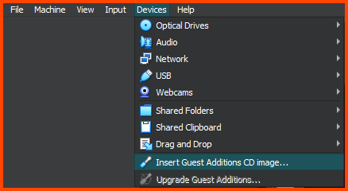

The disk will show up on the dock. Click on it to view the content of the disk.


Right-click anywhere in the empty area in the File Explorer and select "<u>Open in Terminal</u>".

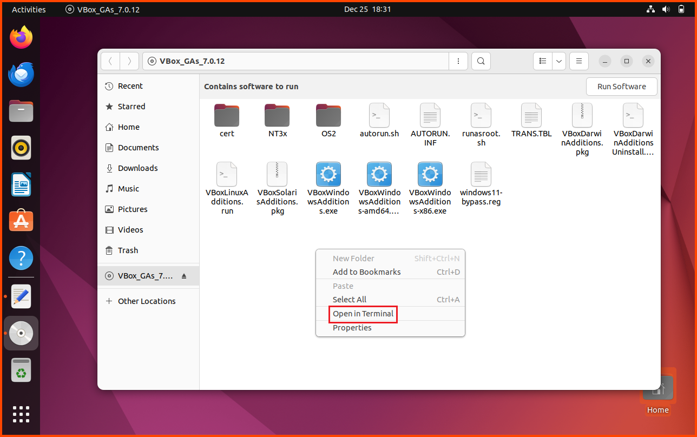

Run the following command to install Guest Additions:

```bash
sudo ./VBoxLinuxAdditions.run
```


Once the installation is complete close the terminal, right-click on the disk icon in the dock and select **`Eject`**.


#### Installing Updates

Press **`Ctrl+Alt+T`** to open a new terminal then enter the following command to update the system:

```bash
sudo apt update && sudo apt full-upgrade
```

Enter your password when prompted. If there are updates press **`Enter`** to start the install.

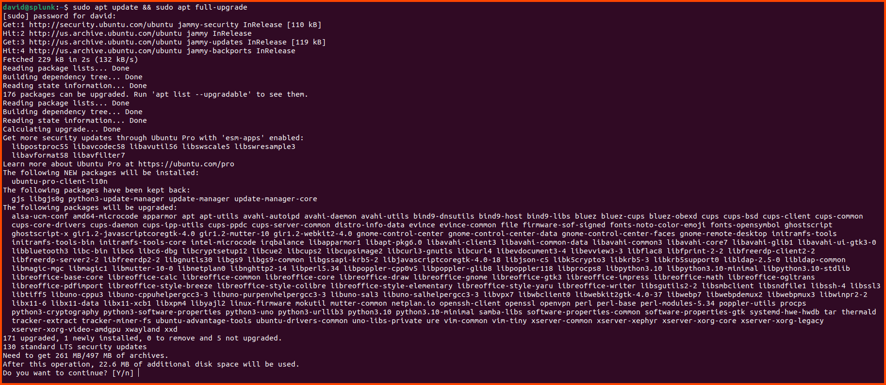

#### Creating VM Snapshot

Shut down the VM. Click on the <u>Hamburger menu</u> beside the VM name and select **`Snapshots`**.

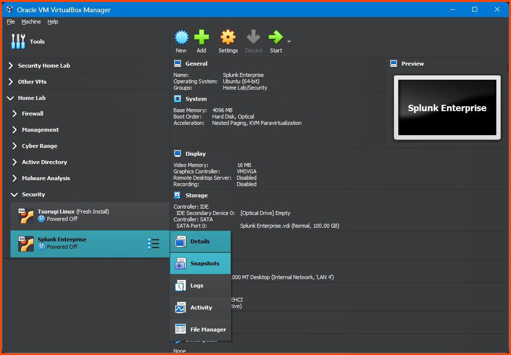

Click on **`Take`** to create a Snapshot.


Provide a descriptive <u>name</u> and click on **`OK`**.


Click on the <u>Hamburger menu</u> and click on "<u>Details</u>" to return to the main page.

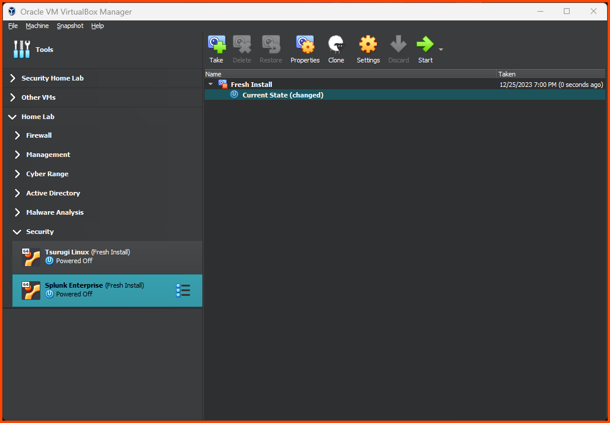

## Splunk Installation

### Splunk Download

On the Ubuntu VM go to the following URL: [Splunk Enterprise Free Trial \| Splunk](https://www.splunk.com/en_us/download/splunk-enterprise.html)  
As of writing the latest version of Splunk Enterprise is **`9.1.2`**.

> [!INFO]
> To download Splunk you have to <u>create a account</u>.  
> Link to get v9.1.2 without an account has been provided at the end of this section.  
> If you want to use the latest version follow the steps below to create a account.

Fill in the details in the form, accept the agreement and click on "<u>Create the Account</u>".

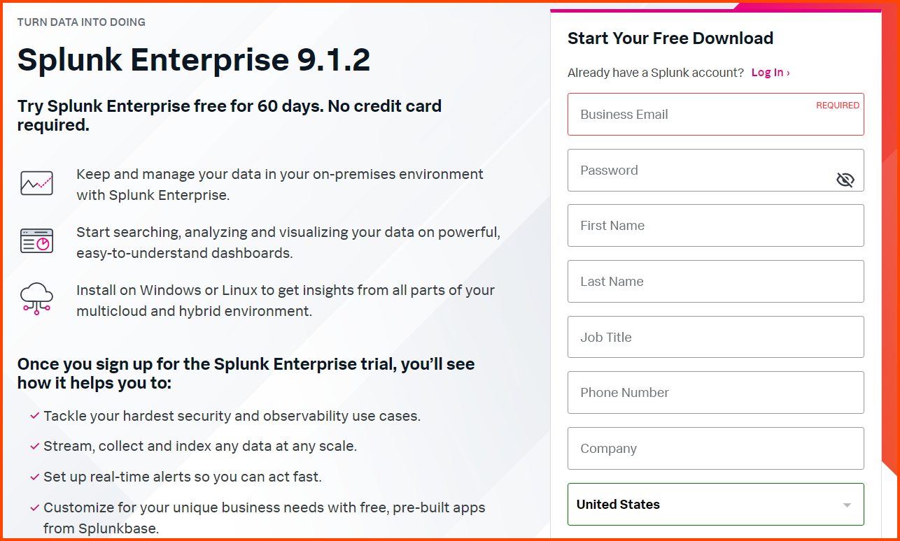

After login go to the <u>Linux</u> section and click on the "<u>Download Now</u>" button for the **`.deb`** file.


Scroll down and accept the agreement and then click on "<u>Access program</u>" to start the download.


Alternatively, use the following link to directly download Splunk v9.1.2:  
[Splunk Enterprise 9.1.2 - Linux (.deb) - Direct Download Link](https://download.splunk.com/products/splunk/releases/9.1.2/linux/splunk-9.1.2-b6b9c8185839-linux-2.6-amd64.deb)

### Splunk Installation

Once the download is complete we will have a **`.deb`** file. Open the Terminal (**`Ctrl+Alt+t`**) and navigate to the <u>Downloads</u> folder.

```bash
cd Downloads
```


Run the following following command to install **`curl`** (dependency for Splunk):

```bash
sudo apt install curl
```

Enter password when prompted.

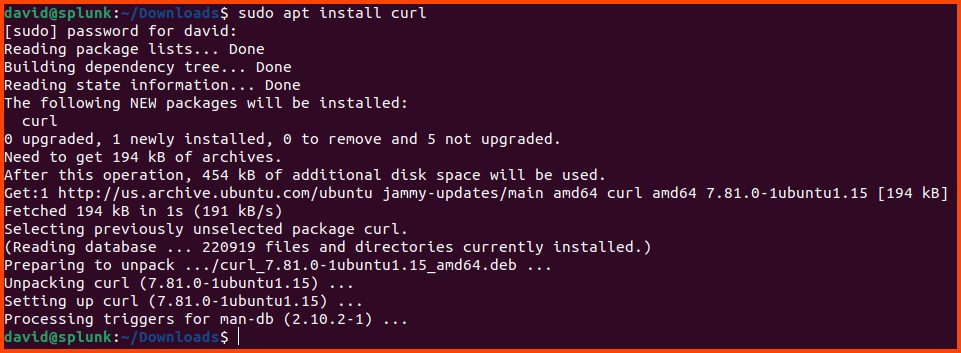

Run the following command to install Splunk:

```bash
sudo dpkg -i splunk-9.1.2-b6b9c8185839-linux-2.6-amd64.deb
```


> [!NOTE]
> If you downloaded the latest version of Splunk the name of the downloaded file could be different from the one shown here. Use the filename that is shown on your system with the above command.

After the installation is completed use the following command to launch Splunk:

```bash
sudo /opt/splunk/bin/splunk start --accept-license --answer-yes
```

Provide a name and password when prompted. These credentials need to be used to log into Splunk. 


Once the setup is complete we see the Splunk is running on **`http://127.0.0.1:8000`**


Run the following to allow Splunk to start automatically when the system is booted.

```bash
sudo /opt/splunk/bin/splunk enable boot-start
```


> [!NOTE]
> You can choose to ignore the last command to enable auto boot.  
> If you do not enable run at boot the command that was shown above to start Splunk will need to run to start Splunk.  

### Creating VM Snapshot

Shut down the VM. Using the <u>Hamburger</u> menu access the <u>Snapshot</u> page. Click on **`Take`** to create a Snapshot. Give the Snapshot a descriptive <u>name</u>.


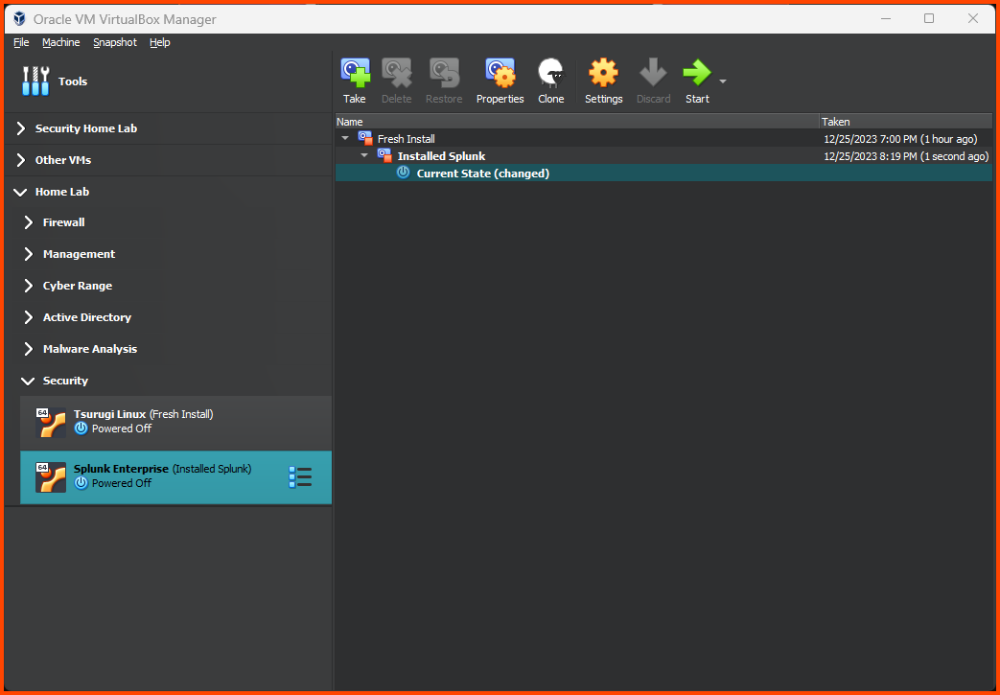

### Splunk Configuration

Before we can install Splunk Universal Forwarder there are a few settings we need to change in Splunk. Open Splunk by going to **`http://127.0.0.1:8000`**.


From the toolbar select **`Settings -> Forwarding and receiving`**.


Click on "<u>Add new</u>" in the <u>Receive data</u> section.


Enter **`9997`** as the port to listen for incoming data. Click on **`Save`**.


## Universal Forwarder Installation

The next steps need to be performed on the Domain Controller (Windows Server 2019). We are going to ingest the log data that is generated by this device into Splunk.

### Universal Forwarder Download

Go to the following link to download Universal Forwarder: [Download Universal Forwarder for Remote Data Collection \| Splunk](https://www.splunk.com/en_us/download/universal-forwarder.html)

You need to log in to be able to download the setup. Select the Windows tab and then click on the <u>Download Now</u> button beside the <u>64-bit</u> option.


Alternatively, Splunk Universal Forwarder v9.1.2 can be downloaded directly using the following link: [Splunk Universal Forwarder 9.1.2 - Windows (.msi) - Direct Download Link](https://download.splunk.com/products/universalforwarder/releases/9.1.2/windows/splunkforwarder-9.1.2-b6b9c8185839-x64-release.msi)

### Universal Forwarder Install

Double-click on the **`.msi`** file to begin installation.


<u>Check</u> the box on the top to <u>accept the agreement</u> and then click on **`Next`**.

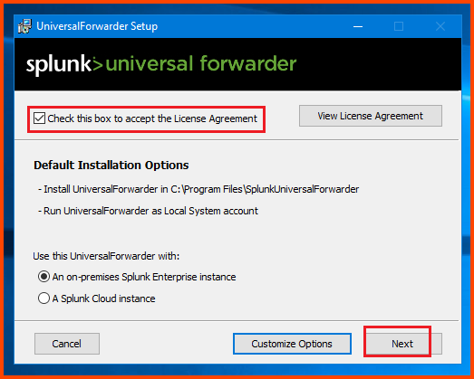

Provide a <u>username</u> and <u>password</u> for the Forwarder. I would recommend using the same credentials that were configured on Splunk.

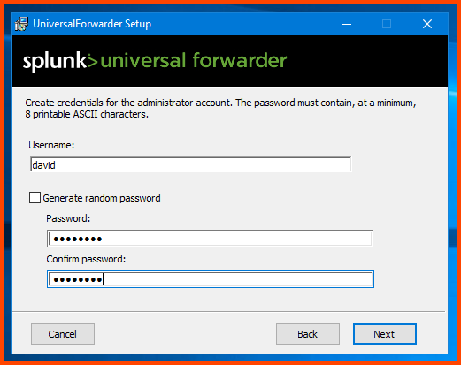

For the new step need the IP address of the Ubuntu (Splunk) VM. Use the following command to get the IP address.

```bash
ip a
```

Use the IP address that is shown under **`enp0s3`**.

> [!NOTE]
> If in your case instead of **`enp0s3`** you see **`eth0`** use the IP address that is shown under that section.


Enter the IP address of the Splunk VM (in my case **`10.10.10.13`**) and enter **`8089`** as the value for the port field then click on **`Next`**.

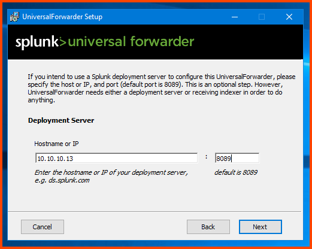

Again enter the <u>Splunk VM IP address</u> and for port enter **`9997`**. This is the port we configured in Splunk. Click on **`Next`** to continue.

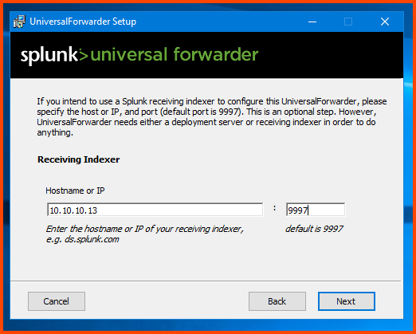

Click on **`Install`**.


Click on **`Finish`** to close the installer.


## Data Ingestion Configuration

Now that we have Splunk and Universal Forwarder configured we need to link both the pieces together so that Splunk can collect data.

### Adding Data Source

In Splunk select **`Settings -> Add Data`**.

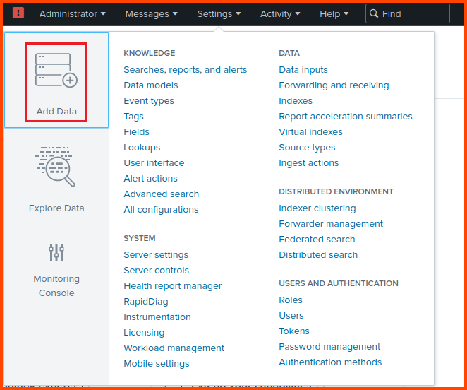

Click on **`Forward`**.

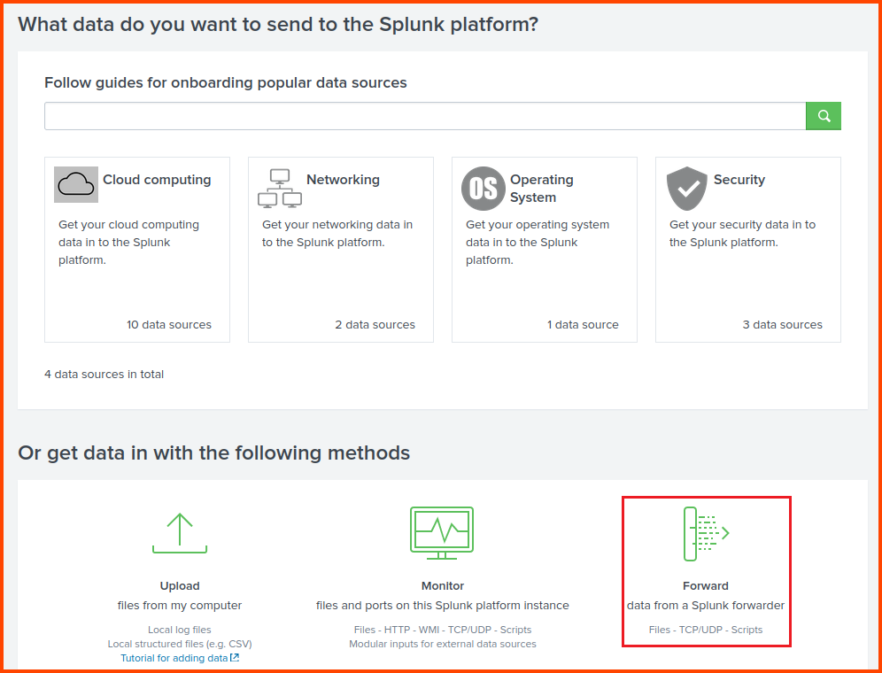

Our DC VM should automatically show up in the left box. Click on "<u>add all</u>" to move it to the right side. In the "<u>New Source Class Name</u>" field provide a name for the source. Click on **`Next`** to continue.


Select "<u>Local Event Logs</u>" then click on the "<u>add all</u>" button above the dropdown field to ingest all the logs generated by the DC. Click on **`Next`** once done.


Click on "<u>Create a new index</u>".Indexes are the Splunk equivalent of SQL Tables. It is used to store similar data.


Provide the Index a <u>name</u>. Keep all the other fields on their default value and click on **`Save`** then click on **`Next`**.


Confirm all the options look correct and click on **`Submit`**.

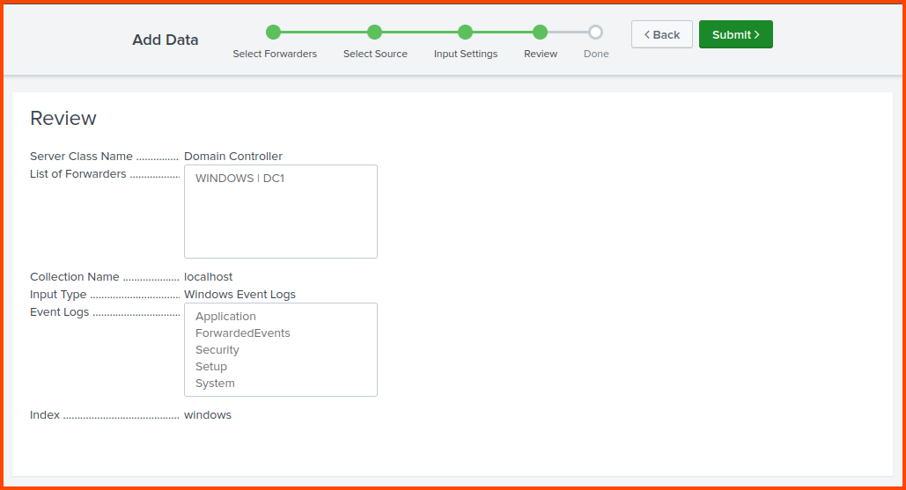

### Querying Data

From the Splunk toolbar select **`Apps -> Search & Reporting`**.


In the search box enter the following to view the ingested data:

```sql
index="windows"
```

In the above command "windows" is the name I gave my index.


> [!INFO]
> If the search does not return any value, wait for 2-3 minutes and then try again. If there is still no data go to the Windows VM and perform some simple actions (open applications, change settings, etc.) then after sometime you should see data flowing into Splunk.

In the next module, we will see how we can download files/malware onto the DFIR VM and then move them over to the Malware Analysis lab using SCP.

[Part 11 - Transferring Files to Malware Analysis Lab](https://blog.davidvarghese.dev/posts/building-home-lab-part-11/)
